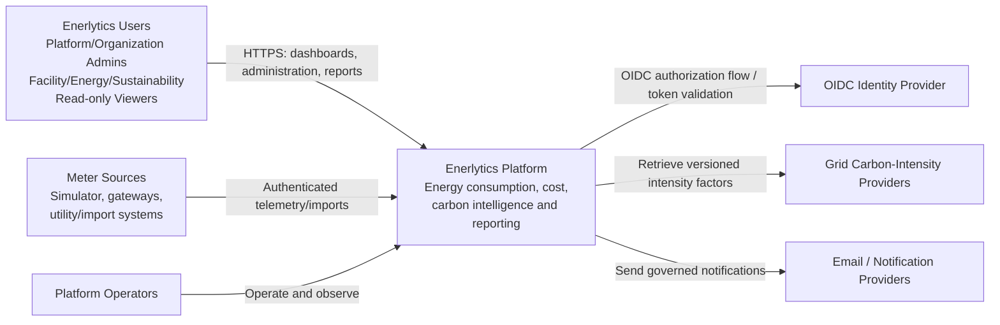
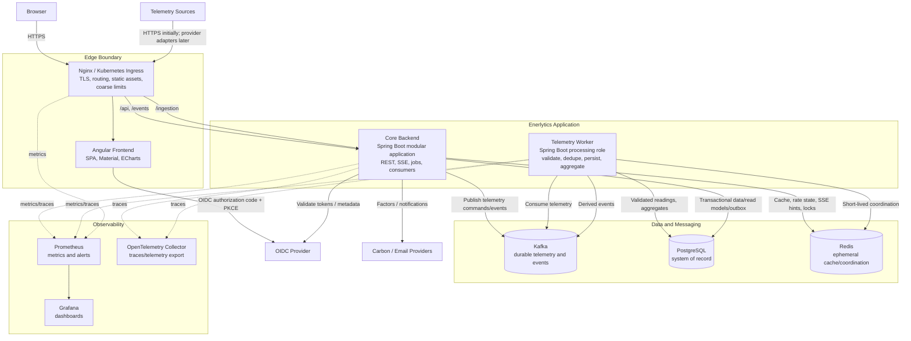
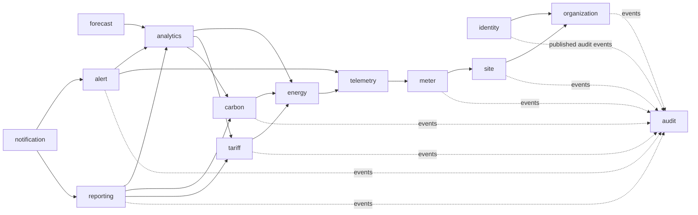
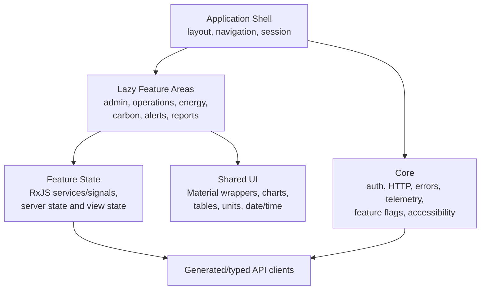
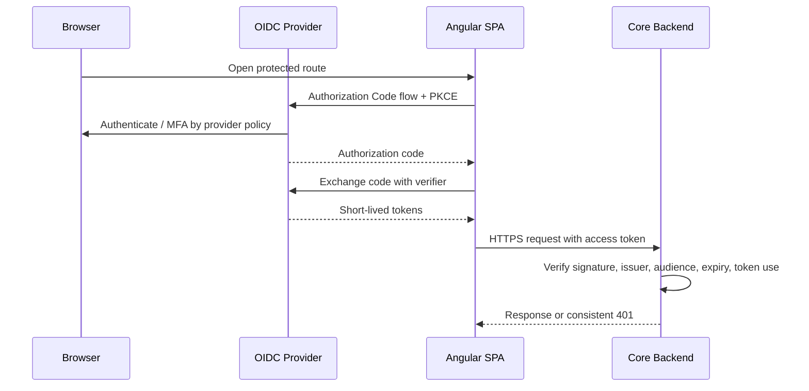
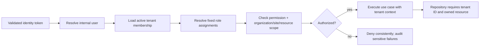

# Enerlytics Technical Architecture

- Status: Approved design baseline; implementation not started
- Version: 2.0
- Date: 2026-09-20
- Functional source of truth: `docs/PRODUCT_REQUIREMENTS.md`

## 1. Architecture Goals and Constraints

Enerlytics must ingest electricity telemetry, present timely operational views, calculate deterministic energy, demand, cost, renewable, and Scope 2 results, and preserve tenant isolation and calculation provenance. The initial design favors a modular platform over independently deployed business microservices.

The architecture must:

1. Keep organization data isolated by tenant and resource scope.
2. Make live data timely without making stale or incomplete data appear authoritative.
3. Produce decimal-safe, unit-aware, timezone-correct, reproducible calculations.
4. Absorb bursty telemetry independently from interactive API traffic.
5. Support idempotent retries, replay, correction, and asynchronous work.
6. Expose consistent contracts, errors, audit history, and observability.
7. Scale containers and workloads before extracting business services.
8. Avoid distributed transactions and duplicated platform infrastructure without evidence.

Unknown volume, retention, availability, RPO/RTO, provider, and regional requirements remain explicit architecture inputs. Capacity values and service objectives must be approved before production sizing.

## 2. Architectural Style

Enerlytics is a **domain-oriented modular platform** implemented from one backend codebase with enforced module boundaries. The initial backend artifact may run in two operational roles:

- **Core application:** synchronous APIs, authorization, configuration, analytical queries, job orchestration, reporting, notifications, and most event consumers.
- **Telemetry worker:** telemetry validation, deduplication, persistence, aggregation triggers, freshness, and telemetry-derived events.

This is not business-domain microservices. It is workload isolation: the same release, contracts, module ownership, and PostgreSQL system of record, deployed with distinct profiles and scaling policies. The telemetry worker is justified because bursty ingestion, Kafka lag, and CPU/write-heavy processing have different failure and scaling characteristics from user-facing APIs. It may initially run in the core process for local development and low-volume environments.

There is no dedicated application API gateway initially. **Nginx/Kubernetes Ingress** is the north-south boundary for TLS termination, routing, static frontend delivery, request-size limits, and coarse rate limiting. Authentication, tenant authorization, validation, and business policy remain in the core backend. A separate gateway would duplicate policy and add a network hop before multiple independently routed APIs exist.

## 3. C4 Level 1 — System Context



### External actors and trust boundaries

- Browsers and meter sources are untrusted network clients.
- The OIDC provider authenticates identities; Enerlytics remains authoritative for tenant membership, role, and resource scope.
- Carbon and notification providers are unreliable external dependencies behind ports/adapters.
- Platform operators use separate privileged access and receive only the tenant detail necessary for approved support.

## 4. C4 Level 2 — Container Architecture



### Initial production deployment units

| Unit | Required initially | Rationale |
|---|---:|---|
| Angular frontend + Nginx image | Yes | Immutable static delivery, browser UX, security headers, compression, and edge routing |
| Nginx/Kubernetes Ingress | Yes | One controlled external boundary; no separate gateway service until multiple APIs justify it |
| Core backend | Yes | Hosts the modular business platform and synchronous API |
| Telemetry worker | Yes for production; may be co-located in development | Isolates bursty write/CPU workload and scales on Kafka lag without multiplying business services |
| Kafka | Yes | Durable ingestion buffer, ordered partition processing, asynchronous events, replay |
| PostgreSQL | Yes | Authoritative relational state, constraints, transactions, time-series and calculation provenance |
| Redis | Yes | Bounded ephemeral caching, coordination, rate state, and realtime hints; never authoritative |
| Prometheus | Yes | Metrics storage, alert rules, service and business-health signals |
| Grafana | Yes | Operational dashboards and investigations |
| OpenTelemetry Collector | Recommended production support container | Decouples trace/telemetry export from vendor destination; absence must not stop business traffic |

Production PostgreSQL, Kafka, and Redis should preferably be managed or independently operated stateful services. They must not be treated as disposable application pods.

## 5. Why Each Major Technology Exists

| Technology | Purpose | Explicit non-purpose |
|---|---|---|
| Angular + TypeScript strict mode | Accessible, responsive, typed SPA; route-level feature isolation and reactive UI | Not an authorization boundary or calculation authority |
| Angular Material + SCSS | Accessible interaction primitives and consistent responsive design | Not a substitute for product-specific accessibility testing |
| ECharts | High-density enterprise charts with reusable adapters and text/table alternatives | Not authoritative data aggregation |
| Nginx / Kubernetes Ingress | TLS, static assets, routing, security headers, coarse rate/body limits | Not tenant authorization or business orchestration |
| Java 21 + Spring Boot 3 | Mature transactional backend, security, validation, batch, messaging, observability | Not permission to create framework-coupled domain models |
| Spring Security | OIDC resource-server integration and method/use-case security support | Identity provider replacement |
| Spring Data JPA | Transactional aggregate persistence and query adapters | Direct cross-module entity sharing or unbounded analytical queries |
| Spring Kafka | Durable telemetry/event producers and consumers with controlled offset handling | “Exactly once” business effects without idempotency/database constraints |
| Spring Batch | Restartable imports, recalculation, forecast, and report jobs | Per-reading synchronous processing |
| Spring Cloud | Selected integration facilities only when required | Mandatory discovery/config services in the initial topology |
| Resilience4j | Timeouts, circuit breakers, bulkheads, and bounded retries at remote boundaries | Retrying validation failures or hiding outages |
| PostgreSQL | System of record, ACID invariants, relational integrity, partition-ready telemetry, calculation lineage | Ephemeral cache or ungoverned event bus |
| Redis | Short-TTL read cache, distributed coordination, rate state, realtime invalidation/hints | Source of truth, durable event storage, or durable authorization records |
| Kafka | Backpressure, durable telemetry, ordered partition processing, replay, decoupled event work | Request/response transport or indiscriminate event publication |
| Flyway | Reviewed, ordered, reproducible database evolution | Runtime schema mutation by ORM |
| MapStruct | Explicit compile-time mapping at adapter boundaries | Hiding domain transformations or calculations |
| Bean Validation | Transport/application input validation | Replacement for domain invariants or database constraints |
| Micrometer | Portable application and business metrics | High-cardinality logs or traces |
| OpenTelemetry | End-to-end traces and context propagation across HTTP, Kafka, and jobs | Persisting business audit records |
| Prometheus | Time-series operational metrics and alert evaluation | Customer-facing historical energy analytics |
| Grafana | Operator dashboards and incident exploration | End-user product dashboards |

## 6. Backend Module Architecture

### 6.1 Internal layering

Each meaningful module may contain:

```text
module/
├── domain/          # aggregates, value objects, policies, domain events
├── application/     # commands, queries, use cases, ports, transaction boundaries
└── adapter/
    ├── in/          # REST, Kafka, batch, scheduler
    └── out/         # JPA, Redis, providers, notification, object storage
```

Dependencies point inward. Modules expose application interfaces and published events. A module must not import another module's persistence entity, repository, internal service, or database table directly. Architecture tests must enforce these rules.

### 6.2 Module diagram



Arrows represent use of a published application contract or event, not access to internals. To avoid a “god analytics module,” authoritative calculations remain with `energy`, `tariff`, `carbon`, and `forecast`; `analytics` composes read models and comparisons.

### 6.3 Module ownership and physical-separation evaluation

| Module | Owns | Initial physical service? | Decision and extraction signal |
|---|---|---:|---|
| identity | Memberships, role assignments, effective access | No | Security policy is tightly coupled to all use cases. Extract only for multi-product identity governance or independent security ownership; external IdP already handles authentication. |
| organization | Tenant lifecycle and defaults | No | Low throughput and strongly transactional with identity/site onboarding. |
| site | Facilities, buildings, zones, assignments | No | Cohesive hierarchy; keep near organization/meter. Extract only with independent facilities product/team. |
| meter | Meter/channel configuration and lineage | No | Configuration participates in ingestion validation but does not require its own network boundary. Publish cached snapshots to worker. |
| telemetry | Readings, quality, ingestion idempotency, freshness | **Separate worker role** | Workload separation now; full service extraction only if volume/retention/write scaling or isolated availability warrants a separately owned datastore/API. |
| energy | Unit conversion, aggregation, demand, baselines, budgets/targets energy inputs | No | Core deterministic domain shared by analytics/cost/carbon. Can run consumers/jobs separately before service extraction. |
| carbon | Factors, Scope 2, renewable evidence/results | No | Requires transactional provenance and energy snapshots. Extract for independent compliance lifecycle, regional rules, or separate release/security boundary. |
| tariff | Tariff versions and cost calculation | No | Transactional, modest load, coupled to reporting and energy. Extract only for procurement/billing-scale ownership. |
| analytics | Query/read models, comparisons, dashboards | No | Read-heavy module can gain replicas/materialized views first. Extract if independently scaled query plane is proven. |
| forecast | Forecast definitions, runs, results | No; separate job execution profile allowed | Batch/CPU work uses Spring Batch worker pools. Extract if models require distinct runtime, GPU/Python stack, or independent lifecycle. |
| alert | Rules, occurrences, lifecycle | No; consumers scale independently | Event-driven internal module. Extract if alert SLO/volume and independent availability justify it. |
| reporting | Definitions, snapshots, artifacts, generation jobs | No; separate batch workers allowed | Asynchronous generation is already isolated by queue/job pool. Extract for large rendering scale or compliance boundary. |
| notification | Preferences, delivery requests/status | No; consumers scale independently | Provider adapters and queue isolate failures. Extract for multi-channel platform reuse or distinct delivery SLO. |
| audit | Immutable business/security events and queries | No | Atomic/durable capture is easier within platform. Extract when regulatory immutability, retention, or external SIEM ownership demands it. |

**Decision rule:** deployment extraction requires measured independent scaling, availability, security, data sovereignty, team ownership, or release-cadence need. Code packages alone are not a reason.

### 6.4 Data ownership

PostgreSQL may be one cluster/database initially, but each module owns its tables and Flyway migrations. Cross-module foreign keys are allowed only when they protect stable tenant/reference identity and do not permit repository sharing; other integration uses IDs, application contracts, projections, and events. Reporting queries use governed projections, not arbitrary joins over private tables.

## 7. Frontend Architecture



- Use standalone components and route-level lazy loading by feature area.
- Keep server state in typed feature data-access services; use RxJS for asynchronous composition and Angular signals for local derived UI state where appropriate. Do not add a global state library until cross-feature complexity demonstrates need.
- Generate or validate API clients from OpenAPI. UI models remain separate from transport DTOs where behavior requires it.
- Central interceptors attach correlation context and handle authentication transport; feature services handle domain errors and retry only safe reads.
- Charts receive already governed aggregates and always provide table/text equivalents, explicit units, timezone, coverage, freshness, and estimated/incomplete status.
- Route guards and hidden actions improve UX; backend authorization remains authoritative.
- SSE connections are scoped to the active organization/site view and reconnect with bounded exponential backoff and a last-event cursor where supported.
- Responsive design preserves information; dense tables use accessible scrolling or alternative cards rather than silently dropping fields.

## 8. Primary Data Flows

### 8.1 General command and event flow

1. Client sends an authenticated command with correlation and optional idempotency key.
2. Core validates transport, resolves identity/membership, authorizes tenant/resource scope, and invokes one application use case.
3. The module validates domain invariants and commits authoritative state plus outbox records in one PostgreSQL transaction.
4. Outbox publisher emits integration/domain events to Kafka.
5. Idempotent consumers update owned projections, trigger calculations, alerts, notifications, or audit processing.
6. UI receives the synchronous result or an asynchronous operation resource and optional SSE state change.

### 8.2 Telemetry ingestion flow

```mermaid
sequenceDiagram
    participant S as Simulator / Meter Source
    participant E as Ingress + Core Ingestion API
    participant K as Kafka
    participant W as Telemetry Worker
    participant P as PostgreSQL
    participant D as Derived Consumers
    participant R as Redis/SSE Hint
    participant U as Live UI

    S->>E: Authenticated batch/readings + source IDs
    E->>E: Size/schema/auth/rate validation
    E->>K: telemetry.received.v1 keyed by meter/channel
    E-->>S: 202 Accepted + ingestion operation
    K->>W: Consume partition in order
    W->>W: Resolve meter config; validate units/time/quality
    W->>P: Insert idempotently + quality/provenance
    alt duplicate
        P-->>W: Unique conflict classified as duplicate
    else accepted/corrected
        W->>P: Update freshness/aggregate inputs + outbox
        P-->>W: Commit
        W->>K: Publish via outbox: telemetry.accepted/rejected
        K->>D: Energy aggregation, alert, operational metrics
        D->>R: Bounded invalidation/live update hint
        R-->>U: Core SSE emits authorized summary change
    end
```

- External acknowledgement means accepted for durable processing, not yet accepted as authoritative reading.
- Kafka key uses stable tenant/meter/channel identity to preserve relevant order while permitting parallel partitions.
- The database unique key provides idempotent business effect; Kafka delivery semantics alone are insufficient.
- Invalid readings are classified with sanitized reason and operational counters. Payload retention/quarantine follows approved privacy and retention policy.
- Backpressure is Kafka lag, not an unbounded in-process queue. Lag and oldest-event age are production alerts.
- Corrections are versioned/superseding records and trigger bounded recalculation for affected windows.

### 8.3 Carbon computation flow

```mermaid
sequenceDiagram
    participant T as Telemetry/Energy
    participant C as Carbon Module
    participant F as Factor Adapter/Registry
    participant P as PostgreSQL
    participant A as Analytics/Reporting

    T->>P: Commit versioned energy aggregate + coverage
    T->>C: energy.aggregate.ready event
    C->>P: Load site region/timezone and effective factor snapshot
    alt factor absent or stale beyond policy
        C->>P: Record incomplete calculation run and reason
        C-->>A: carbon.calculation.incomplete
    else valid factor
        C->>C: Convert units; energy × factor using decimal policy
        C->>P: Save result, algorithm/factor/input versions, coverage
        C-->>A: carbon.result.updated
    end
    F-->>C: Scheduled/manual factor versions via adapter
    C->>P: Validate and version factors; never overwrite used factor
```

Location-based Scope 2 is MVP. Market-based results remain a distinct method and result series when added; no fallback may silently report zero or combine methods. Revisions create new calculation runs and preserve report snapshots.

### 8.4 Authentication flow



Prefer a browser security architecture that minimizes token exposure; final choice between direct SPA/OIDC and a backend-for-frontend cookie model requires the selected IdP and session policy. The backend never trusts Angular route guards or identity claims as tenant authorization by themselves.

### 8.5 Authorization flow



- Membership and resource scope are authoritative in PostgreSQL; short-lived caches must be invalidated on role changes and fail closed when uncertain.
- Every repository operation carries explicit tenant context. Predictable object IDs never confer access.
- Platform support access is separate, time-bound, justified, and audited.
- Background jobs and consumers use service identities and carry tenant context from validated event metadata.

### 8.6 Reporting flow

1. Authorized user submits report parameters and idempotency key.
2. Core validates scope, bounded range, fields, format, and financial/carbon permissions.
3. Reporting creates an immutable request and asynchronous operation, then queues a job.
4. Spring Batch reads governed projections/calculation snapshots, records input/factor/tariff/baseline versions and coverage, and generates CSV/PDF.
5. Artifact storage uses a private object-store adapter in production; local filesystem is not an authoritative clustered store.
6. Metadata and checksum are committed; completion event drives in-app/email notification.
7. Download reauthorizes the current user, then returns a short-lived protected stream or signed URL. Revoked access blocks download even if the report was generated earlier.
8. Failed jobs expose sanitized cause and retry eligibility; idempotent restart never creates conflicting snapshots.

## 9. Kafka Usage

### 9.1 Appropriate topics/events

| Topic family | Key | Producers | Consumers |
|---|---|---|---|
| `telemetry.received.v1` | tenant + meter/channel | Ingestion API, simulator/provider adapters | Telemetry worker |
| `telemetry.accepted.v1` | tenant + meter/channel | Telemetry worker outbox | Energy, alerts, operational projections |
| `telemetry.rejected.v1` | tenant + source | Telemetry worker | Operational monitoring/audit as policy permits |
| `energy.aggregate.updated.v1` | tenant + resource + period | Energy outbox | Carbon, analytics, alerts, forecast invalidation |
| `carbon.result.updated.v1` | tenant + boundary + period | Carbon outbox | Analytics, target, reporting |
| `alert.lifecycle.changed.v1` | tenant + alert | Alert outbox | Notification, realtime summary, audit |
| `report.status.changed.v1` | tenant + report | Reporting outbox | Notification, realtime summary |
| `notification.requested.v1` | tenant + recipient | Alert/report modules | Notification consumer |

Topic names and payload schemas are contract-first in AsyncAPI/schema files. Events include event ID, type/version, occurred time, tenant ID, aggregate ID/version, correlation/causation IDs, producer, and payload. They must not contain secrets or unnecessary personal data.

### 9.2 Delivery and compatibility

- Assume at-least-once delivery and make consumers idempotent using event/inbox IDs and database uniqueness.
- Publish database-derived events through a transactional outbox; commit consumer offsets only after durable business effect.
- Partition for required ordering, not global ordering.
- Use backward-compatible event evolution; breaking semantic changes get a new event version/topic.
- Retry transient errors with bounded backoff. Non-retryable/poison events move to a dead-letter topic with reason, original metadata, alerting, and controlled replay.
- Kafka is not used for synchronous CRUD queries or as the only copy of authoritative business state.

## 10. Caching Strategy

### Cache candidates

- Meter configuration snapshots used by the telemetry worker.
- Effective role/permission summaries with very short TTL and explicit invalidation.
- Carbon factor lookups by immutable version/effective key.
- Stable reference data and expensive dashboard query results where freshness is stated.
- Rate-limit counters, distributed locks for singleton jobs, and short-lived SSE invalidation hints.

### Rules

- Cache-aside is default. PostgreSQL remains authoritative.
- Keys include environment, tenant, resource, semantic version, and query dimensions; no shared unscoped key.
- TTL matches tolerated staleness. Authorization caches use the shortest TTL and invalidation events.
- Mutations commit first, then invalidate. Consumers tolerate missed invalidation by TTL/versioned keys.
- Cache outage degrades to bounded database access or explicit throttling; it must not grant access, lose telemetry, or fabricate data.
- Prevent cache stampedes with request coalescing/locks only for expensive safe reads.
- Do not cache access tokens, secrets, unbounded raw telemetry, report artifacts, or mutable authoritative totals as sole copies.

## 11. Realtime UI Strategy

Use **Server-Sent Events (SSE)** for MVP server-to-browser updates because product flows are predominantly one-way: telemetry summaries, alert lifecycle, operation status, and report completion. Commands remain authenticated REST requests. SSE is simpler to operate through proxies, reconnect, authorize, and observe than WebSocket for this use case.

- Core exposes scoped streams, not raw Kafka topics.
- The server computes or reads authorized summaries; browser never receives cross-tenant events to filter locally.
- Events carry ID, type, resource, server time, freshness/quality, and minimal payload.
- Redis pub/sub or streams may fan out non-authoritative update hints among core replicas; clients refetch authoritative data after a hint.
- Support heartbeat, idle timeout, connection limits, `Last-Event-ID` where bounded replay exists, and exponential reconnect with jitter.
- On missed/replayed-window events, client performs a REST resynchronization.
- Polling with freshness labels is the fallback. WebSocket is reconsidered only for genuine bidirectional high-frequency use cases.

## 12. External Provider Integration

Every provider uses an application port and isolated adapter. Domain/application code depends on provider-neutral models.

- Configure endpoints and credential **references**, never secrets in source or database payloads.
- Apply per-provider timeouts, bulkheads, circuit breakers, bounded retry with jitter, rate limiting, and concurrency limits.
- Validate schema, units, region, timestamps, ranges, and provenance before accepting data.
- Quarantine malformed carbon factors; do not overwrite previously used versions.
- Record connector health, last success, lag/freshness, rate-limit state, and sanitized failure reason.
- Provider outages yield explicit stale/incomplete results according to approved fallback policy; no silent substitution.
- Use contract tests against provider sandboxes/stubs and replayable sanitized fixtures.
- Notification failure never removes the underlying alert/report state; delivery status is durable and retryable.

## 13. Failure Handling and Recovery

| Failure | Required behavior |
|---|---|
| Invalid client command | Reject with consistent problem details; no retry; correlation ID |
| Duplicate command/telemetry | Return/reuse prior idempotent outcome or classify duplicate; no duplicate effect |
| PostgreSQL unavailable | Fail writes; do not acknowledge durable completion; readiness fails; recover from client/Kafka retry |
| Kafka unavailable at ingestion | Reject/503 unless a proven durable local alternative exists; never accept into memory only |
| Kafka consumer failure | Leave offset uncommitted; bounded retry; DLQ poison records; alert on lag/age |
| Redis unavailable | Bypass safe caches, reduce optional realtime, preserve authorization correctness and durable processing |
| Carbon provider unavailable | Keep prior factors immutable; mark freshness/fallback/incomplete state; circuit-break and alert |
| Notification provider unavailable | Persist pending/failed delivery, retry policy, keep in-app source event authoritative |
| Report/calculation job failure | Persist failed operation/checkpoint; safe restart; retain prior completed snapshots |
| SSE disconnect | Client reconnects/resynchronizes; no business state depends on connection |
| Partial data | Return explicit coverage/quality or unavailable result; never silently estimate unless method labels it |
| Zone/replica loss | Kubernetes reschedules stateless containers; stateful recovery follows managed service/backup procedures |

Retries occur only for transient operations and must be bounded, observable, and idempotent. Circuit breakers protect remote calls, not database transactions. Bulkheads prevent one provider or workload from exhausting all request/worker capacity.

## 14. Observability

### 14.1 Signals

- **Metrics:** request rate/error/duration, JVM, pool saturation, PostgreSQL/Redis/Kafka latency, consumer lag and oldest age, ingestion accepted/rejected/duplicate/late counts, telemetry freshness, outbox backlog, calculation duration/failure/coverage, alert evaluation latency, report queue/duration/failure, provider health, notification delivery, SSE connections/reconnects.
- **Traces:** browser correlation through ingress, REST, application use case, PostgreSQL, outbox, Kafka producer/consumer links, batch jobs, and provider calls using W3C trace context where supported.
- **Logs:** structured JSON with timestamp, level, service role, trace/correlation ID, tenant pseudonymous ID, module, event/action, outcome, and sanitized error code. No secrets, tokens, raw provider credentials, or unnecessary telemetry payloads.
- **Audit:** separate durable business/security record; operational logs are not audit history.

### 14.2 Prometheus and Grafana

Prometheus scrapes backend/worker/ingress and infrastructure exporters. Grafana provides at least:

1. Platform availability and latency.
2. Telemetry throughput, lag, rejection, duplicate, and freshness.
3. PostgreSQL/Kafka/Redis dependency health and saturation.
4. Calculation, forecast, batch, reporting, and notification health.
5. External provider freshness/error/rate-limit state.
6. Tenant-safe operational drilldown without high-cardinality metric labels.

Alerts use symptom/SLO signals and actionable runbooks. Tenant/meter IDs should not become unbounded Prometheus labels; drilldown belongs in logs or governed operational projections.

### 14.3 Health semantics

- **Liveness:** process is not irrecoverably stuck; must not fail merely because a dependency is briefly unavailable.
- **Readiness:** instance can safely receive its role's traffic/work, including required dependencies.
- **Startup:** allows migrations/warmup without premature liveness restart.
- Health endpoints disclose no credentials or internal topology to unauthenticated clients.

## 15. Security Architecture

- TLS at ingress; authenticated encryption to stateful services according to platform risk.
- OIDC/OAuth 2.1, short-lived access, PKCE for SPA if direct browser flow is approved, restrictive CORS, and CSRF protection appropriate to the final credential model.
- Tenant/resource authorization in application use cases and tenant-scoped repositories.
- Service accounts for worker/jobs with least privilege; Kafka ACLs and database roles separated by runtime role where practical.
- Secrets supplied by platform secret store/environment references and rotated without image rebuild.
- Nginx security headers, bounded body sizes, safe upload/export handling, non-root containers, read-only filesystems, minimal capabilities, network policies, and no public stateful-service endpoints.
- Audit privileged/support access, role changes, provider configuration, retry/replay, and calculation configuration.

See `docs/SECURITY.md` for governing controls.

## 16. Scaling Path

### Stage 1 — Initial production

- Multiple stateless core replicas behind ingress.
- Independently scaled telemetry worker replicas by Kafka partition/lag.
- Separate batch executor concurrency within core artifact profiles for reports/recalculation if needed.
- PostgreSQL primary with backups and connection pooling; partition-ready telemetry tables.
- Managed/operated Kafka and Redis; Prometheus/Grafana.

### Stage 2 — Scale without service extraction

- Add Kafka partitions based on measured key distribution and ordering needs.
- Add PostgreSQL partitions, indexes, materialized/read projections, read replicas for eligible analytics, and archival tiers.
- Scale consumer groups by workload: energy, alert, carbon, notification, reporting.
- Run reporting/forecast/batch profiles as separate deployments using the same modular artifact.
- Add CDN for immutable frontend assets and object storage for report artifacts.
- Apply tenant-aware quotas and workload concurrency controls.

### Stage 3 — Extract only proven boundaries

A module may become a service only after documenting ownership, data migration, contracts, consistency, SLOs, security, deployment, and rollback in a new ADR. Preferred candidates and triggers:

1. **Telemetry service:** sustained independent write scale, retention/data-store specialization, ingestion availability isolation, or separate operations team.
2. **Analytics query service:** read traffic dominates core, independent read-store lifecycle, or regional query placement.
3. **Reporting service:** rendering/runtime risk, large queue isolation, or compliance artifact boundary.
4. **Notification service:** reuse across products, multi-channel throughput, or independent delivery SLO.
5. **Forecast service:** distinct ML/runtime stack, compute hardware, or model team release cadence.
6. **Carbon service:** independent regulatory ownership, regional factor/data residency, or compliance release cadence.

Organization, site, and meter should generally remain cohesive until a clear bounded-context owner and synchronization model exist. Identity authentication remains external to the IdP; internal authorization may become a platform capability only with multi-product need.

### Extraction safeguards

- Contract-first HTTP/events and consumer contract tests.
- Service owns its data; no cross-service database reads.
- Outbox/inbox and sagas for cross-service consistency; no distributed transaction coordinator.
- Backward-compatible migration with shadow reads/writes or event-fed projections where safe.
- Measured operational benefit must exceed added latency, failure modes, and on-call cost.

## 17. Deployment and Repository Structure

```text
/
├── backend/
│   ├── pom.xml
│   └── src/{main,test}/...
│       ├── bootstrap/
│       ├── shared/                 # technical primitives only
│       ├── identity/
│       ├── organization/
│       ├── site/
│       ├── meter/
│       ├── telemetry/
│       ├── energy/
│       ├── carbon/
│       ├── tariff/
│       ├── analytics/
│       ├── forecast/
│       ├── alert/
│       ├── reporting/
│       ├── notification/
│       └── audit/
├── frontend/
├── contracts/{openapi,asyncapi,schemas}/
├── infrastructure/{docker,compose,kubernetes-or-helm,nginx,prometheus,grafana}/
├── .github/workflows/
└── docs/
```

One backend build can produce runtime profiles/images for `core`, `telemetry-worker`, and later `batch-worker` without copying domain code. Profiles control adapters and consumers, not domain behavior.

## 18. Architecture Validation

Before implementation is considered production-ready:

- Architecture tests enforce module dependency and no-cross-repository rules.
- Contract tests verify OpenAPI/AsyncAPI compatibility.
- Integration tests use real PostgreSQL, Kafka, and Redis containers for transactions, outbox, idempotency, ordering, replay, and cache-failure behavior.
- Security tests prove tenant isolation and every permission boundary.
- Golden datasets prove energy, demand, cost, carbon, renewable, baseline, budget, target, anomaly, and forecast behavior.
- Load tests validate expected telemetry throughput, lag recovery, query latency, SSE connections, and report concurrency.
- Failure tests exercise broker/database/cache/provider outages, redelivery, poison events, worker restart, and partial data.
- Restore and disaster-recovery tests prove approved RPO/RTO.

## 19. Open Architecture Decisions

The following must be approved before final production design or detailed schema sizing:

1. Expected organizations, sites, meters, telemetry interval/throughput, burst profile, retention, and correction frequency.
2. Availability, API latency, telemetry freshness, alert latency, report completion, RPO, and RTO objectives.
3. OIDC provider and direct SPA versus backend-for-frontend credential model.
4. PostgreSQL tenant isolation depth, partition scheme, archival, and read-replica requirements.
5. Kafka hosting, partition capacity, retention, schema registry/contract enforcement, and disaster recovery.
6. Carbon providers, regions, fallback/freshness policy, and market-based accounting evidence.
7. Report object store, artifact retention, encryption, and maximum export sizes.
8. Kubernetes manifests versus Helm and managed-service choices.
9. Notification providers, residency, delivery SLOs, and mandatory channel policy.
10. Quantitative per-quantity decimal scales and rounding rules.

These are blocked decisions, not implicit defaults.

## 20. Governing ADRs

- `ADR-0002`: initial deployment topology and service boundaries; supersedes ADR-0001.
- `ADR-0003`: Kafka, transactional outbox/inbox, and telemetry processing guarantees.
- `ADR-0004`: SSE-first realtime browser delivery.
