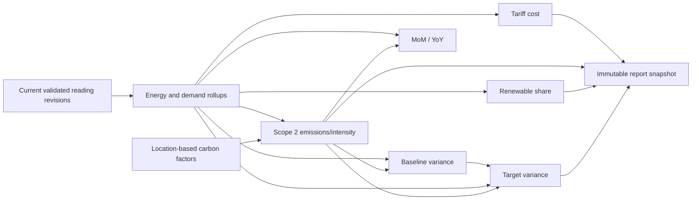

# Enerlytics Deterministic Calculation Specification

- Status: Approved calculation baseline; no code implemented
- Version: 1.0
- Date: 2026-09-20
- Initial carbon method: Location-based Scope 2
- Governing sources: `docs/PRODUCT_REQUIREMENTS.md`, `docs/DATA_MODEL.md`, `docs/EVENT_ARCHITECTURE.md`

## 1. Purpose

This specification defines reproducible formulas and failure behavior for Enerlytics energy, demand, tariff, carbon, intensity, baseline, target, and period-comparison calculations. An implementation conforms only when the same versioned inputs, configuration, timezone rules, precision, and algorithm version produce the same outputs and provenance.

Calculations must never silently convert missing data into zero, stale data into current data, negative import into valid consumption, or incomplete carbon factors into zero emissions.

## 2. Canonical Quantities and Units

| Quantity | Canonical unit | Symbol | Persisted precision | Notes |
|---|---|---|---|---|
| Electrical energy | kilowatt-hour | kWh | `numeric(24,9)` | Import, export, and generation are separate nonnegative quantities |
| Active power / demand | kilowatt | kW | `numeric(20,6)` | Demand is power averaged over a declared interval unless explicitly instantaneous |
| Voltage | volt | V | `numeric(20,6)` | RMS semantics must be identified by meter/channel configuration |
| Current | ampere | A | `numeric(20,6)` | RMS semantics must be identified |
| Power factor | dimensionless ratio | PF | `numeric(12,9)` | Range −1 to 1; sign convention is configured |
| Frequency | hertz | Hz | `numeric(12,6)` | Diagnostic quantity |
| Carbon emissions | kilogram CO2 equivalent | kgCO2e | `numeric(24,9)` | Store CO2-equivalent, not ambiguous “carbon” mass |
| Carbon intensity | kilogram CO2 equivalent per kWh | kgCO2e/kWh | `numeric(20,9)` | Provider factors may arrive as gCO2e/kWh and are normalized |
| Floor area | square metre | m² | `numeric(18,4)` | ft² converts exactly by defined decimal factor |
| Monetary amount | ISO currency major unit | e.g. EUR | `numeric(20,6)` | Currency code is mandatory; no implicit conversion |
| Tariff rate | currency per rate unit | e.g. EUR/kWh | `numeric(20,9)` | Rate unit and currency are mandatory |
| Percentage | percentage points | % | `numeric(9,6)` | 25% is stored/displayed as 25.000000; ratio form is 0.25 |
| Coverage | dimensionless ratio | — | `numeric(9,6)` | 0 through 1 |
| Duration | seconds internally; hours as decimal for formulas | s, h | integer seconds / high-precision decimal | 1 h = 3600 s |

### 2.1 Exact conversion constants

Use decimal constants; do not route authoritative values through binary floating point.

| Conversion | Exact rule used by Enerlytics |
|---|---|
| Wh → kWh | divide by 1000 |
| MWh → kWh | multiply by 1000 |
| W → kW | divide by 1000 |
| MW → kW | multiply by 1000 |
| gCO2e → kgCO2e | divide by 1000 |
| kgCO2e → tCO2e | divide by 1000 |
| tCO2e → kgCO2e | multiply by 1000 |
| gCO2e/kWh → kgCO2e/kWh | divide by 1000 |
| kgCO2e/MWh → kgCO2e/kWh | divide by 1000 |
| lb → kg | multiply by 0.45359237 only when an approved provider contract requires it |
| ft² → m² | multiply by 0.09290304 |
| minutes → hours | divide by 60 |
| seconds → hours | divide by 3600 |

For balanced three-phase power, use the versioned decimal constant `SQRT_3 = 1.732050807568877293527446341505872`, not a platform-dependent binary approximation.

## 3. Precision and Rounding Policy

1. Parse source decimals exactly into arbitrary-precision decimal values.
2. Normalize units before aggregation or multiplication.
3. Use at least 34 significant decimal digits for intermediate arithmetic (equivalent intent to IEEE 754 Decimal128) and `HALF_EVEN` only where a nonterminating division or explicit scale requires rounding.
4. Do not round individual readings before summation beyond validated source/canonical precision.
5. Persist final energy at 9 decimal places, demand at 6, emissions at 9, carbon intensity at 9, percentages at 6, tariff rates at 9, and monetary line/total calculations at 6 unless a future approved jurisdiction-specific rule is versioned.
6. Cost line items are calculated from unrounded quantities/rates, then persisted at 6 decimal places. Invoice/display currency rounding uses the ISO currency minor-unit scale after line-item/tax sequencing. Both persisted calculation amount and displayed amount are retained or reproducible.
7. Convert kgCO2e to tCO2e only for presentation/reporting after summation; do not sum independently rounded tonne values.
8. Every calculation stores `algorithmCode`, `algorithmVersion`, `roundingMode`, output scale, input versions/range, timezone, source watermark, coverage, quality, and calculation time.

Unless a tariff/regulation explicitly mandates another policy, this document uses `HALF_EVEN`. Such an exception must be a versioned calculation method, not a runtime guess.

## 4. Eligibility, Coverage, and Quality

### 4.1 Reading eligibility

An input is eligible when it is the current non-superseded revision, belongs to the authorized tenant/scope, has a supported unit/kind, falls in the half-open calculation period, and has quality allowed by the calculation policy.

- `VALID`: eligible.
- `ESTIMATED`: eligible only when the calculation policy permits it; estimated contribution and count remain disclosed.
- `LATE`: eligible after persistence; it triggers a revised calculation.
- `INVALID`: never eligible.
- `DUPLICATE_REJECTED`: no second business fact; never summed.
- `MISSING`: absence, not a reading and never interpreted as zero.

### 4.2 Coverage

For regular interval channels:

```text
coverage = eligible_expected_duration_seconds / total_expected_duration_seconds
```

When all intervals have equal duration this is equivalent to eligible interval count / expected interval count. Duration weighting is authoritative because DST boundaries, partial intervals, and mixed supported intervals can make counts misleading.

Valid and estimated coverage are also reported separately:

```text
validCoverage     = valid_duration / expected_duration
estimatedCoverage = estimated_duration / expected_duration
missingCoverage   = 1 - validCoverage - estimatedCoverage
```

Clamp only insignificant decimal residue caused by division at the final scale; material values outside 0..1 indicate an error.

### 4.3 Result status

- `COMPLETE`: coverage meets the approved threshold and no blocking input condition exists.
- `PARTIAL`: a value is computed from eligible inputs but coverage is below complete threshold; it must not be presented as a complete period total.
- `ESTIMATED`: estimated inputs materially contribute according to policy.
- `UNAVAILABLE`: no defensible value can be computed.
- `INVALID`: conflicting units/configuration or invariant failure.

The exact minimum coverage threshold is product/configuration input and part of the algorithm version. Examples use 100% for authoritative period totals unless stated otherwise.

## 5. Shared Time and Boundary Rules

1. Store instants in UTC and define periods as half-open `[start, end)`.
2. Calendar hour/day/month/year boundaries are constructed in the site's effective IANA timezone, then converted to UTC.
3. On a spring DST transition, a local day may be 23 hours; on fall transition it may be 25 hours. Expected intervals derive from actual elapsed instants, not an assumed 24 hours.
4. Repeated local clock labels during fall-back remain distinct because their UTC offsets/instants differ.
5. Nonexistent local times during spring-forward cannot be assigned readings. Tariff schedules resolve through the timezone rules described in §13.
6. Organization/portfolio calculations preserve each site's local boundaries unless the report explicitly selects one reporting timezone and documents that choice.
7. Month-over-month and year-over-year compare equivalent site-local calendar periods. A partial current period is compared with the same elapsed local-period fraction and labeled MTD/YTD; it is not compared silently with a complete prior period.

## 6. Formula Specifications

Each formula below is normative. Symbols are local to the formula.

### 6.1 Energy Consumption

**Definition:** Eligible imported electrical energy consumed over period `P`. Import, export, and generation are reported separately; “net energy” is a separately labeled derived metric.

**Inputs**

- Current eligible interval-energy readings `E_i` in kWh, or configured interval-average power `P_i` in kW with exact duration `Δt_i` in hours.
- Scope topology/allocation version to prevent parent/submeter or multi-zone double counting.
- Period `[start, end)`, timezone, quality policy, and expected intervals.

**Formula**

For interval-energy channels:

```text
Consumption_kWh = Σ E_i
```

For configured interval-average power channels only:

```text
E_i_kWh = P_i_kW × Δt_i_hours
Consumption_kWh = Σ E_i_kWh
```

Do not integrate sporadic instantaneous power samples unless a separately approved interpolation/resampling method is versioned.

Optional separately labeled net exchange:

```text
NetImport_kWh = Import_kWh - Export_kWh
```

Net import may be negative, but raw import/export remain nonnegative and carbon/cost methods decide eligibility explicitly.

**Output and unit:** consumption in kWh; persisted `numeric(24,9)`.

**Precision and rounding:** Sum normalized unrounded decimals at 34-digit intermediate precision; round final kWh to 9 decimals using `HALF_EVEN`.

**Failure behavior:** If units cannot be converted, topology is ambiguous, or no eligible input exists, return `INVALID`/`UNAVAILABLE`. With missing intervals, return `PARTIAL` plus coverage; never fill zero. Estimated readings produce `ESTIMATED` status when policy permits.

**Worked example**

Four 15-minute import readings are 12.125, 12.500, 11.875, and 13.000 kWh:

```text
Consumption = 12.125 + 12.500 + 11.875 + 13.000
            = 49.500 kWh
Persisted   = 49.500000000 kWh
```

If instead four interval-average powers are 48.5, 50, 47.5, and 52 kW:

```text
Consumption = (48.5 + 50 + 47.5 + 52) × 0.25 h
            = 49.500 kWh
```

### 6.2 Instantaneous Demand

**Definition:** Active power at one measurement instant. It is operational demand, not billing interval demand.

**Inputs**

Preferred: directly measured active power `P_measured` in kW with timestamp/quality.

Derived only when channel configuration explicitly identifies compatible RMS values and phase topology:

- Single phase: voltage `V` in volts, current `I` in amperes, power factor `PF`.
- Balanced three phase: line-to-line voltage `V_LL`, line current `I`, `PF`.

**Formula**

```text
Direct:       P_kW = P_measured_kW
Single phase: P_kW = V × I × PF / 1000
Three phase:  P_kW = SQRT_3 × V_LL × I × PF / 1000
```

**Output and unit:** instantaneous active power in kW; `numeric(20,6)`.

**Precision and rounding:** 34-digit intermediate; final 6 decimals `HALF_EVEN`. Direct meter power is preferred over recomputation and retains its source precision.

**Failure behavior:** Do not derive when phases are unbalanced, voltage basis is unknown, PF/current/voltage timestamps are not aligned within configured tolerance, PF is outside allowed range, or any input is missing/invalid. Return `UNAVAILABLE`, not zero. Negative direct power is allowed only for a channel whose direction convention defines export; otherwise invalid.

**Worked example**

Balanced three-phase load with 400 V line-to-line, 100 A, PF 0.90:

```text
P = 1.732050807568877... × 400 × 100 × 0.90 / 1000
  = 62.353829072... kW
  = 62.353829 kW
```

### 6.3 Peak Demand

**Definition:** Maximum eligible average demand over the configured demand interval within period `P`; not maximum arbitrary instantaneous sample.

**Inputs**

- Eligible demand intervals `(D_i, intervalStart_i, intervalEnd_i)` in kW.
- Required demand interval/window (for example 15 minutes).
- Period, coverage threshold, and tie policy.

**Formula**

```text
PeakDemand_kW = max(D_i)
```

If demand must be derived from interval energy:

```text
D_i_kW = E_i_kWh / Δt_i_hours
```

Only intervals exactly matching or deterministically resampled to the configured demand window are eligible.

**Output and unit:** peak demand in kW (`numeric(20,6)`), peak interval and duration.

**Precision and rounding:** Compare unrounded canonical demand; round displayed/persisted result to 6 decimals. For exact ties after canonical precision, choose earliest `intervalStart` in UTC as the primary peak and retain all ties for top-N analytics.

**Failure behavior:** No eligible interval → `UNAVAILABLE`. Missing candidate windows or coverage below policy → `PARTIAL`; do not call it definitive billing peak. Mixed/incompatible window sizes without approved resampling → `INVALID`.

**Worked example**

15-minute energies: 18.0, 21.5, 20.0, 21.5 kWh.

```text
Demand values = E / 0.25 h = 72, 86, 80, 86 kW
Peak demand   = 86.000000 kW
```

The second and fourth intervals tie; the earlier UTC interval is the primary peak.

### 6.4 Average Demand

**Definition:** Time-weighted average active demand over observed eligible duration. For complete coverage it also equals total energy divided by total elapsed period hours.

**Inputs**

- Eligible interval-average demand `D_i` and durations `Δt_i`, or eligible energy and elapsed duration.
- Coverage and quality.

**Formula**

```text
AverageDemand_kW = Σ(D_i × Δt_i_hours) / Σ(Δt_i_hours)
```

For complete coverage:

```text
AverageDemand_kW = Consumption_kWh / PeriodDuration_hours
```

**Output and unit:** kW, `numeric(20,6)`.

**Precision and rounding:** 34-digit division, final 6 decimals `HALF_EVEN`.

**Failure behavior:** Zero observed duration → `UNAVAILABLE`. Missing periods produce average over observed duration only and `PARTIAL`; label it “observed average,” not whole-period average. Never divide partial energy by full-period duration unless an explicit estimation method is applied and labeled.

**Worked example**

20 kW for 0.5 h, 40 kW for 1.0 h, 30 kW for 0.5 h:

```text
Average = (20×0.5 + 40×1.0 + 30×0.5) / (0.5+1.0+0.5)
        = 65 kWh / 2 h
        = 32.500000 kW
```

### 6.5 Consumption Deltas

**Definition:** Energy increment derived from a cumulative register. Interval-energy readings do not use this formula.

**Inputs**

- Previous/current cumulative register values `R_prev`, `R_curr` in normalized kWh.
- Timestamps, meter identity/configuration version, reset/replacement marker, optional exclusive rollover modulus `M`.

**Formula**

Normal monotonic register:

```text
ΔE = R_curr - R_prev, when R_curr >= R_prev
```

Confirmed rollover for a register ranging `[0, M)`:

```text
ΔE = (M - R_prev) + R_curr
```

Confirmed reset to zero with authoritative reset reading/time:

```text
ΔE after reset = R_curr - R_reset
```

No delta is inferred across meter replacement unless an approved boundary reading/allocation exists.

**Output and unit:** incremental kWh, `numeric(24,9)` plus delta quality/reason.

**Precision and rounding:** Normalize both registers before subtraction; final 9 decimals `HALF_EVEN`.

**Failure behavior:** An unexplained negative delta is `INVALID_RESET_OR_ROLLOVER`; do not use absolute value and do not clamp to zero. Missing boundary, changed multiplier/unit, or implausible delta beyond configured physical maximum yields `UNAVAILABLE`/quarantine.

**Worked example — normal**

```text
R_prev = 10,250.500 kWh
R_curr = 10,312.875 kWh
ΔE     = 62.375000000 kWh
```

**Worked example — confirmed rollover**

Register modulus `M = 100,000 kWh`, previous 99,995 kWh, current 7 kWh:

```text
ΔE = (100,000 - 99,995) + 7 = 12.000000000 kWh
```

### 6.6 Cost

**Definition:** Sum of versioned tariff line items over a billing period. This base formula supports energy, demand, fixed, tax/surcharge, and explicit credit lines.

**Inputs**

- Eligible energy by tariff band `E_b` in kWh.
- Qualifying billing peak `D_peak` in kW.
- Energy rates `r_b` in currency/kWh.
- Demand rate `r_d` in currency/kW/period.
- Fixed charges `F_j`, taxes/surcharges/credits, tariff version, currency, coverage.

**Formula**

```text
EnergyCharge_b = E_b × r_b
DemandCharge   = D_peak × r_d
Subtotal       = Σ EnergyCharge_b + DemandCharge + Σ FixedCharges + Σ Surcharges + Σ Credits
Tax_k          = TaxBase_k × taxRate_k / 100
Total          = Subtotal + Σ Tax_k
```

Credits are explicit negative line items only when tariff rules permit them. Tax base/order is configured by immutable tariff version.

**Output and unit:** ISO currency major unit, persisted `numeric(20,6)`, plus currency and line items.

**Precision and rounding:** Multiply unrounded canonical quantities by 9-decimal rates using 34-digit precision. Persist each line at 6 decimals `HALF_EVEN`; compute subtotal/tax in the tariff-mandated line sequence. Presentation/invoice total rounds to ISO currency minor digits (e.g. EUR 2) only after persisted total. No silent FX conversion.

**Failure behavior:** Missing/ambiguous tariff/rate, currency mismatch, missing required peak, unsupported rule, or insufficient coverage returns no authoritative total. A partial estimate is allowed only under an explicitly named estimation policy and remains `PARTIAL`/`ESTIMATED`.

**Worked example**

```text
Energy:      1,250 kWh × 0.1845 EUR/kWh = 230.625000 EUR
Demand:      86 kW × 12.50 EUR/kW       = 1,075.000000 EUR
Fixed:                                     25.000000 EUR
Subtotal:                                1,330.625000 EUR
Tax 5%:                                  66.531250 EUR
Total persisted:                        1,397.156250 EUR
Displayed EUR total:                    1,397.16 EUR
```

### 6.7 Time-of-Use Tariffs

**Definition:** Deterministic allocation of energy intervals to effective tariff bands using tariff-local calendar rules.

**Inputs**

- Interval energy `E_i`, `[start_i,end_i)` UTC.
- Immutable tariff version and rate-band calendar.
- Tariff billing IANA timezone, holidays, seasons, day types, and rate priorities.

**Formula**

For an interval wholly in band `b`:

```text
Charge_i = E_i × r_b
```

If interval overlaps multiple bands and the source provides no finer readings, split energy uniformly by elapsed overlap duration only when tariff policy explicitly permits proportional splitting:

```text
E_i,b = E_i × overlapSeconds(i,b) / intervalSeconds(i)
Charge_i = Σ_b(E_i,b × r_b)
```

The allocated energies must reconcile exactly to `E_i` before final rounding; assign any final 9-decimal residue deterministically to the longest overlap, then earliest band ID.

**Output and unit:** energy per band in kWh and charges in tariff currency.

**Precision and rounding:** Duration ratios use 34-digit precision; energy allocations 9 decimals after reconciliation; charge line items 6 decimals; final cost follows §6.6.

**Failure behavior:** No matching band, overlapping same-priority bands, invalid local schedule, ambiguous tariff version, or unsupported split policy blocks authoritative cost. Do not choose a rate arbitrarily.

**Worked example**

A 30-minute interval from 16:45–17:15 local contains 30 kWh. Off-peak ends at 17:00; peak starts at 17:00. Rates are 0.10 and 0.25 EUR/kWh.

```text
Off-peak overlap = 15 min; E_off = 30 × 15/30 = 15 kWh
Peak overlap     = 15 min; E_peak = 30 × 15/30 = 15 kWh
Charge           = 15×0.10 + 15×0.25
                 = 1.50 + 3.75
                 = 5.250000 EUR
```

### 6.8 Carbon Emissions — Location-Based Scope 2

**Definition:** CO2-equivalent emissions from eligible imported grid electricity multiplied by the applicable location-based grid emission factor for the same region/time.

**Inputs**

- Imported electricity intervals `E_i` in kWh.
- Applicable location-based factors `CI_i` normalized to kgCO2e/kWh, with region, effective interval, source/version, freshness, and quality.
- Energy and factor coverage.

**Formula**

```text
Emission_i_kgCO2e = E_i_kWh × CI_i_kgCO2e_per_kWh
Total_kgCO2e      = Σ Emission_i_kgCO2e
Total_tCO2e       = Total_kgCO2e / 1000
```

If a provider factor is in gCO2e/kWh:

```text
CI_kgCO2e/kWh = CI_gCO2e/kWh / 1000
```

If factor granularity is coarser than energy, apply the factor only across its explicit effective interval. If energy spans factor boundaries, split by energy intervals or deterministic overlap allocation; never use one factor beyond its validity silently.

**Output and unit:** kgCO2e (`numeric(24,9)`); tCO2e is presentation/report output derived after summation.

**Precision and rounding:** Normalize factors to 9 decimal places only after exact conversion; multiply with 34-digit intermediate; sum unrounded emissions; final kgCO2e 9 decimals `HALF_EVEN`; tCO2e 9 decimals for report unless report policy specifies display precision.

**Failure behavior:** Missing factor for any material energy interval, incompatible unit/region/method, stale factor beyond approved policy, or incomplete energy makes the total `PARTIAL` or `UNAVAILABLE` according to coverage policy. Never substitute zero. An explicitly approved fallback factor is versioned, labeled, and contributes to fallback coverage.

**Worked example**

Imported energy is 1,250 kWh. Factor is 420 gCO2e/kWh.

```text
CI = 420 / 1000 = 0.420000000 kgCO2e/kWh
Emissions = 1,250 × 0.420000000
          = 525.000000000 kgCO2e
          = 0.525000000 tCO2e
```

### 6.9 Carbon Intensity

**Definition:** Energy-weighted realized location-based carbon intensity for a boundary/period. A source factor is also a carbon intensity, but portfolio/period intensity must be weighted by electricity, not averaged arithmetically across time/sites.

**Inputs**

- Location-based emissions `C_i` in kgCO2e.
- Corresponding eligible imported grid electricity `E_i` in kWh.

**Formula**

```text
RealizedIntensity_kgCO2e_per_kWh = Σ C_i / Σ E_i
RealizedIntensity_gCO2e_per_kWh  = RealizedIntensity_kgCO2e_per_kWh × 1000
```

Equivalent weighted factor form:

```text
Σ(E_i × CI_i) / Σ E_i
```

**Output and unit:** canonical kgCO2e/kWh (`numeric(20,9)`); optional display gCO2e/kWh.

**Precision and rounding:** Sum unrounded energy/emissions, divide at 34-digit precision, final intensity 9 decimals `HALF_EVEN`.

**Failure behavior:** Zero/missing denominator → `UNAVAILABLE`, not zero. Emission/energy boundaries or coverage must match. Partial factor coverage yields partial intensity and disclosed covered energy; it cannot be labeled whole-period intensity.

**Worked example**

100 kWh at 0.40 kgCO2e/kWh and 300 kWh at 0.20:

```text
Emissions = 100×0.40 + 300×0.20 = 100 kgCO2e
Intensity = 100 / 400 = 0.250000000 kgCO2e/kWh
          = 250.000000000 gCO2e/kWh
```

An arithmetic factor average `(0.40+0.20)/2 = 0.30` is incorrect.

### 6.10 Renewable-Energy Share

**Definition:** Percentage of eligible consumed electricity supported by eligible renewable supply within the same boundary and period.

**Inputs**

- Total eligible consumed electricity `E_total` in kWh.
- Eligible onsite renewable energy consumed behind the boundary `E_onsite_consumed`.
- Eligible renewable supply/evidence allocation `E_contractual` where MVP configuration permits it.
- Export, storage, evidence, validity, and allocation records.

**Formula**

```text
RenewableEligible = E_onsite_consumed + E_contractual - E_overlap
RenewableApplied  = min(RenewableEligible, E_total)
RenewableShare_%  = RenewableApplied / E_total × 100
```

`E_overlap` removes double claims. Onsite generation exported outside the reporting boundary is excluded from onsite consumed energy unless a separate accounting policy applies.

**Output and unit:** percentage points (`numeric(9,6)`) plus numerator/denominator kWh and source categories.

**Precision and rounding:** Energy 9 decimals; division at 34-digit precision; final percentage 6 decimals `HALF_EVEN`.

**Failure behavior:** `E_total = 0` → `UNAVAILABLE`/not applicable, not 0%. Missing/incomplete load or conflicting/expired/over-allocated evidence yields `PARTIAL` or `UNAVAILABLE`. Over-procurement does not produce >100%; report excess separately.

**Worked example**

Site consumption is 1,000 kWh. Onsite solar consumed is 220 kWh and eligible renewable supply allocation is 180 kWh with no overlap.

```text
RenewableApplied = 220 + 180 = 400 kWh
Share = 400 / 1,000 × 100 = 40.000000%
```

If eligible evidence totaled 1,100 kWh, applied renewable remains 1,000 kWh and share 100%; excess 100 kWh is separate.

### 6.11 Energy Intensity per Square Metre

**Definition:** Consumption normalized by effective floor area for the same facility boundary and period.

**Inputs**

- Eligible consumption `E` in kWh.
- Effective floor area `A` in m², versioned/effective for period.

**Formula**

```text
EnergyIntensity = E_kWh / A_m2
```

If source area is ft²:

```text
A_m2 = A_ft2 × 0.09290304
```

**Output and unit:** kWh/m², `numeric(24,9)`.

**Precision and rounding:** Area retained at least 4 decimals; division at 34-digit precision; final 9 decimals `HALF_EVEN`.

**Failure behavior:** Missing, zero, negative, overlapping, or boundary-incompatible area → `UNAVAILABLE`. If floor area changes within period, split energy by effective area intervals only when energy can be aligned; otherwise use a versioned reporting-area policy and label it.

**Worked example**

Consumption 125,000 kWh; area 5,000 m²:

```text
Intensity = 125,000 / 5,000
          = 25.000000000 kWh/m²
```

### 6.12 Carbon Intensity per Square Metre

**Definition:** Location-based Scope 2 emissions normalized by effective floor area for the same boundary/period.

**Inputs**

- Eligible location-based emissions `C` in kgCO2e.
- Effective area `A` in m².

**Formula**

```text
CarbonAreaIntensity = C_kgCO2e / A_m2
```

**Output and unit:** kgCO2e/m², `numeric(24,9)`; optional tCO2e/m² is divided by 1000 after calculation.

**Precision and rounding:** 34-digit division; final 9 decimals `HALF_EVEN`.

**Failure behavior:** Propagate carbon incomplete/unavailable status or invalid area. Do not normalize partial emissions and present as complete. Coverage for energy/factor and area version are disclosed.

**Worked example**

525 kgCO2e over 5,000 m²:

```text
Intensity = 525 / 5,000
          = 0.105000000 kgCO2e/m²
```

### 6.13 Baseline Variance

**Definition:** Difference between actual and approved versioned baseline for the same scope, metric, unit, granularity, and period.

**Inputs**

- Actual value `A`.
- Baseline expected value `B`.
- Compatible unit/method/version and matched period.

**Formula**

```text
AbsoluteVariance = A - B
PercentVariance  = (A - B) / B × 100
```

For consumption/carbon/cost, positive means actual is above baseline; negative means below baseline. Savings may be reported separately as `B - A`, clearly labeled.

**Output and unit:** absolute variance in metric unit; percentage points to 6 decimals.

**Precision and rounding:** Inputs retain native canonical scale; subtraction at full precision; absolute result at metric scale; percent 6 decimals `HALF_EVEN`.

**Failure behavior:** Baseline missing/inactive/incompatible or actual incomplete below policy → `UNAVAILABLE`/`PARTIAL`. If `B = 0`, absolute variance is valid but percentage is `UNDEFINED`, not zero or infinity.

**Worked example**

Actual consumption 92,000 kWh; baseline 100,000 kWh:

```text
AbsoluteVariance = 92,000 - 100,000 = -8,000.000000000 kWh
PercentVariance  = -8,000 / 100,000 × 100 = -8.000000%
Savings          = 8,000 kWh (separately labeled)
```

### 6.14 Target Variance

**Definition:** Difference from the target trajectory value for a period, with explicit target direction.

**Inputs**

- Actual value `A`.
- Target trajectory value `T`.
- Direction `AT_MOST` (reduction/ceiling) or `AT_LEAST` (renewable/minimum).

**Formula**

Raw variance:

```text
RawVariance = A - T
RawPercent  = (A - T) / T × 100
```

Direction-aware favorable gap, where positive is favorable:

```text
AT_MOST:  FavorableGap = T - A
AT_LEAST: FavorableGap = A - T
```

On track:

```text
AT_MOST:  A <= T
AT_LEAST: A >= T
```

**Output and unit:** raw/favorable absolute metric variance, percentage points, and deterministic on-track status.

**Precision and rounding:** Metric scale for absolute values; percent 6 decimals `HALF_EVEN`.

**Failure behavior:** Missing target trajectory, incompatible scope/unit/method, or incomplete actual gives `DATA_INCOMPLETE`, not falsely on/off track. If `T = 0`, raw percentage is undefined; absolute/on-track may remain valid.

**Worked example — reduction target**

Actual carbon 480 kgCO2e; target ceiling 500 kgCO2e:

```text
RawVariance  = 480 - 500 = -20.000000000 kgCO2e
RawPercent   = -20 / 500 × 100 = -4.000000%
FavorableGap = 500 - 480 = 20.000000000 kgCO2e
OnTrack      = true
```

### 6.15 Month-over-Month Change

**Definition:** Change between equivalent consecutive site-local calendar months or matched month-to-date windows.

**Inputs**

- Current month value `C` and previous month value `P` for same scope, metric, method, unit, coverage policy, and equivalent completeness.

**Formula**

```text
AbsoluteChange = C - P
PercentChange  = (C - P) / P × 100
```

**Output and unit:** absolute metric change and percentage points.

**Precision and rounding:** Absolute at metric scale; percent 6 decimals `HALF_EVEN`.

**Failure behavior:** Missing/incompatible month, insufficient coverage, or complete-versus-partial mismatch → `UNAVAILABLE` unless matched elapsed windows are explicitly calculated and labeled `MTD`. If `P = 0`, percent is undefined; absolute remains valid. Month lengths are not normalized unless a separate per-day intensity metric is requested.

**Worked example**

August consumption 110,000 kWh; September 99,000 kWh:

```text
AbsoluteChange = 99,000 - 110,000 = -11,000.000000000 kWh
PercentChange  = -11,000 / 110,000 × 100 = -10.000000%
```

### 6.16 Year-over-Year Change

**Definition:** Change between equivalent site-local calendar periods one year apart, using the same metric/method/boundary and matched completeness.

**Inputs**

- Current period value `C`.
- Prior-year equivalent value `Y`.
- Same scope, unit, method, local calendar semantics, and coverage policy.

**Formula**

```text
AbsoluteChange = C - Y
PercentChange  = (C - Y) / Y × 100
```

**Output and unit:** absolute metric change and percentage points.

**Precision and rounding:** Absolute at metric scale; percent 6 decimals `HALF_EVEN`.

**Failure behavior:** Missing/incompatible prior year, boundary/configuration change without reconciliation, or coverage mismatch → `UNAVAILABLE`/`PARTIAL`. For YTD, compare the same local elapsed boundary, including leap-day policy. If prior value is zero, percentage is undefined.

**Worked example**

September 2025 emissions 600 kgCO2e; September 2026 emissions 525 kgCO2e:

```text
AbsoluteChange = 525 - 600 = -75.000000000 kgCO2e
PercentChange  = -75 / 600 × 100 = -12.500000%
```

## 7. Tariff Boundary and Change Rules

1. Resolve tariff by site/meter, instant, priority, and immutable version. Exactly one applicable rule set is required for each charge context.
2. A mid-period tariff change splits energy/demand/fixed-charge applicability at the exact effective instant. The billing result retains every tariff version used.
3. Time-of-use schedules are interpreted in the tariff's IANA billing timezone, not browser timezone.
4. During fall-back, both repeated local intervals receive the rate defined for that local wall-clock/day type unless the tariff contract distinguishes offset/sequence. Both physical intervals are charged once.
5. During spring-forward, nonexistent local intervals generate no expected energy. Fixed schedules do not fabricate an hour.
6. An interval crossing a tariff boundary is split by actual elapsed seconds only under an approved uniform-within-interval policy; otherwise finer telemetry is required and cost is unavailable.
7. Demand charges use the tariff-defined demand window and qualifying peak. Do not substitute instantaneous peak.
8. Fixed charges spanning a tariff change follow the tariff's explicit proration rule. No default proration is assumed.
9. Tariff corrections produce a new tariff/calculation version and do not rewrite completed report snapshots.

## 8. Carbon Factor Selection and Scope 2 Design

### 8.1 Location-based MVP

For each energy interval, select the factor satisfying:

- method is `LOCATION_BASED`;
- factor grid region equals the site's effective grid region;
- factor effective interval contains the energy interval instant/range;
- factor status is approved/valid;
- provider/fallback priority is deterministic and versioned;
- factor freshness is within approved policy.

If energy spans multiple factor intervals, align/split at factor boundaries. Store factor ID/version/value/unit with each carbon result.

### 8.2 Stale factors

- “Stale” means retrieval/publication age exceeds policy, not merely that the factor has coarse granularity.
- Within an explicitly approved grace/fallback policy, the last valid factor may be used with status `FALLBACK_STALE`, factor age, reason, and separate fallback coverage.
- Beyond policy, carbon is `UNAVAILABLE` or `PARTIAL`; zero is prohibited.
- A revised historical factor triggers a versioned recalculation according to governance. Prior reports remain immutable.

### 8.3 Provider data missing

Apply only an approved hierarchy, for example primary regional factor → approved national annual factor. Every fallback has its own factor record/provenance and must be visible. If no approved factor applies, persist incomplete calculation status and do not emit a calculated result.

### 8.4 Future market-based Scope 2

Market-based accounting is a separate calculation method and result series. The architecture must add, without changing location-based history:

- supplier-specific emission factors;
- contractual instrument/certificate quantity, geography, technology, vintage, and validity;
- allocation and retirement to prevent double claims;
- residual-mix factor for unmatched load;
- method hierarchy and evidence quality;
- dual reporting of location-based and market-based Scope 2.

Conceptual future formula:

```text
MarketBased = Σ(matched_energy × instrument_or_supplier_factor)
            + unmatched_energy × residual_mix_factor
```

No certificate or renewable claim automatically implies zero factor unless the approved market-based method and evidence explicitly establish it. Avoided emissions are a separate metric, never subtracted from location-based Scope 2.

## 9. Telemetry Edge-Case Policy

### Missing readings

- Do not create zero readings.
- Compute duration-based coverage and missing counts.
- Return partial/unavailable according to threshold.
- Estimation requires a named/versioned method and emits estimated quality.

### Meter resets and rollovers

- Detect through explicit device event/configuration, validated modulus, or approved reset workflow.
- Apply §6.5 only with evidence.
- Unexplained negative register delta is invalid and quarantined.
- Meter replacement starts a new lineage; no cross-meter delta without boundary evidence.

### Duplicate readings

- Source-event and consumer inbox uniqueness produce one business effect.
- Same event ID/same fingerprint is a duplicate metric, not additional energy.
- Same event ID/different fingerprint is an integrity conflict.
- Same interval/new authorized correction creates a higher revision and bounded recalculation.

### Negative readings

- Negative import interval energy is invalid.
- Export/generation use separate nonnegative direction channels.
- Net import may be negative only as a derived, explicitly labeled value.
- Negative power is permitted only under a configured sign convention; normalize to direction before accounting.
- Cost credits and exports use explicit tariff line types, not accidental negative consumption.

### Estimated readings

- Retain method/version, reason, and source linkage.
- Include only when calculation policy permits.
- Track valid and estimated contribution/coverage separately.
- Results with material estimated input are labeled `ESTIMATED`; thresholds for “material” are versioned policy.

### Late-arriving telemetry

- Persist valid late facts as revisions/current readings according to event specification.
- Recompute affected hour, local day, local month, cost, carbon, baseline/target progress, anomalies, and alerts according to bounded correction policy.
- Store source watermark and calculation revision.
- Do not mutate completed report artifacts; a regenerated report is a new snapshot.
- Data beyond hot retention requires controlled archive/backfill workflow.

## 10. Timezone and DST Worked Examples

### 10.1 Spring-forward day

A site in `Europe/London` on the spring transition has a 23-hour local day. With hourly intervals:

```text
Expected duration = 23 h, not 24 h
Expected intervals = 23
Coverage with all 23 = 23/23 = 1.000000
```

No reading is fabricated for the nonexistent local hour.

### 10.2 Fall-back day

The fall transition has 25 elapsed hours. Two intervals can both display 01:00 local but have different UTC offsets and instants.

```text
Expected intervals = 25
Both repeated-hour readings are included once
Coverage with 24 readings = 24/25 = 0.960000
```

Tariff evaluation applies the contract's wall-clock rule to both unless it explicitly distinguishes them.

### 10.3 Site timezone change

A timezone configuration change is effective-dated. Historical periods retain the timezone version used at the time. A report cannot reinterpret old local days under the current timezone without creating a new explicitly transformed analysis.

## 11. Calculation Dependency and Revision Flow



A corrected input produces new downstream revisions. Superseded results remain traceable. A calculation only publishes an updated fact after result and outbox commit in the same local transaction.

## 12. Provenance Record

Every authoritative result must retain or resolve:

- organization, scope type/ID, and topology/allocation version;
- period start/end UTC, local period label, and effective IANA timezone;
- input reading/aggregate range, current revision IDs or reproducible watermark;
- expected/valid/estimated/missing duration/count and coverage;
- input units and conversion rules;
- algorithm code/version;
- decimal context, output scale, and rounding mode;
- tariff/factor/baseline/target versions as applicable;
- factor provider, region, effective interval, publication/retrieval time, freshness/fallback status;
- calculation run ID, created time, source watermark, revision, and superseded result ID;
- failure/incomplete reason codes;
- correlation/causation identifiers and audit actor/service.

## 13. Failure Codes

Stable machine-readable categories include:

- `NO_ELIGIBLE_INPUT`
- `INSUFFICIENT_COVERAGE`
- `INCOMPATIBLE_UNIT`
- `AMBIGUOUS_TOPOLOGY`
- `INVALID_INTERVAL`
- `UNEXPLAINED_REGISTER_RESET`
- `REGISTER_ROLLOVER_CONFIG_MISSING`
- `NEGATIVE_IMPORT_ENERGY`
- `TARIFF_NOT_FOUND`
- `TARIFF_OVERLAP`
- `TARIFF_RULE_UNSUPPORTED`
- `CURRENCY_MISMATCH`
- `CARBON_FACTOR_NOT_FOUND`
- `CARBON_FACTOR_STALE`
- `CARBON_FACTOR_UNIT_INVALID`
- `RENEWABLE_EVIDENCE_CONFLICT`
- `ZERO_DENOMINATOR`
- `BASELINE_INCOMPATIBLE`
- `TARGET_INCOMPATIBLE`
- `COMPARISON_PERIOD_INCOMPATIBLE`
- `AREA_MISSING_OR_INVALID`
- `CALCULATION_OVERFLOW`

Failures preserve prior valid results and generate no misleading zero replacement.

## 14. Golden Verification Examples

The implementation test suite must include at least:

1. Interval-energy and interval-power calculations yielding the same 49.5 kWh.
2. Single/three-phase instantaneous power with canonical constant.
3. Peak ties and earliest-UTC tie selection.
4. Unequal-duration time-weighted average demand.
5. Normal register delta, confirmed reset, confirmed rollover, and unexplained negative delta.
6. Flat, demand, fixed, tax, credit, tariff change, and TOU split reconciliation.
7. Carbon conversion across g/kWh, kg/kWh, kg/MWh, kg, and tonnes.
8. Energy-weighted carbon intensity versus incorrect arithmetic average.
9. Renewable evidence overlap, over-procurement, export, and zero denominator.
10. m² and ft² intensity conversion.
11. Baseline/target zero denominator and direction-aware status.
12. Complete, partial MTD/YTD, leap-year, 23-hour, and 25-hour comparisons.
13. Missing, estimated, duplicate, late, corrected, negative, and reset telemetry.
14. Stale/missing/revised carbon factors and labeled fallback.
15. Recalculation revision propagation while historical report snapshots remain unchanged.

## 15. Decisions Required Before Implementation

1. Minimum complete coverage and estimated-materiality thresholds per calculation/report.
2. Supported meter channel semantics, intervals, multiplier history, register modulus/reset evidence, and physical sanity ranges.
3. Approved interpolation/resampling methods, if any, for power and mixed intervals.
4. Demand interval/window and billing peak policies for initial markets.
5. Initial tariff complexity, tax rounding sequence, credits, fixed-charge proration, and currency display rules.
6. Initial countries/grid regions, factor granularity, freshness, fallback hierarchy, and provider revision policy.
7. Renewable supply/evidence types allowed in MVP and onsite generation/export/storage treatment.
8. Floor-area effective dating and mixed-use allocation policy.
9. Baseline methods, target trajectory methods, period-comparison completeness, and leap-day policy.
10. Late/correction windows, report regeneration policy, and recalculation service objectives.

These must be approved or encoded as versioned policies before implementation. They must never be hidden defaults.
