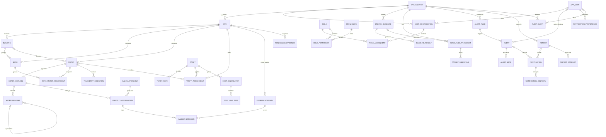
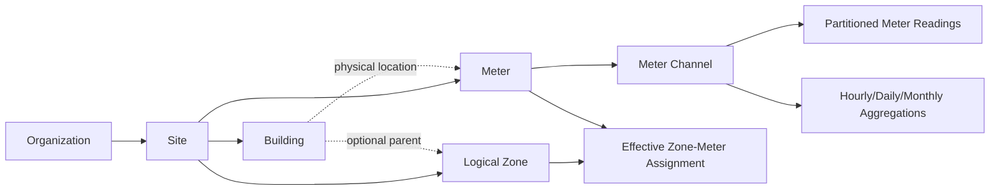

# Enerlytics Logical and Physical Data Model

- Status: Approved design baseline; no schema implemented
- Version: 2.0
- Date: 2026-09-20
- Database: PostgreSQL
- Sources of truth: `docs/PRODUCT_REQUIREMENTS.md`, `docs/ARCHITECTURE.md`

## 1. Design Principles

1. PostgreSQL is the authoritative business store. Kafka transports durable work/events; Redis is never authoritative.
2. Every tenant-owned row contains `organization_id`. Tenant filtering is explicit in application repositories and reinforced by composite keys/foreign keys; PostgreSQL Row-Level Security (RLS) is recommended as defense in depth after connection-pooling behavior is proven.
3. IDs are application-generated UUIDv7 values stored as PostgreSQL `uuid`. UUIDv7 provides time locality without exposing counts. External provider/source identifiers remain separate strings.
4. Persist instants as `timestamptz` in UTC. PostgreSQL stores `timestamptz` as an instant; database/session timezone must be UTC. Sites retain an IANA timezone (`Europe/London`, not an offset) for local periods and DST.
5. Mutable aggregate roots have `created_at`, `updated_at`, and integer `version` for optimistic locking. Immutable append-only facts have `created_at` but no misleading `updated_at`/version.
6. Use `numeric`, never `real`, `float`, or `double precision`, for authoritative energy, demand, carbon, tariffs, costs, percentages, and coordinates requiring deterministic precision.
7. Canonical storage units are kWh for electrical energy, kW for demand/power, kgCO2e for emissions, kgCO2e/kWh for grid intensity, and minor/major ISO currency amounts as documented per column. Original source unit/value are retained where needed for provenance.
8. Effective-dated/versioned facts are superseded, not overwritten. Calculations retain algorithm, input, factor, tariff, baseline, quality, and rounding provenance.
9. Soft deletion is not universal. Use lifecycle/status and `archived_at` only for user-facing configuration that must disappear from normal use while preserving references. Immutable telemetry, calculations, audit, alerts, and reports are retained/expired by policy, not soft-deleted.
10. Database constraints complement application validation. Enumerations are `text` with `CHECK` constraints initially, avoiding PostgreSQL enum migration friction; reference tables are used where values are configurable.
11. JSONB is allowed only for versioned, schema-validated provider payload metadata, rule configuration, report parameters, and audit snapshots. Query-critical and integrity-critical attributes remain typed columns.
12. High-volume telemetry and audit tables are time-partitioned. Foreign-key choices must not make partition retention operationally impossible.

## 2. Naming and Common Conventions

- Physical names use `snake_case`, singular table names, and explicit constraint/index names.
- UUID primary key column is `id`; tenant tables also have `UNIQUE (organization_id, id)` to support composite tenant-safe foreign keys.
- Mutable timestamps: `created_at timestamptz NOT NULL DEFAULT now()`, `updated_at timestamptz NOT NULL DEFAULT now()`. The application sets `updated_at`; a generic database trigger is optional but must not obscure bulk migration behavior.
- Optimistic lock: `version bigint NOT NULL DEFAULT 0 CHECK (version >= 0)` and updates use `WHERE id = ? AND version = ?`.
- Lifecycle instants (`activated_at`, `archived_at`, `acknowledged_at`) are UTC `timestamptz`.
- Effective ranges use half-open semantics `[effective_from, effective_to)`. Nullable end means open-ended. Overlap prevention uses `btree_gist` exclusion constraints where applicable.
- Codes and emails have normalized companion values. Uniqueness is defined on normalized values; display values retain user formatting.
- Monetary `amount numeric(20,6)` supports large portfolios and sub-cent tariff-derived amounts. Presented currency rounding happens by documented ISO/business policy.
- Energy `numeric(24,9)`, demand/power `numeric(20,6)`, emissions `numeric(24,9)`, carbon intensity `numeric(20,9)`, percentage/coverage `numeric(9,6)`, tariff rate `numeric(20,9)`, latitude/longitude `numeric(9,6)`.
- Quantity signs are domain-specific. Import consumption is nonnegative; export/generation are separate directions rather than negative import. Corrections create new revisions.

## 3. Schemas and Module Ownership

A single database may use module schemas to expose ownership while retaining one transaction boundary:

| Schema | Owner module | Main tables |
|---|---|---|
| `iam` | identity | app_user, role, permission, role_permission, user_organization, role_assignment |
| `org` | organization/site | organization, site, building, zone |
| `meter` | meter | meter, meter_channel, zone_meter_assignment, simulation_profile, simulation_run |
| `telemetry` | telemetry | telemetry_ingestion, telemetry_ingestion_key, meter_reading, meter_reading_rejection |
| `energy` | energy/analytics/forecast | calculation_run, energy_aggregation, energy_baseline, baseline_result, forecast_run, forecast_point, anomaly_event |
| `tariff` | tariff | tariff, tariff_rate, tariff_assignment, cost_calculation, cost_line_item, budget, budget_period |
| `carbon` | carbon | carbon_intensity, renewable_evidence, carbon_emission |
| `target` | energy/carbon | sustainability_target, target_milestone |
| `alert` | alert | alert_rule, alert, alert_note |
| `notify` | notification | notification_preference, notification, notification_delivery |
| `reporting` | reporting | report, report_artifact |
| `audit` | audit | audit_event |
| `integration` | integration/platform | provider_connection, outbox_event, inbox_event |

Schema ownership prevents casual cross-module access; it does not justify cross-module repository imports. Reporting uses governed projections/application queries.

## 4. ER Diagram

The diagram shows aggregate-level relationships; high-volume supporting/revision tables are expanded in table definitions.



### 4.1 Primary ownership hierarchy



Zones are logical reporting groups, not electrical topology. A meter has at most one physical site/building location but may have effective-dated membership in multiple zones. Aggregations must prevent double counting when composing site totals.

## 5. Physical Table Definitions

Definitions list essential columns and constraints. All tenant-owned foreign keys should prefer composite `(organization_id, referenced_id)` references to a matching unique key, preventing accidental cross-tenant linkage.

### 5.1 Identity and tenant

#### `org.organization`

| Column | Type | Rules |
|---|---|---|
| id | uuid | PK, UUIDv7 |
| organization_key | varchar(64) | normalized, globally unique, immutable |
| display_name | varchar(200) | nonblank |
| status | varchar(24) | `ACTIVE`, `SUSPENDED`, `ARCHIVED` |
| default_currency | char(3) | uppercase ISO 4217 |
| fiscal_year_start_month | smallint | 1–12 |
| locale | varchar(35) | BCP 47 |
| created_at / updated_at | timestamptz | required, UTC |
| archived_at | timestamptz | nullable; required when archived |
| version | bigint | optimistic lock |

Constraints/indexes: unique `organization_key`; check lifecycle/archived consistency. Organizations are never hard-deleted after business data exists.

#### `iam.app_user`

| Column | Type | Rules |
|---|---|---|
| id | uuid | PK |
| identity_provider | varchar(100) | issuer/provider key |
| external_subject | varchar(255) | immutable provider subject |
| email / normalized_email | varchar(320) | display/normalized |
| display_name | varchar(200) | required |
| status | varchar(24) | `INVITED`, `ACTIVE`, `SUSPENDED` |
| last_sign_in_at | timestamptz | nullable |
| created_at / updated_at | timestamptz | required |
| version | bigint | optimistic lock |

Constraints: unique `(identity_provider, external_subject)`; index on `normalized_email` but do not assume email is globally stable identity. No `organization_id`: one identity can belong to multiple tenants.

#### `iam.role`

`id uuid PK`, `code varchar(64)`, `name varchar(120)`, `description text`, `role_scope varchar(24)` (`PLATFORM`, `ORGANIZATION`, `SITE`, `BUILDING`), `system_role boolean`, `active boolean`, timestamps, `version`. System role code is unique; custom roles, if added in Phase 2, also carry nullable `organization_id` and use partial uniqueness per tenant. MVP seeds fixed roles through a versioned migration.

#### `iam.permission`

`id uuid PK`, `code varchar(100) UNIQUE`, `description text`, `created_at`. Permissions are immutable deployment reference data such as `meter.manage`; no update timestamp is needed for append-only seeded definitions.

#### `iam.role_permission`

`role_id uuid FK`, `permission_id uuid FK`, `created_at`; PK `(role_id, permission_id)`. Deleting seeded role mappings requires a reviewed migration; runtime cascading is not used.

#### `iam.user_organization`

| Column | Type | Rules |
|---|---|---|
| id | uuid | PK |
| organization_id | uuid | FK organization |
| user_id | uuid | FK app_user |
| membership_status | varchar(24) | `INVITED`, `ACTIVE`, `SUSPENDED`, `REVOKED` |
| invited_by_user_id | uuid | nullable FK app_user |
| invitation_expires_at / accepted_at / revoked_at | timestamptz | lifecycle |
| created_at / updated_at | timestamptz | required |
| version | bigint | optimistic lock |

Unique `(organization_id, user_id)` and `(organization_id, id)`. A partial/transactional invariant prevents removal of the last active organization administrator.

#### `iam.role_assignment`

`id uuid PK`, `organization_id`, `user_organization_id`, `role_id`, nullable `site_id`, nullable `building_id`, `valid_from`, `valid_to`, timestamps, `version`. Checks enforce scope matching role scope and `valid_to > valid_from`. Composite FKs guarantee membership/site/building belong to `organization_id`. Unique active assignment key `(organization_id, user_organization_id, role_id, site_id, building_id, valid_from)`. Platform roles use a separate platform assignment table or platform-only administrative configuration; nullable tenant IDs are not mixed into this tenant table.

### 5.2 Facilities and hierarchy

#### `org.site`

`id uuid PK`, `organization_id`, `site_code varchar(64)`, `name varchar(200)`, address fields, `iana_timezone varchar(100)`, `grid_region_code varchar(100)`, `currency char(3)`, `latitude numeric(9,6)`, `longitude numeric(9,6)`, `floor_area numeric(18,4)`, `floor_area_unit varchar(16)` (`M2`, `FT2`), `status`, `opened_on`, `closed_on`, `archived_at`, timestamps, `version`.

Constraints: unique `(organization_id, lower(site_code))`; latitude −90..90, longitude −180..180, floor area > 0, closed date not before opened date. IANA timezone validity is enforced against an application-maintained reference/test, as PostgreSQL cannot provide a stable FK to timezone catalog rows.

#### `org.building`

`id uuid PK`, `organization_id`, `site_id`, `building_code`, `name`, optional floor area/unit, `status`, `archived_at`, timestamps, `version`. Unique `(organization_id, site_id, lower(building_code))`; composite FK `(organization_id, site_id)`; positive area.

#### `org.zone`

`id uuid PK`, `organization_id`, `site_id`, nullable `building_id`, `zone_code`, `name`, `zone_type`, `status`, `archived_at`, timestamps, `version`. Unique `(organization_id, site_id, lower(zone_code))`; composite FKs enforce site/building tenant. A trigger or application/domain invariant verifies a building belongs to the same site. Zones do not recursively contain zones in MVP, avoiding hierarchy cycles.

### 5.3 Meter configuration and simulation

#### `meter.meter`

| Column | Type | Rules |
|---|---|---|
| id | uuid | PK |
| organization_id / site_id | uuid | tenant-safe FKs |
| building_id | uuid | nullable physical location |
| parent_meter_id | uuid | nullable for electrical hierarchy |
| meter_code / serial_number | varchar | code unique in tenant; serial optional |
| source_system / external_source_id | varchar | stable provider identity |
| meter_type | varchar(24) | `IMPORT`, `EXPORT`, `GENERATION`, `SUBMETER`, `VIRTUAL` |
| status | varchar(24) | `DRAFT`, `ACTIVE`, `INACTIVE`, `ARCHIVED` |
| interval_seconds | integer | positive, supported interval |
| multiplier | numeric(20,9) | > 0 |
| source_timezone | varchar(100) | nullable IANA zone for source interpretation |
| activated_at / deactivated_at / archived_at | timestamptz | lifecycle |
| created_at / updated_at / version | standard | mutable aggregate |

Constraints: unique `(organization_id, lower(meter_code))`; unique `(organization_id, source_system, external_source_id)` when external ID is present; parent cannot equal self; activation order valid. Parent cycle and same-site/tenant are enforced transactionally with recursive validation. Meter configuration affecting calculations is versioned through history/events or effective-dated replacement rather than rewriting historical meaning.

#### `meter.meter_channel`

`id uuid PK`, `organization_id`, `meter_id`, `channel_code`, `measurement_kind` (`ENERGY_INTERVAL`, `POWER_AVERAGE`, `REGISTER`, `VOLTAGE`, etc.), `direction` (`IMPORT`, `EXPORT`, `GENERATION`, `NET`), `canonical_unit`, `source_unit`, `interval_seconds`, `active_from`, `active_to`, timestamps, `version`. Unique `(organization_id, meter_id, lower(channel_code))`; supported unit/kind/direction combination checks; positive interval; tenant-safe FK.

Canonical MVP authoritative units are `KWH` for interval energy and `KW` for average demand. Electrical diagnostic channels may store appropriate canonical units but do not enter energy/carbon calculations without explicit conversion policy.

#### `meter.zone_meter_assignment`

`id uuid`, `organization_id`, `zone_id`, `meter_id`, `allocation_fraction numeric(9,6)` default 1, `effective_from`, `effective_to`, timestamps, `version`. Check `0 < allocation_fraction <= 1`; no unintended overlap per zone/meter; aggregate allocation across applicable zones must follow the configured reporting policy and not imply site-total summation.

#### `meter.simulation_profile`

`id uuid`, `organization_id`, `meter_id`, `name`, `seed bigint`, `base_load_kw numeric(20,6)`, `noise_fraction numeric(9,6)`, `interval_seconds`, versioned `profile_config jsonb`, `schema_version`, `status`, timestamps, `version`. Checks ensure nonnegative/bounded loads/noise and schema version. JSON schema validation occurs before persistence.

#### `meter.simulation_run`

`id uuid`, `organization_id`, `simulation_profile_id`, `status`, `requested_by_user_id`, `start_at`, nullable `end_at`, `last_generated_interval`, `created_at`, `updated_at`, `version`. Unique idempotency key may be stored for start commands. Runs are retained for provenance, not deleted with profiles.

### 5.4 Telemetry and readings

#### `telemetry.telemetry_ingestion`

Represents a request/batch, not each reading: `id uuid`, `organization_id`, `source_system`, `idempotency_key varchar(200)`, `received_at`, `status` (`ACCEPTED`, `PROCESSING`, `COMPLETED`, `PARTIAL`, `FAILED`), counts (`submitted`, `accepted`, `rejected`, `duplicate` bigint), sanitized `failure_code`, correlation/trace IDs, timestamps, `version`. Unique `(organization_id, source_system, idempotency_key)`.

#### `telemetry.telemetry_ingestion_key`

Narrow nonpartitioned/global deduplication registry: `organization_id`, `source_system`, `source_event_id`, `reading_interval_start`, `reading_id`, `reading_partition_month date`, `created_at`; PK `(organization_id, source_system, source_event_id)`. It is inserted in the same transaction as the reading. This solves PostgreSQL native partitioning's inability to enforce a global unique source event ID unless the partition key is included. Retention matches raw readings; corrections use new event IDs and explicit supersession.

#### `telemetry.meter_reading` — partitioned

| Column | Type | Rules |
|---|---|---|
| id | uuid | UUIDv7; part of unique identity with time |
| organization_id | uuid | tenant key |
| meter_id / meter_channel_id | uuid | denormalized tenant-safe references |
| ingestion_id | uuid | batch provenance |
| source_system / source_event_id | varchar | source provenance |
| interval_start / interval_end | timestamptz | UTC, half-open interval |
| value | numeric(24,9) | canonical value |
| unit | varchar(16) | `KWH`, `KW`, etc. |
| original_value | numeric(24,9) | nullable source value |
| original_unit | varchar(16) | nullable source unit |
| quality | varchar(24) | `VALID`, `ESTIMATED`, `LATE`, `INVALID` (missing is absence/derived gap) |
| quality_reason | varchar(100) | nullable code |
| revision_no | integer | >= 1 |
| supersedes_reading_id | uuid | nullable logical link, not a partition-crossing FK |
| superseded_at | timestamptz | nullable; current when null |
| simulated | boolean | required |
| received_at / created_at | timestamptz | required |

Partition by `RANGE (interval_start)` monthly. Primary/unique keys on partitioned tables must include partition key: PK `(interval_start, id)`; unique current interval key `(organization_id, meter_channel_id, interval_start, revision_no)`. Per-partition partial unique index on `(organization_id, meter_channel_id, interval_start) WHERE superseded_at IS NULL` guarantees one current revision in that partition. Check `interval_end > interval_start`, allowed units/quality, revision positive, and nonnegative value for import energy. Because a partitioned FK to meter configuration can impede lifecycle/retention and high-rate inserts, IDs are validated before insert and periodically reconciled; the narrow ingestion registry and tenant-safe meter configuration remain authoritative. If operational benchmarks show acceptable cost, composite FKs may be retained.

`MISSING` is generated as a data-quality gap in aggregation, not stored as a fabricated zero reading. Rejected duplicates are counted in ingestion/operations rather than stored as authoritative readings.

#### `telemetry.meter_reading_rejection`

Short-retention/quarantined record: `id uuid`, `organization_id`, `ingestion_id`, source identity/hash, optional meter/channel IDs, event time, `reason_code`, sanitized metadata `jsonb`, `created_at`. Partition monthly by `created_at`; raw payload is omitted by default or stored encrypted in approved quarantine object storage. Retention is short and configurable.

### 5.5 Calculations, rollups, baselines, anomalies, and forecasts

#### `energy.calculation_run`

`id uuid`, `organization_id`, `calculation_type`, `algorithm_code`, `algorithm_version`, `status`, `scope_type`, `scope_id`, `input_from`, `input_to`, `input_watermark`, `requested_by_user_id`, `started_at`, `completed_at`, `coverage numeric(9,6)`, `rounding_mode`, `decimal_scale`, `failure_code`, correlation ID, timestamps, `version`. Check ranges/status lifecycle. Runs are immutable after completion except operational retention metadata.

#### `energy.energy_aggregation` — partitioned

| Column | Type | Rules |
|---|---|---|
| id | uuid | identifier |
| organization_id | uuid | tenant |
| scope_type / scope_id | varchar + uuid | `CHANNEL`, `METER`, `ZONE`, `BUILDING`, `SITE`, `ORGANIZATION` |
| meter_channel_id | uuid | nullable for channel lineage |
| granularity | varchar(12) | `HOUR`, `DAY`, `MONTH` |
| bucket_start / bucket_end | timestamptz | UTC boundaries; local period metadata retained |
| local_period_date | date | site-local reporting date/month anchor |
| timezone | varchar(100) | effective IANA timezone |
| energy_import_kwh / energy_export_kwh / generation_kwh | numeric(24,9) | >= 0 |
| average_demand_kw / peak_demand_kw | numeric(20,6) | nullable, >= 0 |
| peak_at | timestamptz | nullable |
| expected_intervals / valid_intervals / estimated_intervals / missing_intervals | integer | >= 0 |
| coverage | numeric(9,6) | 0..1 |
| quality | varchar(24) | `COMPLETE`, `PARTIAL`, `ESTIMATED`, `INVALID` |
| calculation_run_id | uuid | provenance |
| source_watermark | timestamptz | latest input considered |
| revision_no | integer | versioned recalculation |
| superseded_at / created_at | timestamptz | immutable revision lifecycle |

Partition by range on `bucket_start`, preferably yearly for rollups. Unique `(organization_id, scope_type, scope_id, granularity, bucket_start, revision_no)`; partial current index on the same natural key excluding revision where `superseded_at IS NULL`. Check bucket ordering, counters, coverage, and unit values. Hourly rows are the calculation base for daily/monthly, but local-day/month buckets must be generated from site timezone—not fixed UTC durations.

#### `energy.energy_baseline`

`id uuid`, `organization_id`, nullable site/building/zone/meter scope columns or typed `scope_type/scope_id`, `name`, `metric`, `method`, `reference_from`, `reference_to`, `timezone`, `status` (`DRAFT`, `ACTIVE`, `SUPERSEDED`, `ARCHIVED`), `algorithm_version`, `configuration jsonb`, `approved_by_user_id`, `approved_at`, `superseded_by_id`, timestamps, `version`. Active versions are immutable; configuration has a schema version and typed query-critical method fields. Exclusion constraint prevents conflicting active baseline periods/purposes where required.

#### `energy.baseline_result`

`id`, `organization_id`, `baseline_id`, `bucket_start/end`, `granularity`, `expected_value numeric(24,9)`, `unit`, confidence bounds (nullable numerics), `calculation_run_id`, coverage, created_at. Partition by `bucket_start` if volume warrants; unique baseline/bucket/calculation version.

#### `energy.anomaly_event`

`id`, `organization_id`, scope, metric, `method`, `method_version`, `detected_at`, period, actual/expected/threshold numeric values, unit, magnitude, score `numeric(12,8)` nullable, quality, calculation run, status/feedback, created_at/updated_at/version. Partition by `detected_at` if volume warrants; anomalies are evidence, not raw readings.

#### `energy.forecast_run` and `energy.forecast_point`

Run stores tenant/scope/metric, algorithm/version, training range, as-of time, horizon, input coverage, backtest metric/value, assumptions JSONB, status, timestamps/version. Point stores `forecast_run_id`, `organization_id`, bucket start/end, point value, lower/upper bounds, unit, created_at; range-partition by bucket start only when forecast volume requires. Unique run/bucket.

### 5.6 Tariffs, costs, and budgets

#### `tariff.tariff`

`id uuid`, `organization_id`, `tariff_key`, `version_no`, `name`, `currency char(3)`, `billing_timezone`, `billing_period`, `effective_from`, `effective_to`, `status` (`DRAFT`, `ACTIVE`, `SUPERSEDED`, `ARCHIVED`), `supersedes_tariff_id`, `activated_by_user_id`, `activated_at`, timestamps, optimistic `version`. Unique `(organization_id, tariff_key, version_no)`. Active tariff versions are immutable. Exclusion constraints prevent unintended overlapping active applicability after assignment.

#### `tariff.tariff_rate`

`id`, `organization_id`, `tariff_id`, `rate_type` (`ENERGY`, `DEMAND`, `FIXED`, `TAX`, `SURCHARGE`, `EXPORT_CREDIT`), `name`, `rate_amount numeric(20,9)`, `rate_currency char(3)`, `rate_unit` (`PER_KWH`, `PER_KW`, `PER_PERIOD`, `PERCENT`), optional `tier_from/to numeric(24,9)`, local time/day/season applicability fields, priority, schema-versioned rule metadata JSONB, timestamps, `version`. Checks enforce unit/type compatibility, tier ordering, percentages, and nonnegative rates except explicit credits.

#### `tariff.tariff_assignment`

`id`, `organization_id`, `tariff_id`, `site_id`, nullable `meter_id`, `effective_from/to`, priority, timestamps, version. Composite FKs enforce tenant/site/meter. GiST exclusion prevents overlapping active assignments for the same site/meter/priority. Meter assignment overrides site assignment only by documented deterministic priority.

#### `tariff.cost_calculation`

`id`, `organization_id`, scope, period, `tariff_id`, `calculation_run_id`, `currency`, subtotal/tax/total `numeric(20,6)`, coverage, status, source watermark, created_at. Completed results are immutable; recalculation creates a new version/snapshot linked by supersession.

#### `tariff.cost_line_item`

`id`, `organization_id`, `cost_calculation_id`, `tariff_rate_id`, line type/description, quantity `numeric(24,9)`, quantity unit, rate `numeric(20,9)`, amount `numeric(20,6)`, currency, calculation detail JSONB, created_at. Checks enforce currency and arithmetic sign policy. Reported totals reconcile to line items within documented rounding.

#### `tariff.budget` and `tariff.budget_period`

Budget: `id`, `organization_id`, scope, name, metric (`COST`, `ENERGY`), currency nullable as appropriate, fiscal range, status/version number, approved lifecycle, timestamps, optimistic version. Period: budget FK, period start/end, budget amount `numeric(20,6)` for cost or quantity `numeric(24,9)` plus unit, thresholds, created_at. Unique budget/period; non-overlapping periods; allocations reconcile to approved total.

### 5.7 Carbon and renewable accounting

#### `carbon.carbon_intensity`

| Column | Type | Rules |
|---|---|---|
| id | uuid | PK |
| organization_id | uuid | nullable only for platform-managed public factors; tenant factors carry organization |
| provider_code / region_code | varchar | source and grid region |
| method | varchar | `LOCATION_BASED`, future methods distinct |
| factor_value | numeric(20,9) | >= 0 |
| factor_unit | varchar(32) | canonical `KG_CO2E_PER_KWH` |
| effective_from / effective_to | timestamptz | half-open validity |
| published_at / retrieved_at | timestamptz | provenance/freshness |
| provider_version / revision_no | varchar / integer | immutable source version |
| quality / status | varchar | `VALID`, `PROVISIONAL`, `SUPERSEDED`, `QUARANTINED` |
| source_uri / source_checksum | text / varchar | provenance, no secrets |
| created_at | timestamptz | immutable |

Unique provider/region/method/effective-start/revision. GiST exclusion prevents overlapping simultaneously active factors within the same provider/region/method policy. Revisions insert new rows and supersede; used factors are never updated/deleted.

Tenant isolation for global factors is implemented through separate `carbon.global_carbon_intensity` and tenant override tables if RLS or nullable tenant keys become unsafe; mixing nullable tenant IDs is not recommended in final implementation.

#### `carbon.renewable_evidence`

`id`, `organization_id`, site/scope, evidence type (`ONSITE`, `SUPPLIER_PRODUCT`, future `CERTIFICATE`), provider/reference, quantity `numeric(24,9)`, unit `KWH`, valid/vintage period, allocation status, allocated quantity, document artifact reference, approval/provenance, timestamps/version. Checks prevent negative or over-allocation and enforce period validity. Phase 2 certificate allocation should use a separate immutable allocation table for many-to-many claims.

#### `carbon.carbon_emission`

`id`, `organization_id`, scope, period, method (`LOCATION_BASED`, `MARKET_BASED`), `energy_aggregation_id`, `carbon_intensity_id`, optional calculation run, energy value/unit, factor value/unit snapshot, `emission_kg_co2e numeric(24,9)`, renewable percentage `numeric(9,6)` nullable, energy/factor coverage, status/quality, algorithm/version, source watermark, revision/supersession, created_at. Partition by period start yearly when volume warrants. Unique current result per tenant/scope/period/method/algorithm version. Check coverage 0..1 and emissions nonnegative. Market-based and avoided-emission metrics must use separate method/result types.

### 5.8 Targets

#### `target.sustainability_target`

`id`, `organization_id`, scope, `target_type` (`ENERGY`, `PEAK_DEMAND`, `COST`, `CARBON`, `RENEWABLE_PERCENTAGE`), metric/unit, baseline_id nullable, name, owner_user_id, start/end, target value `numeric(24,9)`, direction, trajectory method, status, approved/closed metadata, timestamps, `version`. Checks enforce period ordering, percentage 0..100, scope/baseline compatibility, active owner membership.

#### `target.target_milestone`

`id`, `organization_id`, target_id, milestone date, expected value/unit, status, actual snapshot/calculation reference, created_at/updated_at/version`. Unique target/date; milestones inside target period.

### 5.9 Alerts

#### `alert.alert_rule`

`id`, `organization_id`, scope, name, rule_type, metric, operator, threshold `numeric(24,9)`, unit, severity, schedule timezone/configuration, debounce/cooldown seconds, enabled, rule_config JSONB + schema version, timestamps, archived_at, version. Checks enforce rule/metric/unit compatibility, bounded durations, and valid scope. Archived rules remain referenced by historical alerts.

#### `alert.alert`

`id`, `organization_id`, alert_rule_id`, scope, `deduplication_key varchar(255)`, status (`OPEN`, `ACKNOWLEDGED`, `RESOLVED`, `CLOSED`), severity snapshot, opened/last_observed/acknowledged/resolved/closed times, acknowledged/assigned user IDs, actual/expected/threshold values and unit, evidence/calculation/anomaly references, occurrence count, title/summary, created_at/updated_at/version. Partial unique index on `(organization_id, deduplication_key) WHERE status IN ('OPEN','ACKNOWLEDGED')` prevents duplicate active alerts.

#### `alert.alert_note`

`id`, `organization_id`, alert_id`, author_user_id, note text, disposition code, created_at`. Append-only; edits create a new note/correction rather than rewrite investigation history.

### 5.10 Notifications

#### `notify.notification_preference`

`id`, `organization_id`, user_organization_id`, optional scope, category, minimum severity, channel, frequency, quiet-hours local times/timezone, enabled, mandatory-policy flag, timestamps/version. Unique active preference dimensions; resource scope must remain accessible to membership.

#### `notify.notification`

`id`, `organization_id`, recipient_user_id, source_type/source_id, category, severity, subject, sanitized body/template data, status, available_at, read_at, created_at, updated_at, version. This is authoritative in-app state and is not deleted when external delivery fails.

#### `notify.notification_delivery`

`id`, `organization_id`, notification_id`, channel, destination hash/masked value, provider, attempt_no, status, provider_message_id, attempted/delivered/failed timestamps, failure code, next_attempt_at, created_at`. Unique notification/channel/attempt and provider message ID where present. Raw destination secrets are not logged; delivery history follows retention policy.

### 5.11 Reporting

#### `reporting.report`

`id`, `organization_id`, report_type, requested_by_user_id, idempotency_key, status, schema-versioned parameters JSONB, scope snapshot, data/calculation watermark, coverage, format, requested/started/completed/expires times, failure code, created_at/updated_at/version`. Unique `(organization_id, requested_by_user_id, idempotency_key)`. Completed report parameters and snapshot metadata are immutable.

#### `reporting.report_artifact`

`id`, `organization_id`, report_id`, storage_provider, object_key, media_type, byte_size, checksum algorithm/value, encryption key reference (not key), created_at, expires_at. Unique report/artifact format or object key. Artifact bytes belong in private object storage, not PostgreSQL; downloads reauthorize current access.

### 5.12 Audit and integration reliability

#### `audit.audit_event` — partitioned append-only

`id uuid`, `organization_id` nullable only for platform events, `occurred_at`, actor type/user/service ID, action, resource type/ID, outcome, reason code, correlation/trace IDs, source IP hash where approved, sanitized changed fields/before/after JSONB, `created_at`. Partition monthly by `occurred_at`; PK includes `(occurred_at, id)`. No `updated_at`, version, update, or delete product API. Platform and tenant events should be separated into distinct tables/schemas if nullable tenant keys complicate RLS. Integrity sealing/export is Phase 2.

#### `integration.outbox_event`

`id uuid PK`, nullable/required tenant according to event type, aggregate type/ID/version, event type/version, payload JSONB, occurred/created times, status, attempt count, available/published times, last error code, correlation/causation IDs. Index unpublished rows on `(available_at, created_at) WHERE published_at IS NULL`. Retain published rows for a bounded replay/diagnostic period, then purge by policy.

#### `integration.inbox_event`

`consumer_name`, `event_id`, tenant ID, event type/version, received/processed times, status, payload checksum; PK `(consumer_name, event_id)`. Insert/process in the same transaction as consumer business effect. Partition/hash or retention cleanup is required at volume.

#### `integration.provider_connection`

`id`, optional organization ID for tenant connector, provider type/code, region, status, credential secret reference, configuration JSONB/schema version, last success/failure/freshness timestamps, failure code, timestamps/version. Never store credential values. Global and tenant connectors should be separate tables if nullable tenant IDs weaken policy.

## 6. Foreign-Key and Deletion Policy

| Relationship | Delete behavior |
|---|---|
| Organization → tenant business data | `RESTRICT`; archive/suspend organization |
| Site/building/zone/meter configuration | `RESTRICT`; archive/effective-date |
| User → membership | `RESTRICT`; suspend/revoke and pseudonymize where legally required |
| Membership → role assignments/preferences | Controlled `CASCADE` only for never-accepted invitations; otherwise revoke/effective-date |
| Role → mappings/assignments | `RESTRICT` for system roles; migration-controlled |
| Meter → channels/readings | `RESTRICT`; deactivate/archive meter |
| Tariff/baseline/factor → calculations/reports | `RESTRICT`; immutable version/supersession |
| Alert → notes/notifications | `RESTRICT`; retain history |
| Report → artifact metadata | Artifact expiration removes object bytes; metadata retained by policy |
| Partitioned raw facts | Retention by partition detach/archive/drop after rollup and legal checks |

Cascades are limited to private child rows that cannot have independent historical meaning. No cascade may remove telemetry, calculations, reports, or audit history.

## 7. Index Strategy

### 7.1 Principles

- Primary keys and unique constraints create required indexes; do not duplicate them.
- Every high-volume query begins with tenant and bounded time. Index tenant first when equality-selective, then resource, then time descending.
- Keep raw-reading indexes minimal because every index increases ingestion cost.
- Use partial indexes for active/current/open/unpublished subsets.
- Use BRIN for broad chronological scans on large append-oriented partitions; use B-tree for selective tenant/meter time ranges.
- Use GIN on JSONB only for demonstrated query paths; JSONB is not a default indexing strategy.
- Use `INCLUDE` columns only after `EXPLAIN (ANALYZE, BUFFERS)` proves index-only value.
- Monitor unused/duplicate indexes and bloat; create large indexes concurrently outside transactional Flyway migrations when required.

### 7.2 Required high-value indexes

| Table | Index | Supports |
|---|---|---|
| user_organization | `(user_id, membership_status, organization_id)` | organization switch/access resolution |
| role_assignment | `(organization_id, user_organization_id, valid_from, valid_to)` | effective permissions |
| site | `(organization_id, status, name)` | scoped site list |
| meter | `(organization_id, site_id, status, meter_code)` | site meter list/health |
| meter_channel | `(organization_id, meter_id, active_from, active_to)` | ingestion configuration |
| meter_reading partition | `(organization_id, meter_channel_id, interval_start DESC) INCLUDE (interval_end, value, unit, quality, superseded_at)` | latest and history for channel |
| meter_reading partition | `(organization_id, meter_id, interval_start DESC)` | meter history |
| meter_reading partition | `BRIN (interval_start)` | broad time scans/retention verification |
| energy_aggregation | `(organization_id, scope_type, scope_id, granularity, bucket_start DESC) WHERE superseded_at IS NULL` | dashboards/history |
| energy_aggregation | `(organization_id, granularity, local_period_date, scope_type)` | local period portfolio reports |
| carbon_intensity | `(provider_code, region_code, method, effective_from DESC)` current-valid | factor resolution |
| carbon_emission | `(organization_id, scope_type, scope_id, method, period_start DESC)` current | carbon dashboard |
| tariff_assignment | `(organization_id, site_id, meter_id, effective_from DESC)` | effective tariff resolution |
| cost_calculation | `(organization_id, scope_type, scope_id, period_start DESC)` | cost history |
| alert | `(organization_id, status, severity, opened_at DESC)` | active alert queue |
| alert | `(organization_id, assigned_user_id, status, opened_at DESC)` | assignee worklist |
| notification | `(organization_id, recipient_user_id, read_at, created_at DESC)` | notification inbox |
| report | `(organization_id, requested_by_user_id, created_at DESC)` | report history |
| audit_event partition | `(organization_id, occurred_at DESC)` | tenant audit timeline |
| audit_event partition | `(organization_id, resource_type, resource_id, occurred_at DESC)` | resource history |
| outbox_event | `(available_at, created_at) WHERE published_at IS NULL` | publisher polling |
| inbox_event | PK `(consumer_name, event_id)` | consumer idempotency |

Do not create one index per UI filter. Validate combinations against actual query plans and cardinality.

## 8. Time-Series Partitioning and TimescaleDB Strategy

### 8.1 Initial recommendation: native PostgreSQL partitioning

Use declarative monthly `RANGE (interval_start)` partitions for `telemetry.meter_reading`. At tens/hundreds of millions of rows, monthly partitions provide bounded index size, partition pruning, fast detach/drop retention, and operationally understandable behavior without an extension dependency.

- Create partitions at least three months ahead through a controlled maintenance job/migration.
- Keep a default partition only as a monitored safety net; drain it promptly. Prefer failing ingestion visibly over allowing an unbounded default partition silently.
- Partition names: `meter_reading_y2026m09`.
- Subpartitioning by hash of `organization_id` is **not initial**. Add only if a monthly partition remains too large or tenant write contention is measured; it multiplies partition/index count.
- Very large tenants may later receive dedicated storage/partition placement after an ADR; do not encode tenant-specific tables prematurely.
- Autovacuum/analyze settings may be tuned per active partition. Old immutable partitions can use lower maintenance frequency and storage compression at infrastructure level.

Partition `meter_reading_rejection` and `audit_event` monthly. Partition `energy_aggregation` and `carbon_emission` yearly or not at all until row counts justify it; they are far smaller than raw readings.

### 8.2 TimescaleDB evaluation

Do **not** require TimescaleDB initially. Native PostgreSQL meets MVP constraints, avoids extension licensing/hosting restrictions, and keeps migrations portable. Run a benchmark before production sizing comparing native partitions with TimescaleDB hypertables for:

- sustained insert throughput and duplicate/correction behavior;
- per-meter bounded-range queries;
- portfolio hourly/daily aggregation;
- compression ratio and retention automation;
- continuous aggregate refresh after late/corrected data;
- backup/restore, replication, managed-service availability, and operating cost.

Adopt TimescaleDB only by ADR if measured compression, continuous aggregates, or operational simplicity materially outweigh portability and extension constraints. If adopted, hypertable time column is `interval_start`, space dimension is considered only from measured tenant distribution, and application contracts remain independent of extension APIs.

### 8.3 Partitioned uniqueness caveat

PostgreSQL unique constraints on partitioned tables must include the partition key. Global source-event deduplication therefore uses `telemetry_ingestion_key`. This registry must be transactionally consistent with reading insert, narrow, indexed only by dedupe key, and retained as long as a source can retry retained data.

## 9. Aggregation Strategy

### 9.1 Rollup pipeline

1. Accepted current readings create `telemetry.accepted` events/outbox records.
2. Energy workers mark affected hourly buckets dirty or recompute them idempotently.
3. Hourly aggregation uses canonical readings and records expected/valid/estimated/missing counts, coverage, source watermark, and calculation run.
4. Daily rollups derive from current hourly rows using the site's effective IANA timezone. A DST day may have 23 or 25 hours and is not forced to 24.
5. Monthly rollups derive from daily rows using local calendar boundaries.
6. Corrections/late readings create a new raw revision and enqueue bounded recomputation of the affected hour, day, month, cost, carbon, baseline variance, target/budget progress, anomaly/forecast invalidation, and dependent reports where policy allows.
7. Recalculation writes a new aggregate revision and supersedes the prior row; completed reports retain their original snapshot.

### 9.2 Rollup grain and ownership

- Channel/meter hourly rollups are the foundational aggregate.
- Site/building/zone/organization rollups must use an explicit aggregation topology/allocation policy to avoid parent/submeter and multi-zone double counting.
- Daily/monthly rollups are persisted for common dashboards, cost/carbon calculation, retention, and reproducibility.
- Peak demand retains the qualifying peak value, interval, demand window, and source context; it is not computed as maximum hourly energy.
- Coverage is derived from expected intervals in the relevant local period and kept separate from zero consumption.

### 9.3 Refresh windows

The exact lateness policy is operational configuration. Initial design supports:

- near-real-time provisional hourly updates;
- finalization after a configured lateness window;
- targeted re-open/revision for later corrections;
- scheduled reconciliation over recent periods;
- explicit `source_watermark`, quality, and revision so users can distinguish provisional and completed data.

## 10. Retention and Archival Strategy

Retention must be approved by legal, product, operations, and customer-contract requirements. Proposed baseline—not a silent production default:

| Data | Hot PostgreSQL | Archive | Deletion/retention behavior |
|---|---:|---|---|
| Raw meter readings | 24 months | Encrypted object storage in open columnar format (for example Parquet), partitioned by tenant/time | Retain 7 years only if contracted/regulatory; otherwise approved tenant policy |
| Hourly aggregations | 5 years | Optional | Keep while required for recalculation/analysis |
| Daily/monthly aggregations | 7–10 years | Optional long-term | Preserve reporting history |
| Rejected/quarantine telemetry | 30–90 days | Normally none | Minimize payload; delete after investigation window |
| Idempotency registry | At least raw-reading retention plus maximum retry horizon | None | Purge with corresponding reading partitions |
| Carbon factors/emissions, tariffs/costs, baselines, targets | Minimum 7 years or regulatory/contract term | Optional immutable archive | Never delete versions referenced by retained reports |
| Reports/artifacts | Metadata 7 years; artifact configurable, e.g. 1 year | Object-store lifecycle | Current authorization always required |
| Audit events | 7 years baseline | Immutable/WORM export if required | Legal/security policy controls |
| Alerts/notifications | Alerts 3–7 years; delivery attempts 1 year; in-app notifications per policy | Optional | Preserve alert audit; minimize delivery PII |
| Outbox/inbox | Published/processed 30–90 days after reconciliation | Kafka provides separate event retention | Never purge pending/failed rows |

### 10.1 Safe raw-data expiration

Before detaching a reading partition:

1. Verify all required hourly/daily/monthly aggregates are complete and reconciled.
2. Verify no pending calculation, report, correction, legal hold, or unprocessed outbox depends on it.
3. Export partition with row count, min/max time, tenant counts, schema version, checksums, and encryption metadata.
4. Validate restore/query of the archive.
5. Detach partition; retain for a cooling period.
6. Drop only after approved evidence and audit event.

A report/calculation requiring expired raw data must either use retained immutable aggregates/snapshots or restore through a controlled archive job; it must not silently claim raw-level reproducibility.

## 11. Query Patterns

All application queries are tenant-scoped, bounded, parameterized, and use allowlisted sort/filter fields.

### Q1. Latest valid reading for a meter/channel

Predicate: `organization_id`, `meter_channel_id`, `superseded_at IS NULL`, quality eligibility; order `interval_start DESC LIMIT 1`. Uses channel/time partial covering index and partition pruning where a recent lower bound is supplied. Maintain meter freshness projection for portfolio health rather than running latest-row queries across every meter.

### Q2. Meter history for a bounded period

Predicate on tenant + channel/meter + `interval_start >= ? AND < ?`, current revision and quality. Raw granularity is range-limited; long ranges use hourly/daily aggregation.

### Q3. Site daily/monthly consumption dashboard

Read current `energy_aggregation` by tenant, site scope, granularity, bucket range. Return energy, demand, coverage, quality, timezone, and watermark. Do not aggregate raw readings on every dashboard request.

### Q4. Portfolio comparison

Read current site-level rollups grouped by site for a bounded local period. Join only governed site metadata. Pagination/sorting occurs on an analytics projection when portfolio size is large.

### Q5. Peak demand drilldown

Read aggregate peak value/time, then query bounded underlying demand intervals around `peak_at`. Demand-window policy and eligibility come from calculation provenance.

### Q6. Effective tariff or carbon factor

Lookup by tenant/site/meter or provider/region/method where `effective_from <= instant` and `effective_to IS NULL OR > instant`, ordered by deterministic priority/version. Exclusion constraints prevent ambiguous active matches.

### Q7. Active alerts

Tenant + optional site/assignee + active statuses, severity and opened time, paginated. Partial active/dedupe indexes avoid scanning closed history.

### Q8. Authorization resolution

Resolve active user identity → active membership → valid scoped assignments → role permissions. Cache briefly by membership/version but fail closed and invalidate on changes.

### Q9. Audit resource history

Tenant + resource type/ID + bounded occurred range ordered descending. Old ranges prune monthly partitions. Exports are asynchronous when large.

### Q10. Report reproducibility

Load report snapshot metadata, then exact referenced calculation/tariff/factor/baseline versions and artifact checksum. Do not regenerate a historical report from current configuration unless explicitly requested as a new report.

## 12. Tenant Isolation

### 12.1 Required controls

- `organization_id NOT NULL` on every tenant-owned row, including child facts even when derivable.
- Composite unique keys `(organization_id, id)` on referenced tenant tables.
- Composite FKs `(organization_id, foreign_id)` for tenant-owned relationships.
- Repository methods require organization context; no unscoped “find by ID” for tenant entities.
- Kafka events, jobs, cache keys, object-store paths, reports, and audit events carry tenant context.
- Database roles separate application migration, core runtime, telemetry worker, reporting/batch, and read-only operational access.
- Connection pools reset transaction/session context before reuse.

### 12.2 Row-Level Security recommendation

Enable RLS on tenant tables as defense in depth after integration tests prove safe transaction-scoped tenant context (for example `SET LOCAL app.organization_id`). Policies compare `organization_id` with the transaction setting. Runtime roles must not own tables or have `BYPASSRLS`; migration role is separate. Platform operations use dedicated audited functions/roles, not a wildcard tenant setting.

RLS does not replace application authorization and may complicate cross-tenant platform jobs. Benchmark and document the final choice in an ADR before schema implementation.

### 12.3 Global/reference data

Do not weaken tenant policy with widespread nullable `organization_id`. Prefer separate global tables for platform roles, public carbon factors, or provider definitions, with explicit copy/override relationships into tenant-owned configuration where required.

## 13. Auditability and Provenance

- Configuration changes generate immutable audit events with actor/service, tenant, action, resource, outcome, reason, correlation, and sanitized changed fields.
- Raw readings retain source, event identity, ingestion, original/canonical values, quality, revision, and simulation flag.
- Calculations retain run ID, algorithm/version, input range/watermark, decimal scale/rounding, coverage, and exact tariff/factor/baseline versions.
- Reports retain request parameters, authorization scope snapshot, calculation/data watermark, artifact checksum, creator, and expiry.
- Corrections create superseding revisions; old rows remain until retention policy allows archive/deletion.
- Audit tables are append-only at application permissions. Database auditing/immutable external export may be added for high-assurance environments.
- Audit JSONB must exclude credentials, tokens, full report contents, unnecessary personal data, and raw telemetry payloads.

## 14. Migration Strategy

### 14.1 Flyway organization

- One ordered migration history per deployable database; migration ownership is reflected by filenames/comments and module schema, not independent services racing the same database.
- Suggested naming: `V<UTC-date>.<sequence>__<module>__<description>.sql` before first release; after release, never edit an applied migration.
- Reference data such as fixed roles/permissions uses idempotent versioned migrations with stable UUIDs.
- Migrations run as a controlled pre-deployment job under a privileged migration role; application replicas never auto-race migrations.

### 14.2 Expand–migrate–contract

1. **Expand:** add nullable/new columns, tables, indexes, or compatible views; old and new application versions work.
2. **Migrate/backfill:** restartable, tenant/time-bounded batches with checkpoints, metrics, throttling, and reconciliation.
3. **Switch:** deploy reads/writes to new representation, optionally dual-write only with explicit consistency monitoring.
4. **Contract:** make constraints strict/drop old structures only after rollback window and evidence.

Destructive type rewrites and table-wide locks are prohibited in ordinary releases. Large index creation uses `CREATE INDEX CONCURRENTLY` in a non-transactional controlled migration. `NOT NULL` may be introduced via `CHECK ... NOT VALID`, backfill, validate, then set not null where appropriate.

### 14.3 Partition operations

- Parent partitioned tables and templates/indexes are created in schema migrations.
- A privileged, monitored maintenance process creates future partitions from approved DDL; no arbitrary dynamic SQL from telemetry requests.
- Partition attachment validates constraints before lock-sensitive attach.
- Retention detach/archive/drop is a separately approved operational migration with audit evidence.
- Migration tests start from the latest supported production schema and representative partition volumes.

### 14.4 Rollback policy

Prefer forward fixes and backward-compatible database releases. Down migrations that destroy data are not automated. Application rollback is supported by expand/contract compatibility. Backup/restore is not a substitute for a safe migration but is tested before high-risk changes.

## 15. Sample Data Relationships

Example organization **Northstar Manufacturing**:

```text
Organization: Northstar Manufacturing (org-uuid)
├── Membership: alex@example.com → Organization Administrator
├── Membership: priya@example.com → Sustainability Manager (organization scope)
└── Site: Cork Plant (Europe/Dublin, IE grid region)
    ├── Building: Production Hall
    │   └── Zone: Assembly
    ├── Meter: GRID-MAIN-01 (IMPORT, 15-minute)
    │   └── Channel: ACTIVE-ENERGY-IMPORT (KWH)
    │       ├── Reading 10:00–10:15 = 125.375000000 kWh, VALID
    │       ├── Reading 10:15–10:30 = 128.112000000 kWh, VALID
    │       └── Hour aggregate 10:00–11:00, coverage 1.000000
    ├── Meter: SOLAR-01 (GENERATION, 15-minute)
    ├── Tariff: Utility 2026 v1
    │   ├── Energy rate = 0.184500000 EUR/KWH
    │   └── Demand rate = 12.500000000 EUR/KW/PERIOD
    ├── Carbon intensity: IE_GRID, 0.226000000 KG_CO2E_PER_KWH
    ├── Carbon emission: hourly imported energy × factor, location-based
    ├── Baseline: 2025 matched-period electricity
    ├── Target: reduce electricity 12% by 2027
    ├── Alert rule: demand above 800 KW for two intervals
    └── Report: September 2026 Energy and Scope 2 snapshot
```

Relational example:

1. `organization.id = O1` appears on every tenant row.
2. `site.organization_id = O1`; building/zone/meter composite FKs include O1.
3. `meter_channel.meter_id = M1`; each reading stores O1, M1, channel C1, UTC interval, and source event.
4. Hourly aggregation G1 references calculation run CR1 and records source watermark/coverage.
5. Carbon emission CE1 references G1 and immutable factor CI1; it snapshots energy/factor values and algorithm version.
6. Cost calculation CC1 references tariff version T1 and emits line items linked to tariff rates.
7. Report R1 records G1/CE1/CC1-era data watermark and artifact checksum; later corrections create new calculation/report versions rather than changing R1.
8. Each material creation/configuration/lifecycle action emits an audit event and outbox event where downstream processing is required.

## 16. Data Integrity and Verification

Before schema acceptance, tests must prove:

- composite FKs reject cross-tenant relationships;
- RLS, if enabled, blocks reads/writes through pooled connections across tenants;
- duplicate source event and duplicate Kafka delivery have one business effect;
- correction/supersession leaves one current reading and recomputes bounded rollups;
- DST local days/months produce correct expected intervals and boundaries;
- unit conversions, decimal precision, rounding, tariff totals, and carbon results match golden data;
- active tariff/factor assignments cannot overlap ambiguously;
- zone/parent meter topology cannot double count site totals;
- partition pruning occurs for production query shapes;
- ingestion/query plans remain within approved SLO under representative hundreds-of-millions scale;
- partition archive/restore and disaster restore are verified;
- audit/report provenance can reproduce retained calculations within policy.

## 17. Decisions Required Before DDL Implementation

1. Approved scale: tenants, meters, interval, sustained/burst writes, retention, correction rate, and query concurrency.
2. RLS adoption and safe platform/support cross-tenant access model.
3. Native partition cadence after volume benchmark and whether TimescaleDB is permitted/available.
4. Exact per-quantity scales, rounding modes, supported electrical units, and conversion vocabulary.
5. Raw/hourly/daily/monthly/audit/report retention and legal-hold requirements.
6. Carbon factor providers, global-versus-tenant factor ownership, factor granularity, and fallback policy.
7. Tariff MVP complexity and whether schedules/tiers require additional normalized calendar/tier tables.
8. Report object store and artifact retention/encryption.
9. Identity provider, platform role storage, and financial-access separation.
10. Archive format/location, encryption, restore SLA, RPO/RTO, and data residency.

These decisions must be resolved or explicitly parameterized before Flyway migrations are authored.
