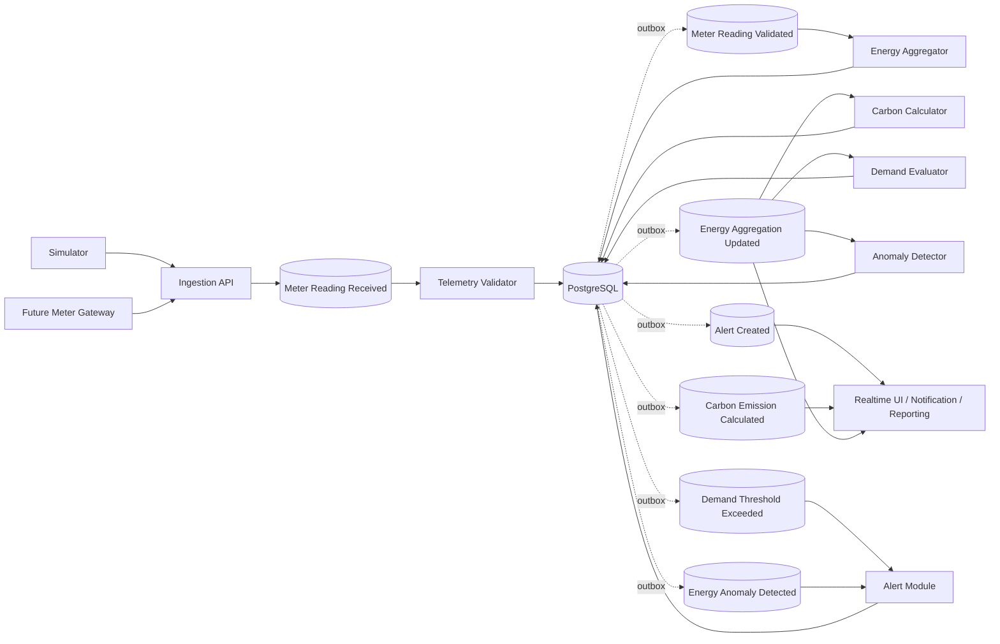
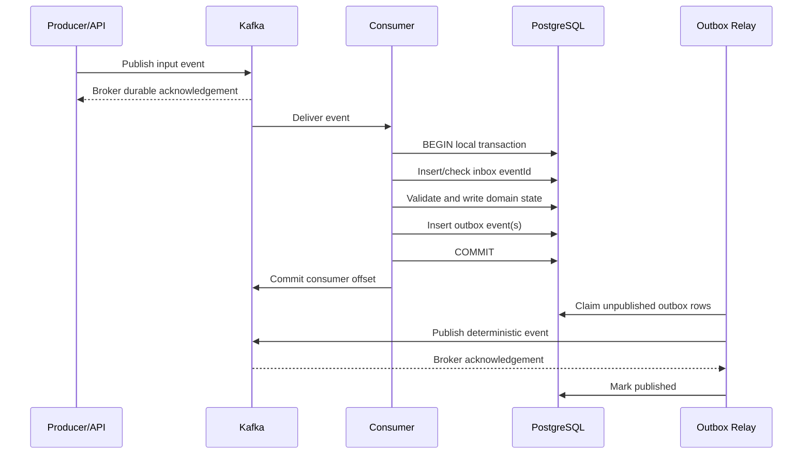

# Enerlytics Event-Driven Telemetry Architecture

- Status: Approved design baseline; telemetry simulator implemented as a separate runnable producer. Telemetry ingestion consumer, validation service, transactional outbox, and end-to-end Kafka integration tests are implemented. Downstream aggregators, carbon, anomaly, and alert processors remain design-only.
- Version: 1.0
- Date: 2026-09-20
- Governing decisions: `ADR-0002`, `ADR-0003`, `docs/ARCHITECTURE.md`, `docs/DATA_MODEL.md`

## 1. Purpose and Guarantees

Enerlytics accepts simulated meter samples initially and physical smart-meter/gateway samples later. Kafka separates source arrival rate from validation, persistence, rollup, carbon, anomaly, and alert processing. PostgreSQL remains authoritative.

The architecture guarantees:

1. **At-least-once transport**, never a misleading end-to-end exactly-once claim.
2. **Effectively-once business effects** through stable source IDs, PostgreSQL uniqueness, transactional inbox/outbox records, and idempotent state transitions.
3. **Per-meter arrival ordering in Kafka**, not global ordering and not event-time ordering.
4. **Event-time correctness:** late/out-of-order samples can revise affected aggregates without rewriting history.
5. **No distributed transactions:** each consumer makes one local PostgreSQL transaction; events are published later from a transactional outbox.
6. **Explicit data quality:** invalid, late, estimated, duplicate, missing, and valid are distinct outcomes.
7. **Tenant isolation:** every key, event, consumer operation, database row, metric drilldown, and replay carries an organization context.
8. **Replayability:** consumers and calculations are versioned and idempotent; controlled replay never bypasses authorization, validation, or audit.

## 2. System Flow



Kafka is the transport between stages. The database/outbox arrows emphasize that events describing authoritative database changes originate only after the change and event record commit atomically.

## 3. Event Naming and Topic Conventions

### 3.1 Event names

Events use past tense because they describe facts:

- `MeterReadingReceived`
- `MeterReadingValidated`
- `MeterReadingRejected` (supporting failure fact)
- `EnergyAggregationUpdated`
- `CarbonEmissionCalculated`
- `DemandThresholdExceeded`
- `EnergyAnomalyDetected`
- `AlertCreated`

Commands, if added later, use imperative names and separate topics. Facts are not repurposed as commands.

### 3.2 Topic names

Pattern:

```text
enerlytics.<domain>.<fact>.v<major>
```

Topic names encode only the breaking major contract version. Environment/region belongs in cluster/deployment configuration rather than application topic names where separate clusters are used.

| Topic | Event | Key | Initial partitions | Producer | Primary consumer groups |
|---|---|---|---:|---|---|
| `enerlytics.telemetry.meter-reading-received.v1` | MeterReadingReceived | `organizationId:meterId` | Capacity-tested; start 12 in production baseline | Ingestion API | `telemetry-validator-v1` |
| `enerlytics.telemetry.meter-reading-validated.v1` | MeterReadingValidated | `organizationId:meterId` | Same or greater than received | Telemetry outbox relay | `energy-aggregator-v1`, `telemetry-live-projection-v1`, `telemetry-quality-monitor-v1` |
| `enerlytics.telemetry.meter-reading-rejected.v1` | MeterReadingRejected | `organizationId:meterId` when known, otherwise `organizationId:sourceSystem` | 6 baseline | Telemetry outbox relay | `telemetry-operations-v1`, `audit-projection-v1` where policy allows |
| `enerlytics.energy.aggregation-updated.v1` | EnergyAggregationUpdated | `organizationId:scopeType:scopeId:granularity` | 12 baseline | Energy outbox relay | `carbon-calculator-v1`, `demand-threshold-evaluator-v1`, `energy-anomaly-detector-v1`, `analytics-projection-v1` |
| `enerlytics.carbon.emission-calculated.v1` | CarbonEmissionCalculated | `organizationId:scopeType:scopeId:method` | 6 baseline | Carbon outbox relay | `analytics-projection-v1`, `target-progress-v1`, `report-invalidation-v1`, `realtime-carbon-v1` |
| `enerlytics.alert.demand-threshold-exceeded.v1` | DemandThresholdExceeded | `organizationId:alertRuleId:scopeId` | 6 baseline | Alert-evaluation outbox relay | `alert-creator-threshold-v1` |
| `enerlytics.analytics.energy-anomaly-detected.v1` | EnergyAnomalyDetected | `organizationId:scopeType:scopeId` | 6 baseline | Analytics outbox relay | `alert-creator-anomaly-v1`, `analytics-projection-v1` |
| `enerlytics.alert.alert-created.v1` | AlertCreated | `organizationId:alertId` | 6 baseline | Alert outbox relay | `notification-alert-v1`, `realtime-alert-v1`, `audit-projection-v1` |

Partition counts are not final capacity decisions. They must be selected from measured peak throughput, consumer processing rate, recovery objective, key skew, and broker limits. Increasing partitions can change mapping and therefore ordering across the change boundary; schedule and observe such changes.

### 3.3 Retry and dead-letter topic names

For each source topic where asynchronous retry is permitted:

```text
<source-topic>.retry-1m
<source-topic>.retry-15m
<source-topic>.dlt
```

Retry/DLT topics retain the source major version in their inherited name. DLT records use a standard failure envelope and preserve the original serialized event and metadata subject to privacy policy.

Telemetry validation normally retries transient infrastructure failures in-place by pausing affected partitions; retry topics are used only after the bounded in-place window or for isolated records. This avoids unnecessary per-key reordering during brief outages.

## 4. Partition Keys and Ordering

### 4.1 Meter telemetry

`organizationId:meterId` is the Kafka key for received and validated meter samples.

Why:

- all samples from one meter reach one partition;
- validation/configuration changes can be applied consistently per meter;
- multiple metrics in one physical sample remain together;
- tenant ID prevents accidental cross-tenant key collision;
- meters distribute work more evenly than organization-only keys.

Do not key only by organization: a large tenant would become a hot partition. Do not key by event ID: it would destroy meter ordering. Channel-level keys may be introduced only if physical samples are split before Kafka and cross-channel ordering is unnecessary.

### 4.2 Derived events

- Aggregation updates key by tenant + scope + granularity so revisions of one logical bucket are ordered relative to other updates for that scope stream.
- Carbon updates key by tenant + scope + accounting method.
- Threshold detections key by tenant + rule + scope to serialize a rule's dedup/cooldown behavior.
- Anomalies key by tenant + scope.
- Alert facts key by tenant + alert.

### 4.3 Exact ordering guarantee

Kafka guarantees order only within one partition and only in broker append order. Enerlytics guarantees:

- records with the same stable key are produced to the same partition under a given partition count;
- producers preserve send order per key when one producer instance observes that order;
- consumers process a partition sequentially unless their implementation explicitly preserves per-key sequencing;
- no ordering between different meters, scopes, rules, or partitions;
- no guarantee that arrival order equals measurement timestamp order.

Every consumer uses event time, source sequence where available, aggregate revision, and source watermark. A late earlier timestamp is processed as a late fact, not discarded merely because a later timestamp arrived first.

## 5. Common Event Envelope

Events are UTF-8 JSON governed by JSON Schema 2020-12 contracts under `contracts/schemas/events/` when implementation begins. Decimal values are JSON strings matching a decimal pattern, never JSON binary floating-point numbers. Timestamps are RFC 3339 UTC strings ending in `Z`. UUIDs are lowercase canonical strings.

A schema registry compatible with JSON Schema is recommended for production enforcement, but vendor/hosting selection remains open. CI remains authoritative for schema compatibility even if broker-side registry enforcement is unavailable.

| Field | Type | Required | Meaning |
|---|---|---:|---|
| `eventId` | UUID | yes | Unique fact ID; stable across transport retry/DLT replay |
| `eventType` | string | yes | Exact semantic name, e.g. `MeterReadingValidated` |
| `schemaVersion` | string | yes | Full semantic contract version, e.g. `1.2.0` |
| `occurredAt` | UTC timestamp | yes | When the business fact occurred |
| `publishedAt` | UTC timestamp | yes | When this Kafka record was created; may change on controlled republish only in replay metadata, not original envelope |
| `organizationId` | UUID | yes | Tenant context |
| `aggregateType` | string | yes | Owning aggregate or fact family |
| `aggregateId` | UUID | yes | Meter, aggregation, emission, anomaly, or alert identity |
| `aggregateVersion` | integer | yes | Monotonic business revision/version where available |
| `correlationId` | UUID/string | yes | End-to-end operation/ingestion correlation |
| `causationId` | UUID | no | Event ID that directly caused this event |
| `traceId` | string | no | W3C trace correlation, not business audit identity |
| `producer` | object | yes | Service name, role, application version |
| `subject` | object | yes | Minimal routing identity, e.g. site/meter/scope IDs |
| `dataClassification` | string | yes | Normally `OPERATIONAL`; never implies public data |
| `payload` | object | yes | Event-specific contract |

Example envelope:

```json
{
  "eventId": "0199a3d7-3db0-7d8c-a12c-5ff63565d829",
  "eventType": "MeterReadingReceived",
  "schemaVersion": "1.0.0",
  "occurredAt": "2026-09-20T10:15:00Z",
  "publishedAt": "2026-09-20T10:15:02Z",
  "organizationId": "0199a300-0000-7000-8000-000000000001",
  "aggregateType": "Meter",
  "aggregateId": "0199a301-0000-7000-8000-000000000001",
  "aggregateVersion": 12,
  "correlationId": "0199a3d7-0000-7000-8000-000000000001",
  "producer": {
    "name": "telemetry-ingestion",
    "role": "core",
    "version": "1.0.0"
  },
  "subject": {
    "siteId": "0199a302-0000-7000-8000-000000000001",
    "meterId": "0199a301-0000-7000-8000-000000000001"
  },
  "dataClassification": "OPERATIONAL",
  "payload": {}
}
```

Secrets, access tokens, provider credentials, user email, and unnecessary site/address details are prohibited. Header values may duplicate event ID/type/version/trace for broker tooling, but payload envelope remains authoritative.

## 6. Event Contracts

### 6.1 MeterReadingReceived

**Meaning:** The ingestion boundary accepted a source sample for durable asynchronous validation. It does **not** mean the values are valid or persisted as authoritative readings.

**Topic:** `enerlytics.telemetry.meter-reading-received.v1`

| Payload field | Type | Required | Rules |
|---|---|---:|---|
| `ingestionId` | UUID | yes | Groups request/batch |
| `sourceSystem` | string | yes | Registered simulator/gateway/provider code |
| `sourceEventId` | string | yes | Stable idempotency ID from source or generated deterministically at trusted adapter |
| `meterId` | UUID | yes | Must match key and tenant-owned active meter |
| `timestamp` | UTC timestamp | yes | Sample/event time; not server receipt time |
| `intervalStart` / `intervalEnd` | UTC timestamp | conditional | Required for interval energy; half-open and end > start |
| `sourceSequence` | integer | no | Monotonic device/gateway sequence when available |
| `energyKwh` | decimal string | conditional | Nonnegative import energy; direction modeled by meter/channel |
| `powerKw` | decimal string | no | Signed only where meter semantics permit |
| `voltageV` | decimal string | no | Positive and within configured sanity bounds |
| `currentA` | decimal string | no | Nonnegative unless channel semantics define direction |
| `powerFactor` | decimal string | no | −1 through 1; business policy may constrain further |
| `frequencyHz` | decimal string | no | Positive and within configured sanity bounds |
| `qualityStatus` | string | yes | Source-declared quality, mapped but not blindly trusted |
| `simulated` | boolean | yes | Simulated data remains visibly identified |
| `meterConfigurationVersion` | integer | no | Source-known version; validator resolves authoritative version |
| `receivedAt` | UTC timestamp | yes | Ingestion boundary time |

At least one supported measurement is required. Unknown fields are rejected unless schema explicitly permits a backward-compatible extension object. Batch API requests produce one event per meter sample after envelope-level checks; batch identity remains shared.

### 6.2 MeterReadingValidated

**Meaning:** Values passed domain validation/normalization and authoritative channel reading revisions were committed to PostgreSQL. The event refers to committed state.

**Topic:** `enerlytics.telemetry.meter-reading-validated.v1`

| Payload field | Type | Required | Rules |
|---|---|---:|---|
| `ingestionId`, `sourceSystem`, `sourceEventId`, `meterId` | IDs/strings | yes | Original provenance |
| `timestamp`, `intervalStart`, `intervalEnd` | timestamp | yes/conditional | Normalized UTC times |
| `meterConfigurationVersion` | integer | yes | Version used for validation |
| `readingSetId` | UUID | yes | Logical physical sample identity |
| `readings` | array | yes | One canonical entry per accepted channel |
| `readings[].readingId` | UUID | yes | Persisted reading revision ID |
| `readings[].channelId` | UUID | yes | Tenant-owned channel |
| `readings[].measurementKind` | string | yes | ENERGY_INTERVAL, POWER_AVERAGE, VOLTAGE, CURRENT, POWER_FACTOR, FREQUENCY |
| `readings[].value` | decimal string | yes | Canonical decimal |
| `readings[].unit` | string | yes | KWH, KW, V, A, RATIO, HZ |
| `readings[].qualityStatus` | string | yes | `VALID`, `ESTIMATED`, or `LATE` as authoritative classification |
| `late` | boolean | yes | Timestamp earlier than current event-time watermark/lateness policy |
| `revisionNo` | integer | yes | Sample/read revision |
| `supersedesReadingSetId` | UUID | no | Correction linkage |
| `validationRuleSetVersion` | string | yes | Reproducibility |
| `persistedAt` | UTC timestamp | yes | Commit-adjacent fact time |

The event does not include invalid values from rejected samples.

### 6.3 MeterReadingRejected

**Meaning:** A received sample could not become authoritative due to nonretryable validation/configuration failure.

**Topic:** `enerlytics.telemetry.meter-reading-rejected.v1`

Payload includes ingestion/source IDs, meter ID if resolved, sample timestamp, `reasonCode`, `reasonCategory` (`SCHEMA`, `METER`, `UNIT`, `RANGE`, `TIME`, `AUTH_CONTEXT`, `CONFIGURATION`), sanitized field paths, validator rule-set version, and rejected time. It excludes credentials and normally excludes the full raw payload. Duplicates are not rejected/invalid readings; they are a separate idempotent outcome and metric.

### 6.4 EnergyAggregationUpdated

**Meaning:** A current aggregation revision was committed and prior revision, if any, superseded.

**Topic:** `enerlytics.energy.aggregation-updated.v1`

| Payload field | Type | Required |
|---|---|---:|
| `aggregationId`, `calculationRunId` | UUID | yes |
| `scopeType`, `scopeId` | string/UUID | yes |
| `granularity` | HOUR/DAY/MONTH | yes |
| `bucketStart`, `bucketEnd` | UTC timestamps | yes |
| `localPeriodDate`, `timezone` | date/string | yes |
| `energyImportKwh`, `energyExportKwh`, `generationKwh` | decimal string | yes |
| `averageDemandKw`, `peakDemandKw` | decimal string/null | no |
| `peakAt` | UTC timestamp/null | no |
| `expectedIntervals`, `validIntervals`, `estimatedIntervals`, `missingIntervals` | integer | yes |
| `coverage` | decimal string 0..1 | yes |
| `quality` | string | yes |
| `sourceWatermark` | UTC timestamp | yes |
| `revisionNo` | integer | yes |
| `supersedesAggregationId` | UUID | no |
| `algorithmVersion`, `roundingMode`, `decimalScale` | string/integer | yes |
| `trigger` | string | yes: `NEW_READING`, `LATE_READING`, `CORRECTION`, `RECONCILIATION` |

Consumers compare revision/source watermark and ignore stale older revisions even if Kafka delivery order changes during retry/replay.

### 6.5 CarbonEmissionCalculated

**Meaning:** A versioned carbon result was committed from a specific energy aggregation and carbon-intensity factor.

**Topic:** `enerlytics.carbon.emission-calculated.v1`

Payload: emission ID, calculation run ID, scope, period, method (`LOCATION_BASED`; future methods distinct), energy aggregation ID/revision, energy kWh, carbon-intensity ID/version/value/unit, `emissionKgCo2e`, renewable percentage if calculated, energy/factor coverage, status/quality, source watermark, algorithm/rounding version, revision, and superseded emission ID. Incomplete calculation outcomes should use a separate `CarbonCalculationIncomplete` fact rather than publish a misleading calculated value.

### 6.6 DemandThresholdExceeded

**Meaning:** A persisted rule evaluation determined that a versioned demand aggregate breached a configured rule after debounce/cooldown policy.

**Topic:** `enerlytics.alert.demand-threshold-exceeded.v1`

Payload: evaluation ID, alert rule ID/version, scope, aggregation ID/revision, observed period, observed demand kW, threshold kW, operator, magnitude kW/percent, required/observed duration, severity, deduplication key, evaluated time, and rule timezone. This fact is idempotent by evaluation ID and deduplication key; it is not itself the Alert aggregate.

### 6.7 EnergyAnomalyDetected

**Meaning:** A deterministic/versioned anomaly result was committed.

**Topic:** `enerlytics.analytics.energy-anomaly-detected.v1`

Payload: anomaly ID, calculation run ID, scope, metric/unit, period, method/method version, actual value, expected value/range, magnitude, optional decimal score, quality/coverage, evidence aggregation IDs/revisions, deduplication key, detected time, and model/source watermark. Scores are decimal strings and are not presented as measured energy.

### 6.8 AlertCreated

**Meaning:** An Alert aggregate was committed after deduplication/lifecycle policy.

**Topic:** `enerlytics.alert.alert-created.v1`

Payload: alert ID, source type (`DEMAND_THRESHOLD`, `ENERGY_ANOMALY`, `DATA_QUALITY`, etc.), source event/evaluation/anomaly ID, rule ID/version where applicable, scope, severity, status `OPEN`, title/summary code, opened time, deduplication key, observed/expected/threshold values and unit, assigned user ID if set, and alert version. Notification and realtime consumers use this fact; they do not infer alert creation directly from threshold/anomaly topics.

## 7. Schema Versioning and Compatibility

### 7.1 Version rules

- Topic suffix `v1` is the breaking major event family version.
- Envelope `schemaVersion` uses semantic versioning: major breaking, minor backward-compatible fields, patch clarification/constraint correction that does not reject previously valid data.
- Event meaning is immutable. A semantic change creates a new event type or topic major version.
- Producers and consumers use contract tests against checked-in schemas. CI rejects incompatible evolution.
- Schemas set explicit required fields, decimal regex/precision, UUID/timestamp formats, allowed additional properties, and bounds.

### 7.2 Compatible changes

Allowed within a topic major version:

- add an optional field with safe default semantics;
- add a new enum value only when consumers are required to tolerate unknown values safely, otherwise it is breaking;
- relax a non-security/non-integrity constraint;
- add optional metadata that does not alter event meaning.

Breaking changes:

- remove/rename required field;
- change type, unit, precision semantics, key semantics, tenant meaning, or event meaning;
- make optional field required without a universally valid default;
- change decimal from canonical string to number;
- alter ordering/identity behavior.

### 7.3 Major-version migration

Dual-publish v1 and v2 from one committed outbox intent only through an explicitly versioned publisher/mapping, migrate consumers independently, compare outcomes, stop v1 producers, then retire v1 after retention and rollback windows. Never transform old history destructively in place.

## 8. Producer Behavior

### 8.1 Ingestion producers

- Authenticate source/service identity and authorize tenant/meter before publishing.
- Perform envelope/schema, batch-size, timestamp syntax, and request-rate checks only; authoritative meter/unit/range validation belongs to telemetry workers.
- Require or generate a stable `sourceEventId`. Physical gateways should preserve device event/sequence identity. If absent, a trusted adapter may derive a deterministic hash from tenant, source, meter, timestamp/interval, and canonical source fields; collision/semantic risks must be documented.
- Use Kafka key `organizationId:meterId`.
- Configure idempotent Kafka producer, `acks=all`, retries for broker-transient errors, compression (`zstd` or `lz4` after benchmark), bounded linger/batch size, delivery timeout, and production replication/minimum in-sync replica policy.
- Return `202 Accepted` only after the broker acknowledges according to durability policy. Acknowledgement means accepted for processing, not validated.
- If Kafka is unavailable or delivery times out, return a retryable failure; never buffer authoritative telemetry only in process memory.
- Use client id with instance/role identity and propagate trace/correlation IDs.

### 8.2 Outbox producer

The outbox relay:

1. claims a bounded batch of unpublished rows using `FOR UPDATE SKIP LOCKED` or equivalent lease;
2. maps the immutable outbox payload to the checked contract;
3. publishes with idempotent Kafka producer and deterministic event ID/key;
4. marks `published_at` in a separate PostgreSQL transaction after broker acknowledgement;
5. retries unmarked rows after crash/timeout.

A crash after Kafka acknowledgement but before marking published can produce a duplicate event. This is expected; consumers deduplicate by event ID/business key. The outbox relay must not hold a database transaction open while waiting on Kafka if avoidable. Multiple relays may scale horizontally through row claiming.

### 8.3 Simulator

The simulator uses the same authenticated ingestion contract and topic as physical adapters. It uses deterministic seed/run/sample identity, sets `simulated=true`, and does not bypass validation, idempotency, quality, aggregation, carbon, anomaly, or alert flows.

## 9. Consumer Groups and Ownership

| Consumer group | Input | Database effect/output | Ordering sensitivity |
|---|---|---|---|
| `telemetry-validator-v1` | MeterReadingReceived | ingestion key, reading revisions/rejections, inbox, outbox validated/rejected | Per meter |
| `energy-aggregator-v1` | MeterReadingValidated | calculation run, hourly/current affected rollups, inbox, outbox aggregation | Per meter input; DB serializes bucket revision |
| `energy-rollup-daily-v1` | EnergyAggregationUpdated (HOUR) or scheduled dirty buckets | daily rollups/outbox | Per scope/bucket |
| `energy-rollup-monthly-v1` | EnergyAggregationUpdated (DAY) or schedule | monthly rollups/outbox | Per scope/bucket |
| `carbon-calculator-v1` | EnergyAggregationUpdated | carbon emission/incomplete result, inbox, outbox | Per scope/method/period |
| `demand-threshold-evaluator-v1` | EnergyAggregationUpdated | evaluation inbox/outbox; optional evaluation record | Per rule/scope dedup serialized in DB |
| `energy-anomaly-detector-v1` | EnergyAggregationUpdated | anomaly event row, inbox, outbox | Per scope/method |
| `alert-creator-threshold-v1` | DemandThresholdExceeded | alert/dedup state, inbox, AlertCreated outbox | Per rule/scope |
| `alert-creator-anomaly-v1` | EnergyAnomalyDetected | alert/dedup state, inbox, AlertCreated outbox | Per scope |
| `notification-alert-v1` | AlertCreated | notification/delivery request and inbox | Per recipient/alert effect |
| `analytics-projection-v1` | aggregate/carbon/anomaly facts | read projection and inbox | Revision-aware |
| `realtime-*-v1` | aggregate/carbon/alert facts | ephemeral Redis hint/SSE refetch signal; inbox optional | Best-effort hint; authoritative DB refetch |
| `audit-projection-v1` | approved business facts | append-only audit projection when not already atomically audited | Event ID idempotent |

Each independently managed projection/use case has its own consumer group. Do not share one group across unrelated consumers because Kafka would load-balance records between them instead of broadcasting to each use case.

## 10. Transactional Boundaries

No transaction spans Kafka and PostgreSQL. There is no XA/distributed transaction coordinator.



### B0 — ingestion boundary (Kafka durability boundary)

The ingestion API has no authoritative reading database transaction. It publishes `MeterReadingReceived` and acknowledges the client after broker acknowledgement. If optional ingestion-request metadata is persisted synchronously, it must not be dual-written naïvely with Kafka; either Kafka remains the first durable fact and a consumer creates metadata, or an ingestion outbox becomes the first boundary. MVP prefers Kafka-first metadata projection.

### T1 — telemetry validation transaction

One PostgreSQL transaction per sample or bounded batch:

1. insert/check `integration.inbox_event` for validator/event ID;
2. reserve `telemetry_ingestion_key` by tenant/source/source event ID;
3. insert one or more immutable channel `meter_reading` revisions or a rejection record;
4. supersede prior correction revision where applicable;
5. update ingestion/freshness projection if owned by telemetry;
6. insert `MeterReadingValidated` or `MeterReadingRejected` into `integration.outbox_event`;
7. commit.

If inbox/source key already indicates completed processing, return success internally and commit/advance offset without repeating effects. Kafka offset is committed only after database commit.

### T2 — energy aggregation transaction

For each affected bucket set:

1. insert/check energy consumer inbox;
2. lock or atomically compare current bucket revision;
3. create calculation run/update bounded status;
4. insert new aggregation revision and supersede old current revision;
5. insert one `EnergyAggregationUpdated` outbox fact per changed aggregate;
6. commit; then commit offset.

Large fan-out across organization/site/building/zone may be split into bounded idempotent bucket jobs rather than one oversized transaction. Dirty-bucket uniqueness prevents duplicate concurrent work.

### T3 — carbon calculation transaction

Insert/check inbox, resolve committed aggregation/factor versions, insert immutable carbon result or incomplete status, insert `CarbonEmissionCalculated` outbox only for a valid calculated result, and commit. Factor retrieval from external providers never occurs inside this transaction; factors are ingested/versioned beforehand.

### T4 — demand evaluation transaction

Insert/check inbox, load rule/version and cooldown/dedup state, persist evaluation state if required, insert `DemandThresholdExceeded` outbox when transition policy says a breach is actionable, and commit. No alert row is created in this transaction; the alert module owns that aggregate.

### T5 — anomaly transaction

Insert/check inbox, calculate from already available inputs or consume a completed calculation result, insert immutable `energy.anomaly_event`, insert `EnergyAnomalyDetected` outbox, and commit. Expensive model execution may occur before the short commit transaction, but inputs/model version and result identity must be revalidated at commit.

### T6 — alert creation transaction

Insert/check source event inbox, enforce alert deduplication/cooldown unique key, insert or update Alert aggregate according to lifecycle policy, append audit record/outbox as required, insert `AlertCreated` outbox only when a new alert is committed, and commit.

### T7 — notification transaction

Insert/check AlertCreated inbox, create authoritative in-app notification and external delivery request, insert notification outbox if separate delivery worker is used, and commit. External email/SMS calls occur after commit in a delivery worker; provider response updates delivery state in a new local transaction. Provider idempotency key is notification/delivery ID.

### Outbox atomicity rule

Any event claiming that PostgreSQL state changed must be represented by an outbox row written in the **same local transaction** as that state. The relay may duplicate publication but cannot lose a committed intent. Events that only acknowledge Kafka receipt at the ingress boundary do not use a database outbox unless ingestion metadata becomes authoritative before Kafka.

## 11. Idempotency and Duplicate Handling

### 11.1 Duplicate layers

1. **HTTP/batch request:** `(organizationId, sourceSystem, idempotencyKey)` prevents duplicated accepted operations.
2. **Source sample:** `(organizationId, sourceSystem, sourceEventId)` in `telemetry_ingestion_key` provides global dedupe across time partitions.
3. **Kafka event:** `(consumerName, eventId)` in `inbox_event` prevents duplicate consumer effect.
4. **Reading interval/revision:** tenant + channel + interval + revision/current uniqueness prevents conflicting authoritative readings.
5. **Aggregation:** tenant + scope + granularity + bucket + revision/current uniqueness.
6. **Alerts:** active deduplication key prevents duplicate open alert creation.
7. **External provider delivery:** stable provider idempotency key where provider supports it.

### 11.2 Outcomes

- Exact duplicate with same source ID and equivalent fingerprint: count as duplicate; do not republish a new validated fact.
- Same source ID with different payload fingerprint: security/data-integrity conflict; quarantine and alert operators. Do not overwrite the first fact.
- Same interval with new explicit correction event ID: create higher revision, link supersession, and trigger recalculation.
- Kafka duplicate after database commit but before offset commit: inbox finds completed event and no-ops; offset can advance.
- Outbox duplicate after broker ack but before `published_at`: downstream inbox no-ops.

Do not rely on in-memory caches for idempotency. Redis may accelerate negative/positive checks but PostgreSQL constraints remain authoritative.

## 12. Late, Out-of-Order, Missing, and Invalid Readings

### 12.1 Watermarks and lateness

Maintain event-time watermark per meter/channel or processing scope based on maximum accepted sample time and configured allowed lateness. The exact lateness duration is meter/source policy.

- Within allowed lateness: validate/persist normally; update provisional affected buckets.
- Beyond allowed lateness but inside raw retention/correction policy: persist as `LATE`, create a correction/revision path, and recompute affected hour/day/month and dependent cost/carbon/alerts where policy permits.
- Older than correction/retention boundary: quarantine or route to controlled backfill; never silently insert into expired history.
- Future timestamps beyond clock-skew tolerance: reject/quarantine with `TIME_FUTURE`.

Event-time logic uses site timezone only for rollup boundaries; event timestamps remain UTC.

### 12.2 Missing data

Absence is not a zero reading. Gap detection compares expected intervals against accepted current readings and records missing counts/coverage in aggregation. A separate data-quality alert may be generated. If estimation is allowed, estimated rows/results are explicitly labeled with method/version and never replace original provenance.

### 12.3 Invalid data

Nonretryable examples:

- unknown/inactive/cross-tenant meter;
- unsupported unit or metric/channel mapping;
- invalid interval/order;
- non-decimal/nonfinite value;
- power factor outside −1..1;
- impossible configured sanity range;
- unauthorized source/meter relationship;
- source ID payload conflict.

Persist sanitized rejection metadata with short retention and publish MeterReadingRejected via outbox. Do not send ordinary validation failures to technical DLT: DLT is for processing/contract failures, while rejection is a valid business outcome.

## 13. Retry Policy and Dead-Letter Handling

### 13.1 Failure classification

| Class | Examples | Action |
|---|---|---|
| Business invalid | unit/range/meter/time validation | Commit rejection + outbox; advance offset |
| Duplicate | repeated source/event ID | Record metric/count; no duplicate effect; advance |
| Transient infrastructure | DB timeout, broker leader move, temporary lock | Bounded retry with jitter; pause partition if needed |
| Prolonged shared dependency outage | PostgreSQL unavailable | Stop/pause consumption, fail readiness, retain Kafka lag; do not DLT every event |
| Poison/contract | unreadable schema, unsupported major, deterministic serialization failure | DLT with reason after no/limited retry |
| Consumer bug | repeatable unexpected exception | Bounded retry then DLT and page/operator escalation |
| External provider | carbon/email timeout/rate limit | Separate durable request state; circuit breaker/bounded retry; do not block telemetry partition |

### 13.2 Retry schedule

Initial policy, configurable per consumer and finalized with SLOs:

- in-place attempts: up to 3 after initial attempt at approximately 250 ms, 1 s, and 5 s with jitter;
- prolonged event-specific transient failure: retry topic at approximately 1 minute, then 15 minutes;
- after retry budget: DLT;
- shared outages: pause consumption and use Kafka retention, not mass retry topics.

Retries must be bounded by attempt count and elapsed age. Every event carries original topic/partition/offset, first-failure time, current attempt, and sanitized error code in retry headers/failure envelope.

Retry topics can reorder one key relative to newer records. Revision/watermark checks make derived consumers robust, but telemetry validator should prefer partition pause/in-place recovery when ordering matters.

### 13.3 DLT behavior

- One `.dlt` per source topic major version.
- DLT retention baseline 30 days, subject to incident/legal policy.
- ACLs limit read/replay because payloads are tenant operational data.
- Alert immediately on poison/bug DLT growth; business rejections use normal rejection topic/metrics instead.
- DLT records are immutable. Resolution creates an audited disposition: discard with reason, fix-and-replay, or supersede through correction.
- Replay preserves original event ID and payload when retrying the same fact. Metadata records replay actor, ticket/reason, time, and tool version outside the original envelope/through headers.
- Never bulk replay to production without dry-run/count, rate limit, destination validation, and rollback/stop criteria.

## 14. Backpressure and Consumer Scaling

### 14.1 Backpressure

Kafka lag is the durable queue. No unbounded application executor or memory queue is allowed.

- Consumers use bounded poll size, bounded worker concurrency, and database connection-aware concurrency.
- Pause partitions when local queue or database pool reaches safe capacity; resume below low-water mark.
- Ingestion rate limits/quotas protect abusive sources but do not substitute for capacity.
- If lag threatens retention or freshness SLO, autoscale consumers, throttle noncritical replay/batch work, and alert operators.
- Carbon/anomaly/report processing cannot block telemetry validation; each has an independent topic/group/bulkhead.
- Large correction/replay work uses quotas and dedicated consumer groups or command jobs so live traffic retains capacity.

### 14.2 Consumer scaling

Maximum active consumers in one group equals topic partition count. Additional instances are idle. Scale signals combine:

- total lag and maximum partition lag;
- oldest unprocessed event age;
- processing rate versus arrival rate;
- per-event processing duration;
- database CPU/IO/locks/connection saturation;
- retry/DLT rate;
- key/partition skew.

Scale telemetry validator by received-topic partitions. Scale aggregation and derived groups independently. Do not increase partitions reflexively: first identify hot-key skew, slow database queries, lock contention, and downstream saturation.

Per-partition processing remains sequential by default. Parallel processing within one polled batch is allowed only with per-key sequencing and offset barriers that prevent committing past an unfinished earlier record.

## 15. Retention

Proposed Kafka baseline pending approved throughput, replay, RPO, and cost:

| Topic class | Retention | Cleanup | Rationale |
|---|---:|---|---|
| MeterReadingReceived | 7 days minimum; target 14 days if capacity permits | delete | absorb outages/replay validation; PostgreSQL/archive retains authoritative history |
| MeterReadingValidated/Rejected | 14–30 days | delete | rebuild near-term projections and investigate quality |
| EnergyAggregationUpdated | 90 days | delete | downstream recalculation/projection replay |
| CarbonEmissionCalculated | 180 days | delete | reporting/projection recovery; DB is authoritative |
| DemandThresholdExceeded / EnergyAnomalyDetected | 90 days | delete | alert reconstruction/investigation |
| AlertCreated | 180 days | delete | notification/realtime projection recovery |
| Retry topics | greater of source remaining retention or 30 days | delete | allow bounded delayed recovery |
| DLT topics | 30 days baseline | delete | incident resolution; archive only under approved policy |

Do not use compaction for immutable fact topics. If latest-state topics are added later, they require separate contracts and may use `compact,delete`; they do not replace audit/event history.

Kafka retention is not raw-meter legal retention, backup, or audit retention. PostgreSQL/object archive policies in `DATA_MODEL.md` govern authoritative data.

## 16. Replay and Reprocessing

### 16.1 Projection rebuild

Create a new versioned consumer group and replay retained facts from earliest required offset into a new/cleared isolated projection. Compare counts/checksums/results, then switch reads. Never reset a production group blindly while it is serving live traffic.

### 16.2 Failed-event replay

Replay DLT records through an authorized tool to the original topic only after the root cause is fixed. Preserve event ID for idempotency. If the inbox contains a failed marker, transition/release it under audited replay policy; if it contains completed processing, replay no-ops.

### 16.3 Algorithm recalculation

Do not replay old `MeterReadingValidated` under the same consumer group to force a new carbon/anomaly algorithm—the inbox correctly suppresses it. Create an explicit versioned recalculation run/command over authoritative PostgreSQL readings/aggregates, write new result revisions and outbox facts with new event IDs and algorithm version.

### 16.4 Historical backfill

A backfill imports validated historical source data through a dedicated, rate-limited ingestion mode/topic or job using the same domain validation/idempotency rules. Mark origin/backfill run, use event timestamps, and isolate capacity from live telemetry. Resulting revisions trigger bounded downstream recalculation.

### 16.5 Replay controls

Every replay records requester/service, authorization, tenant/range/topic, reason/ticket, expected count, rate, start/end, outcome, duplicate/rejection counts, and correlation ID in audit history. Cross-tenant replay requires platform privilege and explicit scoping.

## 17. Observability

### 17.1 Metrics

Per topic/group without unbounded tenant/meter labels:

- producer send rate, byte rate, latency, retry/error, record size, compression ratio;
- consumer records/sec, processing duration, success/failure/retry, poll/rebalance duration;
- current lag, maximum partition lag, oldest event age, partition skew;
- accepted, validated, rejected by reason category, duplicate, payload-conflict, late, correction counts;
- watermark delay and telemetry freshness percentiles;
- outbox unpublished count/oldest age/publish attempts;
- inbox duplicate count and processing failures;
- aggregation update/revision/recompute duration and dirty-bucket backlog;
- carbon calculation success/incomplete/factor freshness;
- threshold/anomaly/alert creation counts and end-to-end detection latency;
- retry topic and DLT depth/oldest age/replay outcomes;
- database transaction/lock/connection/partition-insert metrics.

Tenant/source drilldown belongs in secured logs or operational projections, not high-cardinality Prometheus labels.

### 17.2 Tracing

Propagate W3C trace context through Kafka headers. Use producer span, consumer process span, database transaction span, and outbox publish span linked to the originating trace. Asynchronous traces may use span links rather than false parent-child timing. `correlationId` remains stable business correlation even after trace retention expires.

### 17.3 Structured logs

Include service/role, event type/version/ID, topic/partition/offset, consumer group, correlation/causation/trace IDs, pseudonymous tenant ID, meter/scope ID where authorized, attempt, outcome, duration, and sanitized reason code. Never log full events by default, tokens, credentials, emails, or unrestricted telemetry payloads.

### 17.4 Alerts and dashboards

Page/actionable alerts:

- Kafka unavailable or below minimum ISR;
- producer error/delivery timeout threshold;
- oldest event age/freshness SLO breach;
- lag increasing faster than recovery capacity;
- partition skew/hot key;
- outbox oldest unpublished age;
- repeated rebalances or consumer crash loop;
- DLT growth or payload conflicts;
- rejection/late/duplicate rate anomaly;
- aggregation/carbon/alert end-to-end latency breach;
- database saturation blocking consumers.

Grafana views cover ingestion overview, per-stage latency/lag, data quality, outbox/inbox, retry/DLT, partition distribution, and end-to-end sample-to-alert flow.

## 18. Development Telemetry Simulator

A standalone Spring Boot component, `telemetry-simulator`, produces `MeterReadingReceived` events for every database meter marked `simulated = TRUE` and `status = ACTIVE`. It is intentionally separate from the production API service.

### Simulator responsibilities

- Read the active simulated meter registry from the same PostgreSQL database used by the backend.
- Apply a `SimulationProfile` (OFFICE, DATA_CENTER, WAREHOUSE, RETAIL, MANUFACTURING, RESIDENTIAL) with profile-specific load curves.
- Generate physically plausible readings that reflect business hours, nighttime base load, weekday/weekend differences, meter-specific base usage, peak periods, bounded random variation, and occasional controlled anomalies.
- Publish events to `enerlytics.telemetry.meter-reading-received.v1` using the `organizationId:meterId` partition key.
- Support deterministic seeding for reproducible test datasets, configurable simulation acceleration for historical backfills, and Micrometer metrics for produced/failed events and active meters.

### Event fields produced by the simulator

| Field | Source |
|---|---|
| `eventId` | Deterministic UUID derived from meter id, timestamp, and sequence |
| `schemaVersion` | `1.0` |
| `meterId` | Database meter id |
| `organizationId` | Tenant organization id |
| `siteId` | Site id |
| `timestamp` | Virtual event time |
| `energyKwh` | Derived from simulated power and interval |
| `powerKw` | Load-profile value with variation |
| `voltage` | Nominal three-phase voltage with anomaly dips |
| `current` | Derived from power, voltage, and power factor |
| `powerFactor` | Typical three-phase power factor |
| `frequency` | Grid frequency |
| `qualityStatus` | `OK` or anomaly label |

### Configuration

All behavior is driven by environment variables (see `application.yml`):

- `SIMULATOR_ENABLED`
- `SIMULATOR_TICK_INTERVAL`
- `SIMULATOR_ACCELERATION`
- `SIMULATOR_SEED`
- `SIMULATOR_ANOMALY_PROBABILITY`
- `SIMULATOR_METER_REFRESH_INTERVAL`
- `KAFKA_BOOTSTRAP_SERVERS`
- `SIMULATOR_KAFKA_TOPIC`

### Relationship to the event pipeline

The simulator is a Kafka producer only. It does not write meter readings directly to PostgreSQL and does not consume events. In production, physical gateways will replace the simulator as the source of `MeterReadingReceived` events, while the rest of the pipeline (validator, aggregator, carbon, anomaly, alert) remains unchanged.

## 19. Security and Governance

- Kafka uses TLS and authenticated service identities; ACLs grant only required produce/consume/topic-admin capabilities.
- Ingestion producers can publish only received telemetry; they cannot publish validated/aggregate/alert facts.
- Consumer groups and outbox relays use separate principals where operationally practical.
- Events always include tenant context, but consumers revalidate ownership against authoritative configuration before database effect.
- Topic/DLT/replay access is audited. Replay tools cannot accept arbitrary destination topics or bypass schema validation.
- Schema registry access and compatibility changes require CI review and production approval.
- Retention, broker encryption, backups, cross-region replication, and residency follow approved policy.
- Event payload minimization is mandatory because Kafka is replicated and retained.

## 19. Failure Scenarios

| Scenario | Expected result |
|---|---|
| Source retries after HTTP timeout but first publish succeeded | Same source event reaches validator; source registry prevents second reading |
| Validator crashes before DB commit | Offset uncommitted; event redelivered; no state exists |
| Validator crashes after DB commit before offset commit | Redelivery; inbox/source key no-op; committed outbox remains |
| Outbox publishes then crashes before marking published | Event may republish; downstream inbox no-op |
| Aggregator processes late correction after newer aggregate | Revision/watermark check writes deterministic newer revision or ignores stale work |
| PostgreSQL outage | Consumers pause/fail readiness; offsets do not advance; Kafka retains backlog |
| Redis outage | Event pipeline persists; realtime hints degrade; authoritative processing continues |
| Carbon factor missing | Persist incomplete calculation status; do not emit CarbonEmissionCalculated |
| Invalid meter value | Commit rejection; emit MeterReadingRejected; no technical DLT |
| Unsupported event major/schema | DLT and operator alert; no blind deserialization |
| Alert source event redelivered | Inbox and active dedup key prevent duplicate alert |
| Partition count increases | Potential ordering boundary documented; consumers rely on event time/revision and monitor skew |
| DLT replay repeats already completed event | Inbox no-op; replay audit records duplicate outcome |

## 20. Verification Strategy

Before production acceptance:

1. Contract tests verify every event against JSON Schema and backward compatibility rules.
2. Integration tests use real Kafka/PostgreSQL for producer ack, key partitioning, inbox/outbox, offset timing, and transactional rollback.
3. Crash-point tests stop consumers before commit, after commit/before offset, and outbox after publish/before mark.
4. Duplicate tests cover request ID, source event ID, payload conflict, Kafka redelivery, outbox republish, alert dedup, and provider idempotency.
5. Event-time tests cover out-of-order, allowed late, very late, future skew, correction, missing intervals, DST, and watermark revisions.
6. Retry/DLT tests distinguish business rejection, shared outage, poison schema, transient event, consumer bug, and controlled replay.
7. Load tests validate peak source throughput, partition skew, lag recovery, database capacity, correction storms, and live/replay coexistence.
8. Security tests verify ACLs, cross-tenant event attempts, unauthorized replay, DLT access, schema changes, and payload/log redaction.
9. Reconciliation tests compare received/validated/rejected/duplicate counts and database/outbox/consumer projection totals.
10. Disaster tests validate broker recovery and that authoritative PostgreSQL data can regenerate supported downstream projections.

## 21. Decisions Required Before Implementation

1. Peak/average readings per second, batch size, meter count, key distribution, outage catch-up time, and freshness/alert SLOs.
2. Kafka provider/hosting, production replication factor, `min.insync.replicas`, availability zones, RPO/RTO, and cross-region strategy.
3. Initial partition counts per topic based on measured processing rates.
4. Schema registry product/hosting and JSON Schema enforcement capabilities.
5. Exact source quality vocabulary, meter sanity ranges, clock-skew tolerance, allowed lateness, finalization, and correction windows.
6. Kafka topic, retry, DLT, and replay retention based on throughput/cost and legal residency.
7. Whether received ingestion metadata is Kafka-first (recommended) or requires a database-first ingestion outbox.
8. Carbon-factor refresh/fallback and incomplete-result events.
9. Alert debounce/cooldown/dedup policies and anomaly algorithm versions.
10. Replay tooling, approval model, quotas, audit integration, and runbooks.

These are explicit blocked decisions, not implementation defaults.
