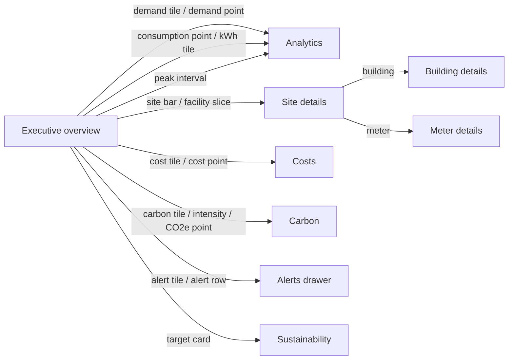

# Enerlytics UI/UX Specification

Status: Phase 17 — design specification only. No Angular implementation in this
phase. This document is the authoritative contract for information architecture,
visual language, and per-screen behavior. Frontend implementation must follow it;
deviations require updating this document.

---

## 0. Design Intent

Enerlytics is an enterprise energy-consumption and carbon-intelligence platform.
The interface is a working instrument for facility managers, energy analysts,
sustainability managers, and administrators — not a marketing surface. The visual
goal: **a dense, calm, analytical workspace** closer to a professional monitoring
console than a generic admin template.

Guiding characteristics:

- **Information-dense without clutter.** Density comes from disciplined
  typography, tight but rhythmic spacing, and clear visual hierarchy — never from
  shrinking text below readable sizes or stacking decoration.
- **Data quality is a first-class visual concern.** Estimated, missing, late,
  and partial-coverage values are always marked. The UI never silently
  interpolates or fabricates.
- **Deterministic, explainable analytics.** Anomalies, forecasts, and alerts
  carry explanations and evidence; the UI surfaces them rather than hiding
  behind opaque scores.
- **Restrained decoration.** No heavy gradients, no glassmorphism, no oversized
  border radii, no ornamental illustration inside working screens, no animated
  backgrounds. Emphasis comes from hierarchy, alignment, and a single confident
  accent color.
- **Responsive and accessible.** WCAG 2.2 AA minimum; all function available by
  keyboard; touch targets ≥ 40px on coarse pointers.

---

## 1. Personas and Their Primary Surfaces

| Persona | Primary surfaces | Secondary |
|---|---|---|
| Facility Manager | Live Energy, Alerts, Facilities, Meters | Energy analytics, Reports |
| Energy Analyst | Analytics, Costs, Forecast, Alerts | Carbon, Meters, Reports |
| Sustainability Manager | Carbon, Sustainability, Reports | Analytics, Forecast |
| Organization Administrator | Administration, Facilities, Meters | All read surfaces |
| Platform Administrator | Administration → Operations | Tenant support tooling |
| Read-only Viewer | Overview, Reports | Permitted read surfaces |

Navigation visibility is derived from effective permissions
(`forecast:read`, `alert:read`, `carbon:read`, `analytics:read`,
`organization:write`, `user:write`, etc.). Hidden items are not rendered;
denied deep links show an authorization error state. Visibility is convenience —
the API enforces authorization.

---

## 2. Information Architecture

### 2.1 Navigation model

Persistent left rail (icon rail 64px collapsed, 232px expanded, user-toggleable
and responsive). Grouped into four labeled sections:

- **Monitor**: Overview · Live Energy · Alerts
- **Analyze**: Analytics · Carbon · Costs · Forecast
- **Manage**: Facilities · Meters
- **Govern**: Reports · Sustainability · Administration

Badge rules: Alerts shows a count badge of open `CRITICAL` + `WARNING` alerts
(capped "99+"). No other nav badges; counts live inside screens.

### 2.2 Route map

| Nav item | Route | Screen |
|---|---|---|
| Overview | `/o/:orgId/overview` | Executive overview |
| Live Energy | `/o/:orgId/live` | Live monitoring |
| Analytics | `/o/:orgId/analytics` | Energy dashboard |
| Carbon | `/o/:orgId/carbon` | Carbon dashboard |
| Costs | `/o/:orgId/costs` | Cost dashboard |
| Forecast | `/o/:orgId/forecast` | Forecasts |
| Alerts | `/o/:orgId/alerts` | Alerts center (+ Rules tab) |
| Facilities | `/o/:orgId/facilities` | Facility tree → site/building details |
| Meters | `/o/:orgId/meters` | Meter explorer → meter details |
| Reports | `/o/:orgId/reports` | Reports |
| Sustainability | `/o/:orgId/sustainability` | Targets & renewable tracking |
| Administration | `/o/:orgId/admin` | Org settings, users, operations |
| — | `/login` | Login |

Entity detail routes: `/facilities/:siteId`, `/facilities/:siteId/b/:buildingId`,
`/meters/:meterId`. All deep links restore filter/context state via query params.

### 2.3 Global context model

Three levels of context, persisted in route state and query params:

1. **Organization** — resolved at login; switcher in top bar for multi-org users.
2. **Scope** — the entity being viewed: organization / site / building / meter.
   Site-level screens inherit scope; a scope chip in the context bar shows the
   active entity and allows clearing back to org.
3. **Period** — preset ranges (Today, Yesterday, Last 24h, Last 7d, MTD,
   Last 30d, Custom) plus granularity (Hour/Day/Month) where applicable.
   Default: Today, hour granularity.

Time semantics: timestamps stored UTC; display in the site's IANA timezone by
default with a visible tz chip (`UTC-05:30 IST` → tooltip shows both). A global
"UTC" toggle exists in the user menu; analytical screens label which axis is in
effect.

### 2.4 Shell layout

```
┌────────┬──────────────────────────────────────────────────────┐
│        │ Top bar: breadcrumb · scope chip · period · user menu  │
│  Nav   ├──────────────────────────────────────────────────────┤
│  rail  │                                                      │
│        │                 Content region                       │
│ 64/232 │              (max-width 1560px, centered)             │
│        │                                                      │
└────────┴──────────────────────────────────────────────────────┘
```

Top bar is 56px, sticky. Content padding: 24px desktop, 16px tablet, 12px
mobile. Page max-width 1560px to keep wide tables and dashboards readable on
large monitors without unusable line lengths.

---

## 3. Visual Design System

All values are design tokens (CSS custom properties under `--ely-*`).

### 3.1 Color

**Neutrals** (warm gray scale; flat, no gradient):

| Token | Value | Use |
|---|---|---|
| `--ely-bg` | `#F7F7F5` | App background |
| `--ely-surface` | `#FFFFFF` | Cards, panels, tables |
| `--ely-surface-raised` | `#FCFCFB` | Drawer/modal surfaces |
| `--ely-border` | `#E4E2DE` | 1px hairlines, card borders |
| `--ely-border-strong` | `#CFCCC6` | Inputs, emphasized separators |
| `--ely-text` | `#201F1D` | Primary text |
| `--ely-text-2` | `#59554F` | Secondary text, labels |
| `--ely-text-3` | `#8B857D` | Metadata, captions, placeholders |
| `--ely-bg-subtle` | `#EFEEEB` | Striped rows, chip backgrounds, track fills |

**Brand/action** (single accent family — deep energy teal):

| Token | Value | Use |
|---|---|---|
| `--ely-accent` | `#0F766E` | Primary buttons, active nav, links, focus |
| `--ely-accent-strong` | `#115E59` | Hover/active states |
| `--ely-accent-subtle` | `#E4F1EF` | Selected rows, active chips, accent fills |
| `--ely-accent-border` | `#99CDC7` | Accent outline elements |

**Semantic**:

| Token | Value | Use |
|---|---|---|
| `--ely-success` | `#1A7F4B` | Resolved, on-track, valid |
| `--ely-warning` | `#B45309` | WARNING alerts, degraded, late data |
| `--ely-critical` | `#B3261E` | CRITICAL alerts, errors, offline |
| `--ely-info` | `#1D4ED8` | INFO alerts, neutral notices |
| `--ely-estimated` | `#6D28D9` | Estimated/interpolated data marks |

Semantic tints (10% surfaces) are computed, never new hues:
`color-mix(in srgb, <semantic> 10%, white)` for chip/badge backgrounds.

**Chart categorical palette** (ordered; always in this order):

1. `#0F766E` teal (primary series / actual)
2. `#64748B` slate (comparison / baseline, usually dashed)
3. `#D97706` amber
4. `#7C3AED` violet
5. `#0284C7` sky
6. `#4D7C0F` olive
7. `#BE185D` rose
8. `#78716C` gray (fallback)

Prior-period series: `#64748B` dashed. Forecast: `#7C3AED` solid with
translucent band `rgba(124,58,237,.12)` for the prediction interval.
Actuals overlay on forecast charts: `#0F766E` points.

### 3.2 Typography

Stack: `Inter, ui-sans-serif, system-ui, -apple-system, "Segoe UI", Roboto`.
Numeric contexts add `font-feature-settings: "tnum" 1, "lnum" 1` for tabular
alignment in KPIs, tables, axes. Code/IDs/correlation IDs:
`ui-monospace, "JetBrains Mono", "SF Mono", Consolas` at 12px.

| Style | Size/Line | Weight | Use |
|---|---|---|---|
| KPI value | 26/32 | 600 | Headline metrics |
| KPI value (dense) | 20/26 | 600 | Secondary tiles, table-embedded metrics |
| Page title | 20/28 | 600 | H1 |
| Section title | 15/22 | 600 | Card/panel titles |
| Label/caption | 11/16 | 600, uppercase, +0.04em | Field labels, rail section headers, KPI labels |
| Body | 13.5/20 | 400 | Default text |
| Body strong | 13.5/20 | 500/600 | Emphasis, table headers |
| Small | 12/16 | 400 | Metadata, helper text, footnotes |
| Micro | 11/15 | 500 | Chips, badges, axis ticks |

### 3.3 Spacing, radius, elevation

Spacing scale (px): `4 8 12 16 20 24 32 40 48 64`.
Standard gaps: card padding `20`, panel internal `16`, section gap `24`,
KPI strip gap `12`, inline chip gap `8`, form field gap `16`.

Radius: `--ely-radius-sm: 4px` (buttons, inputs, chips), `--ely-radius-md: 6px`
(cards, tables, panels), `--ely-radius-lg: 8px` (dialogs, drawers). No pill
shapes except literal status dots. No radius above 8px.

Elevation is flat-first: surfaces are separated by 1px borders, not shadows.
Shadow reserved for floating layers only:
`--ely-shadow-float: 0 8px 24px rgba(32,31,29,.14), 0 2px 6px rgba(32,31,29,.08)`
(dropdowns, drawers, dialogs, toasts). No shadow on cards or tables.

### 3.4 Grid

- 12-column fluid grid inside the 1560px content region; gutter 20px, margins 24px.
- Standard spans: KPI tile `2–3 cols`, chart card `6–8 cols`, side panel `4 cols`,
  full-width table `12 cols`.
- Breakpoints: `≥1440` wide, `1024–1439` desktop, `768–1023` tablet, `<768` mobile.
- At ≤1023 the nav rail collapses to the 64px icon rail; at ≤767 it becomes a
  bottom sheet/drawer triggered by a top-left menu button (never a hamburger
  overlay covering content).

### 3.5 Component patterns

**Cards/panels.** `surface` background, 1px `border` hairline, 6px radius,
20px padding, header row: 15px section title + optional right-side actions/more
menu. No shadows. KPI cards are the same surface with a metric block, not a
distinct visual species.

**KPI tile.** Label (caption, uppercase, `text-3`), value (KPI size, tabular),
optional delta line (`±x.x% vs baseline` with directional arrow glyph and
semantic color), optional 40px-height sparkline, optional quality chip.
Clickable tiles use an accent focus ring and `cursor:pointer`, and deep-link to
the domain surface preserving period/scope.

**Buttons.** Heights: `36px` default, `30px` dense (tables/toolbars). Radius 4px.
Variants: `primary` (accent fill, white text), `secondary` (white, strong border,
`text`), `tertiary` (text-only accent), `danger` (critical border/fill only for
destructive confirms), `ghost` (icon buttons, `text-2`). Icon+label preferred;
icon-only requires tooltip and `aria-label`. Disabled at 45% opacity with
`not-allowed`. Loading: inline 14px spinner, label kept, button disabled.

**Forms.** Labels above fields (caption style), 36px inputs, 4px radius,
`border-strong` → accent border on focus + 2px focus ring `rgba(15,118,110,.25)`.
Required marked with `*` and `aria-required`. Validation: inline error text
(`critical`, 12px) + `border-critical`, summarized banner for submit failures.
Helper text `text-3` under field. Grouped sections separated by 24px gaps and
uppercase group labels — no card-in-card.

**Tables.** The workhorse component. 34px row height (dense analytical default),
13px header with `bg-subtle` background and uppercase label style, 1px row
hairlines, right-aligned numerics with tabular figures, left-aligned text.
Zebra striping optional at `bg-subtle` 50%. Row hover: `bg-subtle`. Selected row:
`accent-subtle`. Sortable headers show an always-visible affordance (muted arrow,
accent when active). Pagination: `Rows 1–50 of 1,240` + prev/next + page-size
select — never infinite scroll for tabular data. Row click opens the entity;
row-local actions live in a trailing kebab menu. Column visibility and
saved views on explorer tables.

**Chips/badges.** 20px height, 4px radius, 11px/500 text, 6px×10px padding.
Semantic tint background + semantic text + optional 6px status dot. Used for
severity, alert status, meter status, data quality, tariff type, scope.

**Status indicators.** 8px dot + 12px label. Meter status: `ONLINE` success,
`OFFLINE` critical, `DEGRADED`/stale warning, `INACTIVE` neutral gray.
Freshness indicator: `data · 34s ago` — text-3 until `stale-threshold`, then
warning chip `STALE`.

**Severity indicators.** `CRITICAL` critical chip, `WARNING` warning chip,
`INFO` info chip; always paired with a filled left border (3px) on alert rows so
severity survives color-only scanning and is accessible.

**Data-quality marks.** Consistent everywhere: `VALID` unmarked (default, no
visual noise); `ESTIMATED` violet `EST` chip + dotted underline; `MISSING` gap in
charts + gray `NO DATA` marker; `LATE`/`STALE` amber chip; `PARTIAL` coverage
chip showing `PARTIAL 82%`; `UNAVAILABLE` gray `N/A` cell — never rendered as 0.

**Navigation.** Rail item: 40px height, 18px icon + 13px label, active state =
`accent-subtle` background + 3px accent left bar + accent icon. Collapsed rail
shows icon with tooltip. Section headers are uppercase labels (`text-3`) inside
the expanded rail.

**Dialogs/drawers.** Entity editors and rule builders are right-side drawers
(480px, `surface-raised`, float shadow) — full page context stays visible.
Destructive confirms use a 400px modal with explicit consequence text and a
typed-confirmation when impact is high.

**Feedback.** Toasts: bottom-right, 320px, 4px radius, auto-dismiss 6s,
semantic left border, action link where relevant. Every mutation toast includes
the entity name. Errors use the API's RFC-9457 `detail` + `correlationId`
(mono, copyable).

**Skeletons.** Skeleton blocks match the real layout 1:1 (KPI strips get
rectangles, tables get 6 ghost rows, charts get axis outlines). No generic
spinners for content regions — spinners only for short inline waits and
buttons.

### 3.6 Data-visualization standards

Canonical chart vocabulary — do not invent new chart types:

| Type | Use |
|---|---|
| Line/area series | Consumption, emissions, cost, intensity over time |
| Baseline band | Expected range (light `bg-subtle` fill around dashed baseline) |
| Interval band | Forecast lower/upper bounds (translucent violet) |
| Hour-of-week heatmap | Load-shape analysis; 24×7 cells, sequential teal scale |
| Horizontal bar | Site/building/meter comparisons |
| Stacked bar/area | Cost composition (energy vs demand), meter mix |
| Waterfall | Cost breakdowns and deltas |
| Donut | Composition only when ≤5 categories (renewable mix); else horizontal bar |
| Sparkline | KPI tiles, table row trends (no axes) |

Standards: axes carry explicit units (`kWh`, `kW`, `tCO₂e`, `gCO₂e/kWh`,
currency code); gridlines are `border` hairlines, y-axis only; no 3D, no
drop-shadows, no gradient fills under lines except ≤12% opacity area tint on the
primary series; missing intervals are rendered as true gaps, not connected
lines; anomaly points are marked with outlined markers in the severity color;
forecast segments are visually distinct (violet + band) from history; every
chart has a textual summary (`aria-label` + visible caption stating the
conclusion, e.g. "Consumption peaked 14:00–15:00 at 412 kW, 18% above
baseline").

### 3.7 State patterns (applies to every screen)

- **Empty** — explain the state and give the action: icon (18px, `text-3`) +
  one-line cause + primary CTA. Distinguish *no data yet* (onboarding CTA:
  "Register a meter" / "Configure a tariff") from *filters exclude everything*
  ("Reset filters" button). Never blank regions.
- **Loading** — layout-matched skeletons; streaming surfaces show a live
  latency readout instead of a spinner.
- **Error** — region-level failure replaces only that region: title +
  `detail` + `correlationId` (copyable) + Retry. A failed widget never takes
  down the page. Permission failures show a distinct authorization state.
- **Stale/partial** — streaming and aggregate surfaces show freshness chips;
  partial coverage is a data-quality chip on the affected KPI/panel, never
  silently excluded.

### 3.8 Accessibility

WCAG 2.2 AA: contrast ≥4.5:1 (all tokens above pass on their surfaces); focus
ring 2px `rgba(15,118,110,.5)` on every interactive element and never removed;
all dashboards operable by keyboard (tabular data reachable via table →
detail links); charts provide `aria-label`, visible text summary, and a
"View as table" toggle; severity/status never color-only (dot + label + row
border); motion respects `prefers-reduced-motion` (live surfaces degrade to
manual refresh); touch targets ≥40×40px; zoom to 200% without horizontal
scroll at 1280px+ content.

---

## 4. Screen Specifications

Each screen defines: user objective · layout · key KPIs · charts · tables ·
filters · interactions · drill-down · empty state · loading state · error
state · responsive behavior.

### 4.1 Login

- **User objective:** authenticate into the correct tenant with minimum friction
  and return to the requested deep link.
- **Layout:** centered two-panel 720px card on `--ely-bg`: left brand column
  (logotype "Enerlytics", one-line product statement, a single restrained
  line-chart motif in accent on `bg-subtle`), right form column. No imagery,
  no carousel, no marketing copy blocks.
- **Key KPIs / charts / tables / filters:** none.
- **Interactions:** email + password inputs, show/hide password, "Sign in"
  primary button, "Forgot password" link, remember-this-device checkbox.
  Post-login org selection step only when the account holds >1 membership.
- **Drill-down:** none.
- **Empty state:** n/a — fields carry inline validation (format, required).
- **Loading:** primary button spinner + inputs disabled; org list loads with
  skeleton rows.
- **Error:** generic "Invalid credentials" banner (no field-level leakage);
  lockout message after threshold; `SESSION_EXPIRED` return notice when a
  deep link bounced through login; inline server error banner with
  `correlationId`.
- **Responsive:** <768px single column; brand column collapses to a 64px
  header band; card goes full-width with 16px padding.

### 4.2 Executive overview (Overview)

The flagship surface. This section is the refined, implementation-ready spec:
full layout wireframes, the required KPI set, all ten visualizations, the
filter contract, and the interaction contract.

**User objective:** "Is the portfolio healthy right now, and where do I need
to look?" — a 30-second situational read that routes the user to the right
deep surface with context already applied.

#### 4.2.1 Desktop wireframe (≥1440px)

```
┌──────────────────────────────────────────────────────────────────────────────────────────────┐
│ ▸ Enerlytics                                                     Org: Enerlytics Org ▾   JD ▾│
├──────┬───────────────────────────────────────────────────────────────────────────────────────┤
│ MON  │ Overview › Enerlytics Org                                                              │
│ ◉ Over│ ┌─ Filters ─────────────────────────────────────────────────────────────────────────┐│
│  Live│ │ Org: Enerlytics Org ▾ │ Site: All sites ▾ │ Building: All ▾ │                     ││
│ ▤ Alerts│ │ Period: Today ▾  [custom: 2026-02-04 00:00 → 23:59 IST] │ Compare: Baseline ▾   ││
│      │ └──────────────────────────────────────────────────────────────────────────────────────┘│
│ ANA  │ Auto-refresh ● ON 30s ▾   Last updated 14:32:07 IST (2s ago)   ⟳ Refresh   ⏸ Pause    │
│  Anly│ ╔══════════╦══════════╦══════════╦══════════╦══════════╦══════════╦══════════╗           │
│  Carb│ ║CURRENT   ║TODAY'S   ║TODAY'S   ║TODAY'S   ║GRID CO₂  ║RENEWABLE ║ ACTIVE   ║           │
│  Cost│ ║DEMAND    ║CONSUMPT. ║ENERGY    ║CARBON    ║INTENSITY ║ ENERGY   ║ ALERTS   ║           │
│  Fcst│ ║          ║          ║COST      ║EMISSIONS ║          ║          ║          ║           │
│      │ ║ 412.3 kW ║12,480    ║$1,872.40 ║5.8       ║ 318      ║  34.2%   ║ ▮3 ▮7 ▮12║           │
│ MNG  │ ║          ║   kWh    ║          ║  tCO₂e   ║gCO₂e/kWh ║          ║          ║           │
│  Fac.│ ║▲4.2% vs  ║▼2.1% vs  ║▲5.4% vs  ║▼1.8% vs  ║▼12% vs   ║▲1.4pt vs ║1 critical║           │
│  Mtrs│ ║typical   ║baseline  ║baseline  ║baseline  ║yesterday ║ last mo. ║2 warning ║           │
│      │ ║live·2s   ║agg·2m    ║EST ·partial║agg·2m   ║EST EM    ║MTD       ║live·3s   ║           │
│ GOV  │ ╚══════════╩══════════╩══════════╩══════════╩══════════╩══════════╩══════════╝           │
│  Rep │ ┌──────────────────────────────────────────┐┌─────────────────────────┐                │
│  Sus │ │ CONSUMPTION OVER TIME              kWh ⟳ ││ CURRENT CARBON          │                │
│  Adm │ │ actual ──  baseline ┄┄  prior ··  ●anom ││ INTENSITY               │                │
│      │ │ kWh▲               ╭─╮                   ││      318                │                │
│      │ │ 900│         ╭─────╯  ╰──●                ││   gCO₂e/kWh  [EST]      │                │
│      │ │ 600│   ╭─────╯        ╰──╯                ││   ▂▃▅▃▂▄▅ last 6h       │                │
│      │ │ 300│───╯               gap=missing        ││   ▼12% vs yesterday     │                │
│      │ │   0└──┬───┬───┬───┬───┬───┬───►  hour     ││   src: ElectricityMaps  │                │
│      │ │      00  04  08  12  16  20  24          ││   zone DE · upd 14:30   │                │
│      │ │ zoom brush [████████████]  reset ⟲       ││   → Carbon dashboard    │                │
│      │ └──────────────────────────────────────────┘└─────────────────────────┘                │
│      │ ┌──────────────────────────────────────────┐┌─────────────────────────┐                │
│      │ │ DEMAND CURVE                       kW  ⟳ ││ PEAK DEMAND PERIODS     │                │
│      │ │ kW▲        TOU peak window ▒▒▒▒▒▒        ││ today · top 5 intervals │                │
│      │ │ 500│    ╭──╮    ▒▒▒▒╭───╮▒▒▒▒            ││ 1. 14:00–15:00  468 kW ●│                │
│      │ │ 300│ ╭──╯  ╰──▒▒▒▒▒│   │▒▒▒▒             ││ 2. 09:00–10:00  451 kW ●│                │
│      │ │ 100│─╯       ▒▒▒▒▒╰───╯▒▒▒▒ thr 500 ┄┄   ││ 3. 16:00–17:00  437 kW ●│                │
│      │ │   0└──┬───┬───┬───┬───┬───┬───►          ││ 4. 11:00–12:00  402 kW  │                │
│      │ │      00  04  08  12  16  20  24          ││ 5. 08:00–09:00  398 kW  │                │
│      │ └──────────────────────────────────────────┘│ peak ▲8.4% vs typical   │                │
│      │                                              │ → Demand analytics    │                │
│      │                                              └─────────────────────────┘                │
│      │ ┌─────────────────────────┐┌──────────────────────────┐                                 │
│      │ │ SITE COMPARISON    kWh  ││ ENERGY BY FACILITY       │                                 │
│      │ │ today · horizontal bars ││ today · share of total   │                                 │
│      │ │ Site A ██████████ 5,210 ││    ╭───────────╮         │                                 │
│      │ │ Site B ████████ 4,020   ││ A 41.7% ██████ │ C 19.9% │                                 │
│      │ │ Site C █████ 2,480      ││    │  B 32.2%  │ D 6.2%  │                                 │
│      │ │ Site D ██ 1,310    EST  ││    ╰───────────╯         │                                 │
│      │ │ → click bar: site page  ││ → click slice: facility  │                                 │
│      │ └─────────────────────────┘└──────────────────────────┘                                 │
│      │ ┌─────────────────────────┐┌──────────────────────────┐                                 │
│      │ │ CARBON TREND      tCO₂e ││ COST TREND          USD  │                                 │
│      │ │ last 7 days · daily     ││ last 7 days · daily      │                                 │
│      │ │  t▲    ╭╮      ╭─       ││  $▲        ╭──╮    ╭─    │                                 │
│      │ │  8│ ╭──╯╰───╮─╯         ││ 2k│   ╭────╯  ╰────╯     │                                 │
│      │ │  4│─╯       ╰─          ││ 1k│───╯                 │                                 │
│      │ │   └──┬──┬──┬──┬──┬──┬──► ││   └──┬──┬──┬──┬──┬──┬──► │                                 │
│      │ │     J29 30 31 F1  2  3 4││     J29 30 31 F1  2  3 4 │                                 │
│      │ └─────────────────────────┘└──────────────────────────┘                                 │
│      │ ┌──────────────────────────────────────────┐┌─────────────────────────┐                │
│      │ │ RECENT ALERTS              open: 12  →   ││ TARGET PROGRESS         │                │
│      │ │ ▮CRIT 14:02 High consumption            ││ 2030 CO₂e: −40%         │                │
│      │ │   Site B › Meter M-14 · 412kW>350kW     ││ ██████████░░░░ 61%      │                │
│      │ │ ▮WARN 13:48 Meter offline               ││ actual ── target ┄┄     │                │
│      │ │   Site D › M-07 · last seen 41m         ││ ON TRACK · next         │                │
│      │ │ ▮WARN 12:20 High demand · Site A › B-02 ││ milestone Q3: −12%      │                │
│      │ │ ▮INFO 11:05 Anomaly resolved · M-19     ││ → Sustainability        │                │
│      │ └──────────────────────────────────────────┘└─────────────────────────┘                │
└──────┴───────────────────────────────────────────────────────────────────────────────────────┘
```

#### 4.2.2 Tablet wireframe (768–1023px)

Nav rail collapses to 64px icons; filters collapse into one
`Filters (3 active)` button opening a bottom sheet; KPI strip scrolls
horizontally as snap cards; grid becomes single column in the defined order
(1→10 below).

```
┌────────────────────────────────────────────────────────┐
│ ≡ │ Overview      Org ▾   [Filters (3)]   ⟳ ⏸   JD ▾   │
├────┴───────────────────────────────────────────────────┤
│ Auto-refresh ON 30s · updated 14:32:07 (2s ago)        │
│ ◄ [CURRENT DEMAND][TODAY kWh][COST][CO₂e][INTENSITY]►  │
│   (snap-scroll tile strip, all 7 tiles)                │
│ ┌──────────────────────────────────────────────────────┐
│ │ CONSUMPTION OVER TIME                    kWh       ⟳ │
│ │ (full-width chart, condensed legend row)             │
│ └──────────────────────────────────────────────────────┘
│ ┌──────────────────────────────────────────────────────┐
│ │ DEMAND CURVE                             kW        ⟳ │
│ └──────────────────────────────────────────────────────┘
│ ┌──────────────────────────┐┌──────────────────────────┐
│ │ SITE COMPARISON          ││ ENERGY BY FACILITY       │
│ └──────────────────────────┘└──────────────────────────┘
│ ┌──────────────────────────┐┌──────────────────────────┐
│ │ CARBON TREND             ││ COST TREND               │
│ └──────────────────────────┘└──────────────────────────┘
│ ┌──────────────────────────┐┌──────────────────────────┐
│ │ PEAK DEMAND PERIODS      ││ TARGET PROGRESS          │
│ └──────────────────────────┘└──────────────────────────┘
│ ┌──────────────────────────┐┌──────────────────────────┐
│ │ RECENT ALERTS            ││ CARBON INTENSITY         │
│ └──────────────────────────┘└──────────────────────────┘
└────────────────────────────────────────────────────────┘
```

#### 4.2.3 Mobile wireframe (<768px)

Rail becomes a bottom nav (Monitor group only: Overview · Live · Alerts ·
More). Filters open as a full-screen sheet. Single column, KPI strip
scrolls horizontally; each card full-width; charts use condensed axes
(hourly ticks every 6h) and the same data — never sampled down silently.

```
┌──────────────────────────────┐
│ ≡ Overview        JD ▾       │
│ [Filters (3)]  ⟳ ⏸           │
│ updated 14:32:07 · 2s ago    │
│ ◄[DEMAND][kWh][COST][CO₂e]►  │
│ ┌──────────────────────────┐ │
│ │ CONSUMPTION OVER TIME    │ │
│ └──────────────────────────┘ │
│ ┌──────────────────────────┐ │
│ │ DEMAND CURVE             │ │
│ └──────────────────────────┘ │
│ ┌──────────────────────────┐ │
│ │ SITE COMPARISON          │ │
│ └──────────────────────────┘ │
│ …(remaining cards in order)… │
├──────────────────────────────┤
│ ◉Overv │ Live │ ▤Alerts │ ⋯ │
└──────────────────────────────┘
```

#### 4.2.4 Required KPI strip (7 tiles, fixed order)

Each tile: caption label → value + explicit unit → delta line vs the
selected comparison → freshness/quality line. Clicking a tile deep-links
with the current filters preserved.

| # | Tile | Value + unit | Delta line | Freshness | Quality chips | Click → |
|---|---|---|---|---|---|---|
| 1 | Current Demand | `kW`, 1 decimal | `▲/▼ %` vs typical peak for this hour | live, ≤30s | `STALE` if >120s | Analytics (demand) |
| 2 | Today's Consumption | `kWh`, grouped digits | `▲/▼ %` vs comparison | ≤5m | `PARTIAL n%` if coverage <100 | Analytics |
| 3 | Today's Energy Cost | site currency + 2dp | `▲/▼ %` vs comparison | ≤5m | `EST`, `UNAVAILABLE` (no tariff) | Costs |
| 4 | Today's Carbon Emissions | `tCO₂e`, 2dp | `▲/▼ %` vs comparison | ≤5m | `EST`, `UNAVAILABLE` (no factor) | Carbon |
| 5 | Current Grid Intensity | `gCO₂e/kWh`, int | `▲/▼` vs same time yesterday | provider ts | `EST` (estimated obs), `STALE` (>24h) | Carbon |
| 6 | Renewable Energy % | `%`, 1dp | `pt` change vs last month | MTD calc | coverage note | Sustainability |
| 7 | Active Alerts | counts `crit/warn/info` | — | live, ≤30s | severity split dots | Alerts |

Rules: deltas are signed and colored (`▲` = worse for consumption/cost/
emissions/demand, `▲` = better for renewable %); when the comparison basis
is `NONE`, the delta line shows the absolute period subtotal instead;
units are always printed — a bare `412.3` is never acceptable.

#### 4.2.5 Required visualizations (10 cards, fixed order)

All charts follow §3.6. Every card header carries: title · current unit ·
per-card `⟳ updated HH:MM:SS` · overflow menu (export CSV, view as table,
open in domain surface).

1. **Consumption over time** — line/area, hourly (daily for range >14d).
   Series: actual (teal), baseline band + dashed line, prior period
   (slate dashed, when compare=prior). Anomaly markers, gaps for missing
   intervals. Tooltip: bucket time (site tz + UTC), each series with
   `kWh`, deviation %, coverage chip. Zoom: brush + wheel, resets via ⟲.
   Click point → Analytics at that bucket+scope.
2. **Demand curve** — line, `kW` y-axis. TOU peak windows shaded
   `bg-subtle` behind series when a tariff exists (legend note);
   threshold reference line when configured. Tooltip: `kW`, `kWh` for
   that hour, TOU window name. Zoom: same brush contract. Click →
   demand view in Analytics.
3. **Site consumption comparison** — horizontal bars, `kWh` for the
   period, sorted desc, value labels at bar end, coverage/EST chips on
   partial sites. Click bar → Site details.
4. **Carbon emissions trend** — line, period granularity, `tCO₂e`
   (unit switcher g/kg/t kept consistent with the tile). Compare
   overlay when selected. Click point → Carbon dashboard period.
5. **Cost trend** — line or stacked bar (energy vs demand components),
   currency code in axis + tooltip (`USD`, never bare `$`). Compare
   overlay. Click → Costs dashboard. `UNAVAILABLE` state if no tariff.
6. **Energy by facility** — donut if ≤5 facilities else horizontal bar.
   Slice = share of period kWh with % label + kWh in tooltip. Click
   slice → facility-scoped Analytics.
7. **Peak demand period** — ranked list chart (top 5 intervals):
   interval window, `kW` bar, marker for all-time-vs-typical.
   Click row → demand analytics scoped to that window.
8. **Current carbon intensity indicator** — big-number card:
   `gCO₂e/kWh`, 6h sparkline, vs-yesterday delta, provider name + zone
   + fetched time + `EST`/`STALE` chips. Click → Carbon dashboard.
9. **Sustainability target progress** — progress bar + mini trajectory
   (actual solid vs target-path dashed), on-track/off-track chip with
   rule tooltip, next milestone line. Click → Sustainability.
10. **Recent alerts** — list, newest first: severity border+chip, time,
    rule name, entity path, observed vs threshold with units. Click →
    alert drawer (in Alerts). Header shows open count → Alerts center.

#### 4.2.6 Filters

| Filter | Control | Depends on | URL param | Persist |
|---|---|---|---|---|
| Organization | context-bar org switcher (multi-org only) | — | `org` path | session |
| Site | single/multi select, "All sites" default | org | `site=id1,id2` | yes |
| Building | select, disabled until site chosen | site | `building=id` | yes |
| Date range | presets Today/Yesterday/24h/7d/MTD/30d + custom picker | — | `from`,`to` (ISO) | yes |
| Comparison | Baseline / Prior period / Same period last year / None | — | `compare=` | yes |

- Dependency rule: changing a parent filter clears dependent children
  (new site ⇒ building resets to "All").
- Persistence: filters serialize into query params on every change —
  refresh, share, and back/forward navigation restore the exact view
  ("URL-shareable where practical"). `localStorage` holds per-user
  last-used filters when the URL has none.
- The filter bar always shows the resolved state — an applied deep link
  displays the same chips it would if set manually. A `Reset` clears to
  defaults (All sites · Today · Baseline).

#### 4.2.7 Interaction contract

- **Tooltips:** unified hover tooltip — bucket timestamp (site tz with
  UTC in parentheses), every visible series with its unit, delta vs
  comparison, coverage/quality flags. Focusable on keyboard via the
  chart's "View as table".
- **Zoom:** brush-drag and wheel zoom on all time-series cards; zoom is
  local until `Apply as range` promotes it to the global period filter;
  ⟲ resets.
- **Click-to-drill:** chart segments/points/bars deep-link per §4.2.5;
  the destination opens with scope+period already applied.
- **Date picker:** custom range = two date-time fields + quick presets;
  validates `from < to`, max 366 days, and site-local vs UTC mode is
  labeled inside the picker.
- **Auto-refresh:** live tiles (Current Demand, Active Alerts, Recent
  alerts) poll at 30s; aggregate cards at 5m; all pause when the tab is
  hidden (`document.visibilityState`) and on `⏸ Pause`; resume shows
  `catching up…` once then normal cadence. `Auto-refresh ● ON/OFF`
  state and interval (30s/1m/5m) are user-selectable.
- **Last updated:** every card header shows `updated HH:MM:SS` (site
  tz); the page header shows global `Last updated …(relative)`; stale
  streams get `STALE` chips instead of silently freezing.
- **Units:** every number carries its unit — axis label, tile suffix,
  tooltip suffix, table column header. Currency shows ISO code.

#### 4.2.8 Drill-down map



#### 4.2.9 States

- **Empty:** first-run onboarding — ordered checklist (Create site →
  Register meter → Configure tariff → Start telemetry) with CTAs; a
  filter-empty state ("No data for this selection") offers `Reset
  filters`. Missing capabilities degrade per-tile: no tariff ⇒ cost tile
  shows `UNAVAILABLE` + "assign a tariff" link — never `0`.
- **Loading:** real-layout skeletons (7-tile strip + 10 cards) on first
  load; refresh cycles update in place — no flicker, values transition
  without re-rendering the whole card.
- **Error:** per-card failure with `detail` + `correlationId` + retry;
  a failed tile shows its last good value dimmed + `STALE` chip when
  cache permits; page-level outage banner only when the analytics base
  endpoint is unreachable.
- **Stale/partial:** `STALE` on breached freshness, `EST`/`PARTIAL n%`
  chips on affected tiles and cards, `NO DATA` gaps in series.

#### 4.2.10 Responsive behavior

- ≥1440: full layout as §4.2.1.
- 1024–1439: KPI strip wraps 4+3; two-column rows per §4.2.1 pairs stay
  paired.
- 768–1023: icon rail; filter sheet; KPI strip horizontal snap-scroll;
  cards stack in defined order (§4.2.2).
- <768: bottom nav; full-screen filter sheet; single column; condensed
  axes; data never silently downsampled (chart tooltip still resolves
  hourly values).

### 4.3 Energy dashboard (Analytics)

- **User objective:** analyze consumption and demand for any dimension, period,
  and granularity; locate peaks, anomalies, and data-quality gaps; answer "why".
- **Layout:** analytical filter bar (pinned, collapsible) → KPI strip (5) →
  main line chart (12) → heatmap (7) + demand profile (5) → dimension
  breakdown table (12) → anomaly list (12, collapsible section).
- **Key KPIs:** total kWh in period, peak demand kW + its timestamp, average
  demand, load factor %, coverage % of underlying readings.
- **Charts:** multi-series consumption trend (actual + baseline + prior period
  toggles; anomaly markers; missing-data gaps); hour-of-week heatmap
  (load shape); demand duration curve; per-child stacked contribution bars.
- **Tables:** dimension breakdown (entity, kWh, share %, avg kW, peak kW,
  peak time, Δ% vs prior, coverage chip); anomaly list (timestamp, method,
  actual vs expected, deviation %, severity, explanation, status).
- **Filters:** scope (org/site/building/zone/meter via context + scope
  selector), period preset/custom, granularity (Hour/Day/Month), compare
  (prior period, baseline, none), anomaly-method filter.
- **Interactions:** brush/zoom on the main chart re-scopes the period;
  toggling series; heatmap cell click; "View as table" on every chart;
  export CSV of the current view; anomaly row → acknowledge link (if
  permitted) or "create alert rule" shortcut.
- **Drill-down:** breakdown row → same screen re-scoped to that entity
  (breadcrumb extends); heatmap cell → 15-min/interval detail for that
  day+hour; anomaly row → meter/entity context.
- **Empty:** "No aggregates in this range" with the likely cause (no telemetry
  yet, or dimension has no meters) + action (open Meters, widen range).
- **Loading:** chart skeletons with real axis frames; table ghost rows.
- **Error:** region-level retry cards; a `PARTIAL`/`UNAVAILABLE` data state
  banner when coverage < configured threshold — never interpolated silently.
- **Responsive:** heatmap scrolls horizontally with sticky hour labels;
  breakdown table keeps priority columns (entity, kWh, Δ, coverage) with
  horizontal scroll; filter bar collapses into a "Filters (n)" button.

### 4.4 Carbon dashboard (Carbon)

- **User objective:** read Scope 2 performance — emissions, intensity,
  renewable share, and provider data quality — and compare facilities.
- **Layout:** filter bar (period, site, provider) → KPI strip (5) → emissions
  trend (8) + intensity gauge card (4) → site comparison (7) + provider
  quality panel (5) → by-facility table (12).
- **Key KPIs:** today/period emissions tCO₂e, current grid intensity
  gCO₂e/kWh + estimated flag, carbon per kWh, renewable %, factor coverage %.
- **Charts:** emissions trend (gCO₂e/kgCO₂e/tCO₂e unit switcher); dual-axis
  consumption vs intensity; site comparison bars (consistent units);
  provider-quality stacked breakdown (VALID/ESTIMATED/STALE/MISSING);
  carbon per floor area where floor area exists.
- **Tables:** by-facility (site, kWh covered, gCO₂e, kgCO₂e, tCO₂e,
  intensity, coverage chip, factor source); provider quality rows (zone,
  latest, retrieved, estimated, stale hours).
- **Filters:** period, granularity, site multi-select, unit display
  (g/kg/t), provider zone.
- **Interactions:** unit switch updates all charts and tables; site bar →
  site carbon tab; stale-factor rows flag visibly.
- **Drill-down:** facility row → site details → Carbon tab; intensity card →
  provider-quality detail.
- **Empty:** no observations → "No carbon data — provider may be
  unconfigured" + link to settings; missing factors render `UNAVAILABLE`
  (never zero).
- **Loading:** standard skeletons.
- **Error:** provider outage panel state (latest successful fetch shown with
  stale marker + retry); partial-coverage chips.
- **Responsive:** KPI strip wraps; comparison chart scrolls; table keeps
  site + tCO₂e + coverage priority columns.

### 4.5 Cost dashboard (Costs)

- **User objective:** understand energy spend — totals, tariff composition,
  demand charges, trends, and variance vs baseline.
- **Layout:** filter bar (period, site, meter, currency notice) → KPI strip
  (5) → cost trend stacked (8) + tariff composition (4) → daily/monthly cost
  table + tariff breakdown (12) → baseline comparison chart (12).
- **Key KPIs:** period cost (currency), MTD cost, projected month-end cost,
  avg unit cost per kWh, demand-charge share %.
- **Charts:** cost trend stacked by component (energy vs demand charge);
  waterfall (baseline → actual explaining delta); cost by site/meter bars;
  TOU period shading on the hourly view (peak/off-peak background bands).
- **Tables:** daily cost (date, kWh, energy cost, demand charge, total,
  tariff name, coverage chip); tariff summary (name, type, currency,
  effective range, windows) with manage entry point for `tariff:write`.
- **Filters:** period, site/meter scope, granularity (Day/Month), baseline
  period selector.
- **Interactions:** TOU shading toggle; day row → hourly cost drill with
  tariff windows highlighted; "Manage tariffs" deep-link for permitted users.
- **Drill-down:** day → hourly; waterfall segment → contributing
  meters/sites; tariff → tariff editor drawer.
- **Empty:** no tariff configured → `UNAVAILABLE` KPIs + "Assign a tariff to
  this site" CTA — cost is never fabricated as 0.
- **Loading:** skeletons; projected-cost tile shows its assumption note.
- **Error:** mixed-currency selection → explicit notice panel (never summed);
  region retry cards.
- **Responsive:** stacked KPI wrap; waterfall scrolls horizontally; table
  keeps date + total + coverage.

### 4.6 Live monitoring (Live Energy)

- **User objective:** real-time operational awareness — what is happening now,
  what stopped reporting, what is firing.
- **Layout:** live context bar (site scope, pause/play, stream state,
  latency) → status strip (4 tiles) → live consumption chart (8, streaming)
  + meter status board (4) → per-site sparkline grid (12) → live event feed
  (12, capped 50 rows, newest top).
- **Key KPIs:** current total demand kW (with freshness timestamp), meters
  reporting %, last ingest lag seconds, alerts triggered last hour.
- **Charts:** streaming line of total/org-scope kW updated via SSE (rolling
  window selector 15m/1h/6h); per-site sparkline grid; demand threshold
  reference line when configured.
- **Tables:** meter status board (meter, site, last value kW, last seen,
  freshness chip, status dot); event feed (time, type — reading/alert/
  offline/recovery — entity, summary).
- **Filters:** site scope, meter group, event-type checkboxes, status
  (online/stale/offline).
- **Interactions:** pause/resume stream (paused state is explicit — chart
  header shows `PAUSED` chip); threshold line toggle; event feed click →
  entity; reconnect affordance.
- **Drill-down:** sparkline/status row → meter details (preserves live
  context); alert events → alert drawer.
- **Empty:** no live meters → "No meters reporting" + register/configure CTA;
  filtered-to-zero → reset.
- **Loading:** initial connect shows axis frame + "connecting…" latency; no
  full-screen spinner.
- **Error:** stream disconnect → banner "Live feed disconnected — showing
  last known" with all values dimmed + `STALE` chips + auto-retry countdown;
  SSE auth failure → sign-in redirect.
- **Responsive:** sparkline grid 4→2→1 columns; status board becomes a
  compact list; stream controls stay in the top bar.

### 4.7 Site details

- **User objective:** manage and analyze one facility end-to-end: structure,
  meters, performance, configuration.
- **Layout:** entity header (name, status chip, address, IANA tz, grid region,
  currency, actions menu) → tab bar: `Overview · Energy · Carbon · Costs ·
  Meters · Tariffs · Settings` → tab content.
- **Key KPIs (Overview tab):** today kWh, current kW, today cost, today
  tCO₂e, meters online/total, buildings count.
- **Charts:** site 24h consumption vs baseline; building contribution bars;
  meter status donut (≤5 statuses).
- **Tables:** buildings (name, floors, area m², meters, today kWh, status);
  meters (code, type, building/zone, last seen, status); tariffs (name, type,
  currency, effective range, windows count, actions).
- **Filters:** tab-local; building status filter; meter status filter.
- **Interactions:** tab deep links (`?tab=`); add building/meter CTAs
  (permission-gated); tariff assign/manage drawers; site settings form.
- **Drill-down:** building row → building details; meter row → meter
  details; KPI → corresponding tab/domain dashboard.
- **Empty:** no buildings/meters yet → guided setup hints per tab; no tariff
  → Tariffs tab shows assignment CTA.
- **Loading:** header loads first (name/meta), then per-tab skeletons.
- **Error:** 404-style state for unknown site (no cross-tenant leakage);
  per-tab retry.
- **Responsive:** header meta wraps into a definition list; tabs scroll
  horizontally with the active tab underlined; tables → priority columns.

### 4.8 Building details

- **User objective:** same as site, one level down: structure, zones, meters,
  and the building's contribution.
- **Layout:** entity header (name, site breadcrumb, floors, area m², status)
  → tabs: `Overview · Energy · Meters · Zones · Settings`.
- **Key KPIs:** today kWh, peak kW, share of site consumption %, meters
  online/total.
- **Charts:** building 24h consumption; zone contribution stacked bar;
  meter sparkline grid.
- **Tables:** zones (name, meters, today kWh); meters (code, channel, zone,
  last seen, last value, status).
- **Filters:** zone filter, meter status.
- **Interactions:** add zone/meter (permission); zone row → zone-scoped
  analytics.
- **Drill-down:** meter → meter details; zone → analytics scoped to zone.
- **Empty:** no zones/meters → create CTAs; zones are optional (hint text
  explains logical grouping).
- **Loading/Error/Responsive:** same pattern as Site details.

### 4.9 Meter details

- **User objective:** forensic view of one meter — health, readings, quality,
  configuration, anomalies.
- **Layout:** entity header (meter code, status dot + freshness, type,
  serial, building/zone assignment, simulated chip when applicable,
  actions) → KPI strip (4) → interval chart (12, quality-shaded) → tabs:
  `Readings · Configuration · Anomalies · Events`.
- **Key KPIs:** last seen (relative), current kW, today kWh, data
  completeness % today.
- **Charts:** interval energy/power series with data-quality shading
  (estimated bands violet-tinted, missing gaps) and anomaly markers; power
  profile (avg/peak band).
- **Tables:** readings (interval, kWh, kW, PF, quality chip, source);
  anomalies (time, method, actual, expected, deviation, severity,
  explanation, suppressed flag); events (heartbeat, registration, config
  changes, assignments).
- **Filters:** readings period + quality filter; anomaly method/status.
- **Interactions:** quality flag hover shows provenance; anomaly row →
  explanation + related alert; edit metadata drawer (`meter:write`);
  heartbeat/simulation controls (permitted only).
- **Drill-down:** anomaly → Anomalies section in Analytics; alert → Alerts;
  assignment → site/building.
- **Empty:** no readings yet → status-aware hint (meter registered
  `x ago`, telemetry not started → simulator/config CTA).
- **Loading:** header + KPI skeletons first, chart after.
- **Error:** standard region retries; stale meter → `STALE` freshness chip
  stays on all values.
- **Responsive:** KPI strip wraps; chart full width; tabs scroll; tables
  keep time + value + quality.

### 4.10 Meter explorer (Meters)

- **User objective:** inventory at scale — find meters by any attribute,
  verify health coverage, and navigate to the right device fast.
- **Layout:** faceted filter rail (240px left, collapsible) + toolbar
  (search, saved views, column config, register CTA) + dense table (12).
- **Key KPIs:** strip of 4 compact counters — total, online, stale, offline —
  above the table, each acting as a one-click filter chip.
- **Charts:** none (density over decoration); inline 7-day sparkline per row.
- **Tables:** meter inventory — code, site, building, type, channels,
  status dot, last seen, today kWh, sparkline, completeness, actions kebab.
- **Filters:** site/building facet, status, type, last-seen age buckets
  (<1m, <1h, <24h, older), assignment (assigned/unassigned), simulated flag,
  full-text search.
- **Interactions:** saved views; column visibility; bulk actions
  (assign site, activate/deactivate — permission-gated); register meter
  drawer.
- **Drill-down:** row → meter details; site cell → site details.
- **Empty:** zero meters → register/import CTA; zero filter hits → active
  filter chips + reset.
- **Loading:** table skeletons (sparkline cells get tiny ghosts).
- **Error:** standard; facet counts survive list errors.
- **Responsive:** filter rail → bottom-sheet "Filters (n)"; table keeps
  code + status + last seen + sparkline priority columns.

### 4.11 Alerts

- **User objective:** triage the alert inbox fast — what is firing, who owns
  it, what to do next — and manage the rules that generated it.
- **Layout:** tab bar `Alerts · Rules` → Alerts tab: left filter rail
  (status, severity, type, scope, site) + alert list (7) + detail drawer
  (5, opens on selection). Rules tab: rules table + builder drawer.
- **Key KPIs:** open alerts by severity (3 counters), acknowledged, mean
  time to acknowledge, resolved today.
- **Charts:** 7-day alert volume mini-bar by severity (list header).
- **Tables:** alert list rows — severity left-border + chip, title, entity
  (type + name, linked), observed vs threshold, age, status chip, owner;
  rules table — name, type, scope, metric + operator + threshold, window,
  severity, cooldown, enabled toggle, last evaluated, last triggered.
- **Filters:** status (OPEN/ACK/RESOLVED), severity, alert type, scope
  type, site, date range.
- **Interactions:** select row → detail drawer (evidence: metric value,
  threshold, window, context payload pretty-printed, related anomaly/meter
  links, lifecycle timeline); acknowledge/resolve with optional note;
  bulk acknowledge (same-user, permission `alert:write`); rule create/edit
  drawer — scope → metric → operator → threshold → window → severity →
  cooldown → enabled, with live metric preview ("current value: 412 kW");
  enable/disable toggle.
- **Drill-down:** entity → site/building/meter; rule → rules tab scoped;
  anomaly-evidence → Analytics anomaly section.
- **Empty:** inbox-zero state ("No open alerts" + quiet illustration-free
  copy); rules tab empty → "Create your first alert rule" CTA.
- **Loading:** list skeletons; drawer loads detail lazily with skeleton.
- **Error:** mutation failure toasts with retry; rule-builder validation
  inline (threshold must be numeric, window > 0, scope required for
  meter-scoped metrics).
- **Responsive:** drawer becomes full-screen sheet; filter rail → filter
  sheet; list rows collapse to title + severity + age.

### 4.12 Forecasts

- **User objective:** see expected consumption for the next 24h / 7 days,
  understand the method and its accuracy — never pretending the model is
  smarter than it is.
- **Layout:** control bar (entity scope, horizon `NEXT_24_HOURS` /
  `NEXT_7_DAYS`, method select, Generate button) → forecast chart (8) +
  accuracy panel (4) → runs table (12).
- **Key KPIs:** horizon total predicted kWh, peak predicted demand
  (24h), expected range width %, last evaluation MAE / MAPE.
- **Charts:** history + forecast line with interval band (violet band,
  `lowerBound–upperBound`) and actuals overlay for matured buckets;
  per-bucket error bars on evaluated runs; method comparison toggle
  (overlay two methods when both exist).
- **Tables:** runs (generatedAt, method, horizon, points, evaluated count,
  MAE, MAPE, actions→evaluate/view); point detail expandable per run
  (timestamp, predicted, lower, upper, actual, |err|, %err).
- **Filters:** entity scope (required for generate), horizon, method
  (`SEASONAL_MOVING_AVERAGE`, `SAME_HOUR_BASELINE`, `TREND_ADJUSTED`).
- **Interactions:** Generate → POST run, chart updates in place; Evaluate
  → backfills actuals and updates MAE/MAPE visibly (toast + panel refresh);
  method/history-length explainer popover — one line per method describing
  the exact formula in plain language.
- **Drill-down:** run row → run detail chart + points table; point → the
  underlying actual bucket in Analytics.
- **Empty:** insufficient history → dedicated explainable state:
  "Forecast needs ≥ N days of hourly history — this entity has M"
  (mirrors the API error, not a generic failure).
- **Loading:** generation shows chart skeleton + "estimating…" note;
  evaluation shows progress on the runs row.
- **Error:** region-level; `UNAVAILABLE` when history insufficient;
  provider/method mismatch surfaces the API's message verbatim.
- **Responsive:** chart + accuracy stack; band remains legible at small
  width (simplified axis ticks); runs table keeps method + generated +
  MAPE.

### 4.13 Reports

- **User objective:** produce and retrieve reproducible, versioned reports —
  the artifact other stakeholders consume.
- **Layout:** template gallery (top, card grid of report types: Monthly
  Energy, Carbon & Scope 2, Cost & Tariff, Anomaly & Data Quality,
  Sustainability Progress) + report history table (12) + generation drawer.
- **Key KPIs:** reports generated this month, scheduled (future), last
  generation timestamp.
- **Charts:** none — the artifact is the chart.
- **Tables:** history — name, type, period, scope, generatedAt, generated
  by, status (QUEUED/GENERATING/COMPLETED/FAILED chip), coverage %,
  download.
- **Filters:** type, status, period, scope, search.
- **Interactions:** template → generation drawer (period, scope, format
  PDF/CSV, sections toggles) → `202 Accepted` + in-table progress status;
  completed row → download + coverage/provenance preview; failed row →
  error detail + regenerate.
- **Drill-down:** coverage chip → provenance summary (factor versions,
  tariff versions, data-quality breakdown — the reproducibility snapshot).
- **Empty:** no reports → template gallery stands alone with "Generate your
  first report" hint.
- **Loading:** generating rows show inline progress state; no blocking
  modal.
- **Error:** failed generation keeps the failed status + reason; retry
  preserves original parameters.
- **Responsive:** gallery cards stack; table keeps name + status +
  generated + download.

### 4.14 Targets (Sustainability)

- **User objective:** define and track sustainability targets — emissions
  reduction, renewable share — and see trajectory vs plan.
- **Layout:** KPI strip (4) → target cards grid (12, 2–3 per row) →
  selected target detail (trajectory chart + milestone table) → renewable
  tracking panel.
- **Key KPIs:** targets on-track %, portfolio emissions vs trajectory Δ,
  current renewable %, next milestone date.
- **Charts:** cumulative emissions vs target trajectory (actual solid,
  target path dashed, projection violet to deadline); renewable % trend;
  milestone timeline.
- **Tables:** milestones (date, target value, actual, status
  achieved/missed/upcoming); renewable evidence entries (period, source,
  kWh, coverage) where available.
- **Filters:** target status, scope, year.
- **Interactions:** create/edit target drawer (type: emissions reduction %
  or renewable %; baseline period; target value; deadline; scope; notes);
  on-track/off-track computed chip with the rule shown in tooltip.
- **Drill-down:** target card → detail section; evidence row → carbon
  dashboard period.
- **Empty:** no targets → "Set your first sustainability target" CTA +
  explainer of supported types.
- **Loading:** skeletons.
- **Error:** standard; insufficient baseline data shows an explicit
  `UNAVAILABLE` trajectory note rather than a flat line.
- **Responsive:** cards 1-col; trajectory chart full width; milestone table
  keeps date + target + status.

### 4.15 Organization settings (Administration)

- **User objective:** configure tenant identity and operational defaults;
  review tenant-scoped audit trail.
- **Layout:** admin sub-nav (left, 200px): `Organization · Users · Audit ·
  Operations` → Organization tab: settings form sections (Profile: name,
  display name, key; Defaults: currency, locale, fiscal year start, default
  timezone; Telemetry: ingestion defaults; Notifications: org-level digest
  preferences) → Audit tab: audit table → Operations (platform-admin only).
- **Key KPIs:** members count, active sites/meters, data-retention setting.
- **Charts:** none.
- **Tables:** audit log (time, actor, action, entity, outcome, correlation
  ID mono).
- **Filters:** audit — actor, action, entity type, date range.
- **Interactions:** form saves section-wise with dirty-state guard;
  org archive action behind typed confirmation (`organization:write` +
  platform/admin policy); audit export (permitted).
- **Drill-down:** audit row → expanded detail (before/after summary);
  user row → user management filtered.
- **Empty:** no audit events in range → date-widen hint.
- **Loading:** form skeleton preserving layout; audit ghost rows.
- **Error:** field validation inline (e.g. invalid IANA tz, currency);
  save failure banner with `correlationId`; archive denial explained.
- **Responsive:** sub-nav → horizontal tabs; forms single column; audit
  table keeps time + actor + action + outcome.

### 4.16 User management (Administration → Users)

- **User objective:** invite users, assign least-privilege scoped roles,
  review and revoke access.
- **Layout:** toolbar (search, invite CTA, filters) → users table (12) +
  member detail drawer (roles, scopes, activity) → invite/role drawer.
- **Key KPIs:** active members, pending invites, suspended, roles
  breakdown mini-counts.
- **Charts:** none.
- **Tables:** users (name, email, role chips w/ scope, status, last
  active, actions); pending invites (email, role, invited by, expiry,
  resend/revoke).
- **Filters:** role, status (active/pending/suspended), scope (org/site).
- **Interactions:** invite drawer — email, role select, scope select
  (org-wide or specific sites/buildings), expiry; role edit drawer with
  per-permission description text (plain-language effect of each role);
  suspend/reactivate and revoke with confirm; no self-demotion of the last
  org admin (enforced + explained).
- **Drill-down:** row → member drawer (memberships, assignments, recent
  audit actions).
- **Empty:** filters-to-zero → reset; empty invites table hidden.
- **Loading:** table skeletons; drawer lazy-loads assignments.
- **Error:** duplicate invite → inline message; permission errors surface
  authorization state; suspend/revoke failure toast.
- **Responsive:** table keeps name + roles + status; drawer full-width on
  mobile.

---

## 5. Cross-Cutting Flows and Conventions

- **Tenant switching:** org switcher reloads to the same surface in the new
  org when permissions allow; otherwise to that org's Overview. No state
  leaks across tenants.
- **Deep links:** every filtered view is reconstructable from the URL
  (scope, period, granularity, filters, selected row). Refresh and share
  always reproduce the same view.
- **Session expiry:** API 401 → preserve the current route, route through
  login, restore on return. SSE 401 → reconnect triggers the same flow.
- **Mutation feedback:** toast pattern with entity name; optimistic updates
  only where safe (enable/disable toggles roll back visibly on failure).
- **Authorization failures:** any deep link to a denied surface shows the
  authorization state with "request access" hint — never silently
  redirects.
- **Print/export:** Reports is the only print-optimized surface; dashboard
  exports are CSV of the current view.

## 6. Implementation Notes (Angular, next phase)

- Component library: Angular standalone components; styling via CSS custom
  properties defined in §3 — no third-party theme package.
- Charts: a single chart wrapper (D3 or ECharts — decide in implementation
  ADR) implementing §3.6 vocabulary; all charts consume canonical DTOs.
- State: route-driven context service (org/scope/period) + per-feature
  stores; SSE service for Live Energy with backoff reconnect.
- API client generated from `contracts/openapi/`; error mapping to §3.7.
- This spec does not prescribe component decomposition — only visual and
  behavioral contracts.
